# Alexa Specialty

## Introduction

### Skill Types

* Custom Skills
* Smart Home Skills
    * For building a skill to communicate with smart home devices using a pre-built model
* Flash briefing skills
    * For building skill that provides a short overview of news or other content
* Video Skills
   * For providing video content such as movies and TV shows
* Music skills
    * For providing audio content such as radio stations and sngs
* List skills
    * For tracking, adding, updating, or removing items from a list
    

## Chapter 3 - Skill Design (REVER Curso)

### Design Patterns

#### Adaptability
    
* And adaptable skill is one that can understand and process what a user says appropriately
* Multiple Utterances
    * Tell me about and adventure
    * Tell me about the adventures
    * Tell me about the italy adventure
    * Tell me about Italy
* Account for Over-Answering
    * Alexa: Which adventure would you like to hear abouut?
    * User: I would like to hear about italy then Egypt
    * Alexa: you want to hear about italy first and then Egypt, right
 * Request Additional Information
    * User: I would like to hear more
    * Alexa: Which adventure would you like to hear about italy or Egypt
* Handle Corrections
* Plan for Errors
* Anticipate Alexa not understanding

### Personalization

* A personalized skill is one that remembers interactions with and information about the user
1) Custom Welcome Message
2) Remember User Information
3) Remember User Interactions


#### Availability

* A skill that is available is designed to guide users and keep all options open
* Consider Response Time Limits
    * 8 Second time limit
    * Ask clarifying question
* Effectively manage lists
    * Keep options simple
    * Add Paging
    * Start with top 3 best matches
    * Ensure effective pacing using SSML
* Complete Task & End session

#### Relatability

* A skill that is relatable allows the user to fell like they are having a conversation
* Write it how you say it
* Use connections
* Vary Alexa responses

#### Voice Considerations

* Voice is Different
    * Think voice first
        * Screen Second
    * Provide Context
* Avoid Cognitive Overload
    * Information overload
    * Consider users with disabilities
    * Dialog Management
* Use Localization
    * Prepare for the global marketplace
 

#### Design

* Skill Purpose
    * What's the purpose of your skill?
    * Who are your users?
    * What can users do with the skill?
    * What information do you need?
    * Use Cases
            * Identity customer needs and how your skill will address those needs
* Design Steps
    *  Script with Conversational Turns
        * Write the dialog between Alexa and the users
    * Storyboard
        * Expand the script with variations and error cases
    * Interaction Model
        * Use the Alexa skills kit (ASK) to implement the logic and voice interface
        
#### Script & Storyboard

* Document the conversation flow
* Conversation Parts
    * Utterance
        * What the user says to Alexa to begin or continue the dialog
    * Situation
        * Determine the context. For example, is this  anew user or a returning user?
    * Response
        * Determine how Alexa will respond to the user
    * Prompt
        * Alexas prompt back to the user to continue the conversation

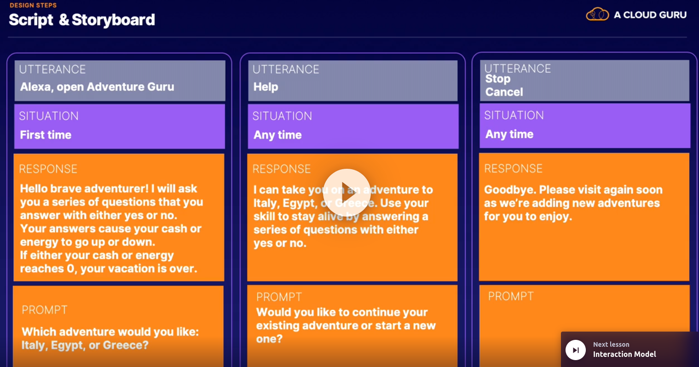
 
#### Interaction Model

* Intents
    * An action that fullfills a user's request or intention
* Sample utterances
    * A list of spoken phrases the user will say to alexa
* Custom Slots
    * A list of possible values
* Dialog Model
    * Defines the steps for a multi-turn conversation between alexa and the user
    
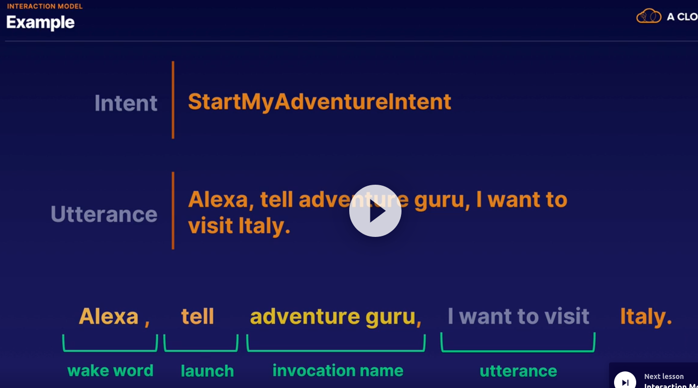

## Chapter 4 - Skill Architecture

### Skill Architecture

* Echo Device
    * Smart Speaker
    * Microphone
    * Wake Word
* Alexa Voice Service
    * Services
    * Apis
    * Machine Learning
    * Natural Languague understanding
    * Process request
    * Send request to skill
* Alexa Developer Console
    * Front End
    * Back End
    * Alexa Developer Console
    * Receives request
    * Sends to back end logic
    * Alexa skills kit (ASK)
* AWS Account
    * Takes Action
    * User's itent
    * Sends response back
    * Text-to-speech synthesis (TTS)
    * AWS Lambda
    * Post Requests
* Custom Endpoint
    * Accessible via internet
    * HTTPS/443
    * SSL/Amazon-trusted certificate
    * Verify request from Alexa
    * SDK or manually
    * Adhere to Json Format

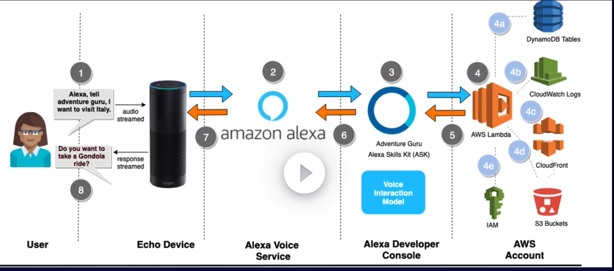

#### Creation Process

* The typical steps required to create, build, test, and publish a custom skill
1) Voice User Interface (VUI)
    * In Alexa developer console to implement Voice Interaction model
    * Intents
    * Logics
2) Fullfillment Logic
    * Backend logic
        * Lambda
        * Custom Endpoint
3) Connect VUI to Code
    * Frontend connects to backend using json
4) Building & Testing
5) Distribution
    * Alexa Marketplace Store
    * Alexa for business - Private Skill
6) Certification
    * To Alexa skills store
 
 

## Chapter 5 - Skill development

### Skill development

* ASK Cli

Behind the Scenes uses SMAPI (Skill management API)

```bash
npm install -g ask-cli
ask init
ask deploy
ask clone
```

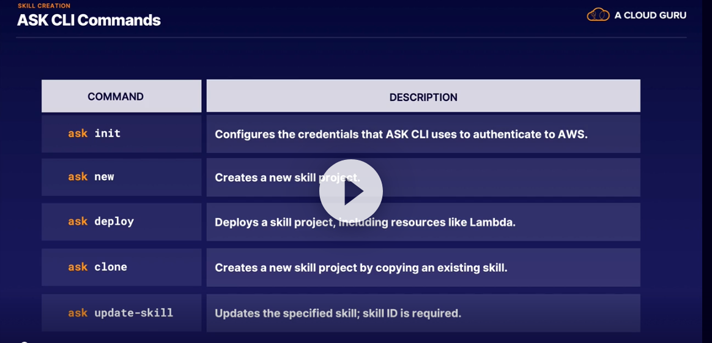

### Custom Skill

* Innovation name
* Intents
* Utterances
* Slots
* Image Files
* Audio Files
* Service Endpoint
* Configuration in developer console

* Design - Configure - Code - Integrate - Test - Publish


* 3 Ways to Invoke Custom Skills
    * Phrase and invocation name (IntentRequest)
        * Alexa, tell Adventure Guru I want to go Australia
    * No specific Intent (LaunchRequest)
        * Alexa, open Adventure Guru
    * Name-free interaction (CanFullFillIntentRequest)
        * Alexa, finds a skill to match user's request

### Interaction Model

* Custom
    * You define the requests and utterances
    * Complete control over the users experience
    * Invocation name required 
        
* Pre-built
    * The requests and utterances are defined for you
    * Less control over the user's experience
    * No invocation name

### Skill
 
 * Invocation Name
    * Used by custom skills
    * Two or more words
        * Exception: names unique to your brand can be one word
    * Can only contain lowercase alphabetic characters
        * Exception: can contain periods and apostrophes
    * Can't infringe on intellectual property rights to others
    * Names of people or places not allowed
    * If only two words, can't include "the", "a", "an", "for", "to", or "of"
    * Can't contain Alexa launch phrases like "ask", "tell", "enable", etc
    * Can't contain the wake words
    * Separate acronyms like "N. B. A." instead of NBA
    * Numbers must be spelled out like "twenty-one"
    * Must be written in each language you intend to support

* Intent
    * An Action that fulfills the users requests
    * Includes a name and list of utterances
    * Name can only contain case-insensitive alphabetical characters and underscores
    * Name cannot include numbers
    * Name cannot include special characters
        * Exception: built-in intents use AMAZON namespace
    * Names cannot include spaces
    * Types
        * Custom Intent
            * You define the name
            * Tou define the utterances
            * You provide code on back-end
        * Pre-built
            * Library of Intents
            * Represent common actions
            * Utterances already provided
            * You provide code on back-end
            * Can be extended
    * Pre-built
        * Standard
            * AMAZON.CancelIntent - Required
            * AMAZON.HelpIntent - Required
            * AMAZON.StopIntent - Required
            * AMAZON.FallbackIntent - Required
            * AMAZON.NextIntent
            * AMAZON.YesIntent
            * AMAZON.NoIntent
            * AMAZON.PauseIntent
            * AMAZON.SearchAction<object>
        * Standard with Screen
            * AMAZON.PreviousIntent
            * AMAZON.NextIntent
            * AMAZON.ScrollUpIntent
            * AMAZON.ScrollLeftIntent
            * AMAZON.ScrollDownIntent
            * AMAZON.ScrollRightIntent
            * AMAZON.PageUpIntent
            * AMAZON.PageDownIntent
            * AMAZON.MoreIntent
            * AMAZON.NavigateHomeIntent (Required)
            * AMAZON.NatigateSettingsIntent
        * Categories
            * Books
            * Calendar
            * Movie show times
            * Local search
            * Music
            * Video
            * Weather

* Utterances
    * spoken phrase mapped to an internet
    * Separate acronyms like "N.B.A" instead NBA
    * Numbers and punctuation marks spelled out like $21 should be "Twenty-one Dollars"
    * Apostrophes and related ponctuation should be enclosed in brackets when defining slots
 
 * Slots
    * Values that are passed to the utterance
    * Values can change and come from a predefined list of values
    * Define your own list or use predefined built-in slot
    * Accepts synonyms
    * No punctuation outside of the curly braces
    * No dashes following a slot value
    * Special characters are allowed
    * Add validation to make slots required
    * Built-in Slots
        * AMAZON.FOUR_DIGIT_NUMBER
        * AMAZON.SearchQuery
        * AMAZON.Ordinal
        * AMAZON.Country
        * AMAZON.PhoneNumber
        * AMAZON.Number
        * AMAZON.DayOfWeek
        * AMAZON.US_FIRST_NAME

* Interfaces
    * Audio Player
        * AMAZON.PauseIntent
        * AMAZON.ResumeIntent
    * Display / DisplayTemplate
        * Skills that use both screen and voice interaction using display templates
        * BodyTemplate1 and BodyTemplate2
    * Video App
        * Provides the VideoApp.Launch directive for streaming video files
        * AMAZON.CancelIntent Not Supported
    * GadgetController / GameEngine
        * Skills that control and receive input from Echo buttons
        * GadgetController.SetLight
        * GameEngine.StartInputHandler
    * CanfullfillIntentRequest
        * Checks to see if your skill can handle a given users request
        * CanFullIntentRequest, CanFullFillIntent
    * Alexa Presentation Languague
        * Design languague allowing you to build interactive and multimodal (Video and Voice) Alexa Skills
        * Replaces Display Templates
    * Auto Delegation / Dialog
        * Provides directives for managing a multiturn conversation
        * IntentRequest, DialogDelegate
        

### Lambda

* Receives user's intent (IntentRequest)
* Returns response to Alexa Voice Service (AVS)
* Multiple ways to author

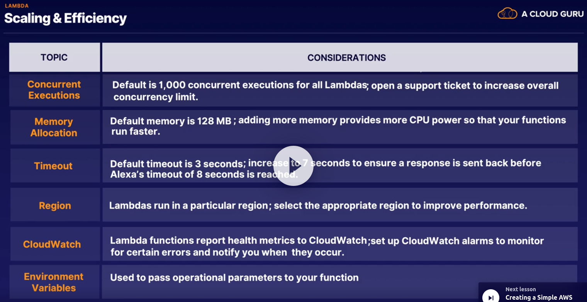

* Standard Requests
    * LaunchRequest
        * When the user invokes your skill wihtout providing a specific intent
    * IntentRequest
        * Makes a request that corresponds to one of the intents defined in your schema
    * SessionEndedRequest
        * The current skill session ends for any reason other than your code closing the session
    * CanFulfillIntentRequest
        * Service is quering a skill to determine whether the skill can understand and fulfill the intent request
        * Interface -> You have to update your skill manifest to indicate that your skill supports the new CAN_FULFILL_INTENT_REQUEST interface
* Others
    * AudioPlayer
    * PlaybackController
    * Gadget Controller
    * InputHandlerEvent
    * Connections.Response

* Code
    * Request Handlers
    * Exception Handlers
    * Handler Classes
        * To use handler classes, each request handler is written as a class that implements two methods of the AbstractRequestHandler class - can_handle and handle

### DynamoDB

* Capacity Modes
    * Two capacity modes
        * On-demand
        * Provisioned
* Provisioned
    * Default mode and is free-tier eligible
* Units
    * Unit represents a read-per-second or a write-per-second value
* Performance
    * Read and write capacity values have a large impact on performance
    
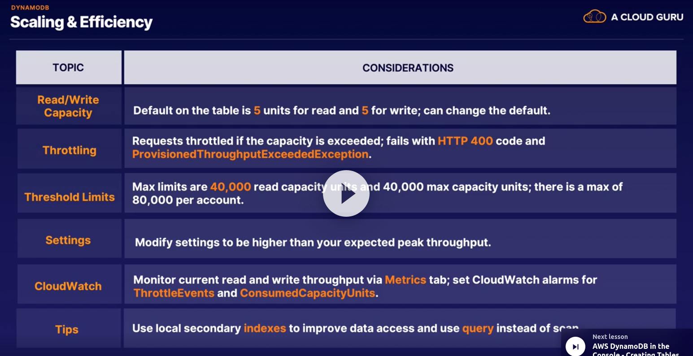

### Custom Endpoint

* Accessible via internet
* HTTPS/443
* SSL/Amazon-trusted certificate
* Verify request from Alexa
* SDK or manually
* Adhere to json format

* Uses Cases
    * Progressive response api
        * A progressive response is interstitial content that Alexa plays while waiting for your skill response
        * Sends confirmations that your skill has received the request and is working on it
        * Play short audio
        * Provide other engaging content
        * Content must be valid SSML
        * <speak> tag
        * <audio> tag
        * 8 second timeout still enforced
        
## Chapter 6

### Devices with Screens

* Echo Spot Limitations
    * There is no back button
    * There is more text wrapping than on other devices
    * Header text may not display at all
    * if header text displays, it may be truncated with an ellipsis
    * Background images may be scaled down and edges cropped
    
* Built-Intents 
    * Developer Handles
        * AMAZON.PreviousIntent
        * AMAZON.NextIntent
    * Handled for Developer
        * AMAZON.ScrollUpIntent
        * AMAZON.ScollLeftIntent
        * AMAZON.ScrollDownIntent
        * AMAZON.ScollRightIntent
        * AMAZON.PageUpIntent
        * AMAZON.PageDownIntent
        * AMAZON.MoreIntent
        * AMAZON.NavigateHomeIntent
        * AMAZON.NavigateSettingsIntent
 

### Visual Components

* Cards
    * Cards display additional visual information to accompany a skill's response
    * Simple Card
        * Displays plain text with card title and content
    * Standard Card
        * Displays plain text with a card title, content and an image. The image can be stored on S3
        * Troubleshooting Standard Cards
            * Image URL
                * The URL doesn't point to an image, image is private or URL has expired
            * Image Format
                * Images mus b in PNG or JPEG format
            * CORS
                * The server where your image is hosted isn't CORS-enabled
            * Image Dimensions
                * The image file you provided is too large
    * LinkedAccount
        * Allow users to start the account linking process
    * AskForPermissionsConsent
        * Allows users to grant specific permissions

* Visual Templates
    * Cards
        * Used for basic visual output; displays plain text and images; or to ask for permissions
    * Body Templates
        * Displays content with text and images; images cannot be selected; BodyTemplate1, BodyTemplate2
    * List Templates
        * Displays a scrollable list of items; images are selectable; ListTemplate1, ListTemplate2
    * Images
        * Used in list body or list templates
        

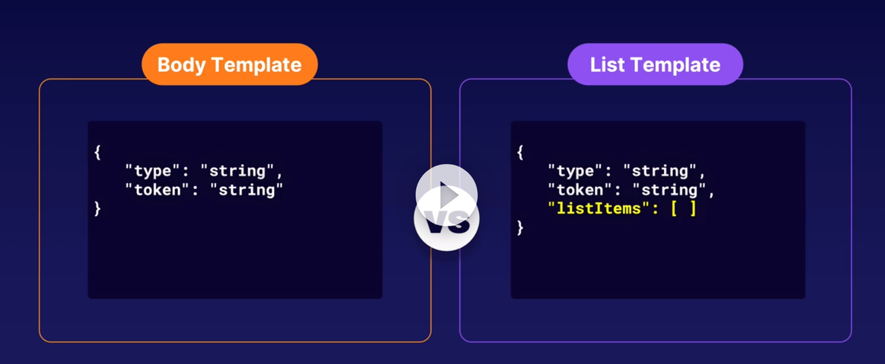

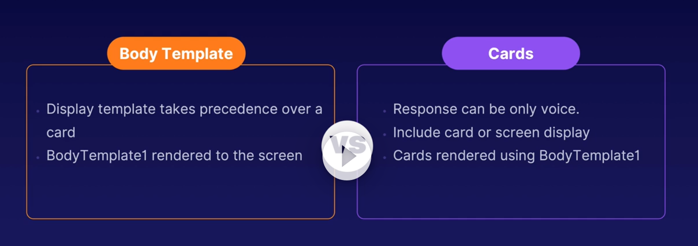

* Alexa Presentation Languague
    * Multimodal skills
    * Includes graphics, images, slide shows, and interactive screen displays
    * Similiar to building a web page with HTML, javascript, and CSS.
    * Create an APL document in JSON Format
    

### Sound Effects

* Speech Synthesis Markup Language (SSML)
    * SSML Tags
        * amazon:effect
            * Supported : whispered
        * audio
            * Play audio file
            * Audio clips no longer than 4 minutes/240 seconds
            * Couple with time attribute on break tag
            * MP3 Format
            * The bit rate must be 48 kbps
            * Don't have to store on S3 (can be any acessible HTTPS endpoint)
        * break
            * Pause on speech
        * emphasis
            * Change the rate, volume on speech
            * Modes: strong, moderate, reduce
        * lang
            * lang tag to sentences in order languague
        * p
            * Paragraph
        * phoneme
            * Provides phonemic pronunciation
        * prosody
            * Modify volume, pitch and rate
        * s
            * Sentence
        * say-as
            * Indicates how should interpert: Interjection, digits, spell-out....
        * speak
            * Root Tag
        * sub
            * Substitute phrase
        * voice
            * Use Polly Voice
            * Different characters, different accent
        * w
            * Interpert like a verb or noun

* Speechcons

* Amazon Polly

* Alexa Skills Kit Sound Library
    * Provides set sound of skills can use in your skill
    * Animals, footsteps, vechile, alarm, machine, voices, television, etc
    

### Audio Streaming

* Voice Only
    * AudioPlayer Interface
        * Directives
* Voice + Screen
    * Audio Player Interface
        * Directives
        * Requests
    * PlaybackController Interface
        * Directives
        * Requests

* AudioPlayer Interface
    * Directives
        * Types
            * AudiPlayer.Play
            * AudiPlayer.Stop
            * AudiPlayer.ClearQueue
        * Requests
            * AudioPlayer.PlaybackStarted
            * AudioPlayer.PlaybackFinished
            * AudioPlayer.PlaybackStopped
            * AudioPlayer.PlaybackNearlyFinished
            * AudioPlayer.PlaybackFailed
        * playBehavior Attribute
            * REPLACE_ALL
                * Immediately begin playback, and replace current enqueued streams
            * ENQUEUE
                * Add the specified stream to the end of the current queue
            * REPLACE_ENQUEUED
                * Replace All Streams in the Queue

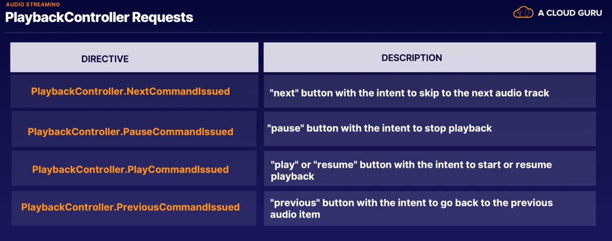
    * Enable
        * Enable AudioPlayer interface via console
        * Include the required built-in intents
            * AMAZON.PauseIntent
            * AMAZON.ResumeIntent
        * Gracefully handle the optional intents
        * Send back an AudioPlayer.Play directive
        * Handle the requests

* Considerations
    * Alexa speaks text before streaming audio
    * Built-in intents can be invoked without a skill name
    * Intents are automatically sent to the most recent skill playing audio
    * Only respond with AudioPlayer directives to PlaybackController Requests
    * PlaybackController requests are not sent in response to voice requests
    
### Video

* VideoAppInterface
    * VideoAPP.Launch
* Enable
    * Enable VideoPlyer interface via console
    * Gracefully handle the supported intents
        * AMAZON.PauseIntent
        * AMAZON.StopIntent
        * AMAZON.ResumeIntent
    * Send back an VideoPlayer.Launch directive
    * Play Video
* Considerations
    * A user can control the video via voice or touch
    * Always check for video app support in the context.system.device.SupportedInterfaces property
    * The ShouldEndSession parameter must not be included
    * The back button is displayed on every VideoApp screen
    
### Dialog Management

* Delegate the dialog to Alexa to handle
* Alexa prompts the user for required slots
* Each skill can have a delegation strategy, which can be overridden at the intent level

* Auto-delegation - Simple Dialog
    * Delegate the entire dialog to Alexa
    * Doesn't send an IntentRequest until all slots filled
    * Alexa completes the dialog steps based on dialog model
    * Enabled for entire skill or individual intents
    * Dialog directives not used

* Manual Delegation - Complex Dialog
    * Your skill receives an IntentRequest for each turn
    * Your skill determines if all required slots have been filled
    * If not, skill returns Dialog.Delegate directive
    * The request includes the dialogState: STARTED, IN_PROGRESS, Or Completed
    * The dialogState is set to COMPLETED
    
* Delegation in Code - Code Controls
    * This does not make use of auto delegation. You will need to determine the status of the dialog and next steps in your own code
    * Your skill checks for slot values and returns appropriate directive: Dialog.ElicitSlot, Dialog.confirmSlot, or Dialog.ConfirmIntent
    * Your skill does receive the dialogState, but it will only include STARTED or IN_PROGRESS
    
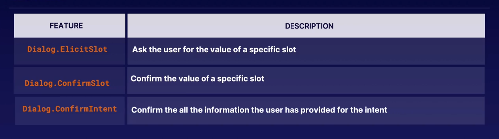

* Enable Auto Delegation
    * Intents
        * Add intents to your skill
    * Activate
        * Activate dialog management by making slots required and adding prompts
    * Interfaces
        * Turn on Auto Delegation in the interfaces section of the Alexa Developer Console
        
### State Management

* Session State
    * Session starts when the blue light ring turns on
    * If set to end, the session ends with delivery of response
    * Track information during a multi-turn conversation
    * Data added to session object in the JSON requests
    * Session data sent to Alexa; Alexa Sends data back
* User Level
    * Allows data to be persisted between sessions
    * Data stored in DynamoDb
    * Track several data elements by UserId
    * Boto3 library used to read to and write from DynamoDB
    
### Alexa Settings API

* Timezone of the Echo Device
* Distance Measurement
* TEmperature Measurement

* apiAccessToken - used for authorization
    * Each request includes an API access token
* deviceId - unique identifier
    * Identifies the user's device
    

### Device Address API

* The echo device's physical address
* Request Permission
    * The user must approve access to address information
* Privacy Policy
    * Your skill must include a link to your Privacy Policy on the Distrubution Page
* Child-Directed Skill
    * Skills meant for children cannot access the address information
* Call in realtime
    * Your skill must call the device address api every time
    

### Customer Profile API

* Customer's Contact information: name, email address and phone number
* Request Permission - The user must approve access
* Privacy Policy - Your skill must include a link yo your privacy policy on the Distribution page
* Child-Directed Skill - Cannot access to customer information
* Call In Realtime

### Location Services

* Location services allows you to get the user's realtime geolocation
* Request Permission - The user must approve access
* Privacy Policy - Your skill must include a link yo your privacy policy on the Distribution page
* Child-Directed Skill - Cannot access to customer information
* Call In Realtime

### Account Linking

* Secure Method
    * A secure way for alexa skills to connect with third party systems
* Skill types
    * Smart home and Video Skills require account linking
    
* How It Works
    * OAuth 2.0 used to account linking
    * Supports authorization code grant or implicit grant
    * Login with Amazon (LWA)
    * Certificate signed by Amazon-approved certificate authority
    * Configure account linking the console
    * Update skill back-end with account linking logic

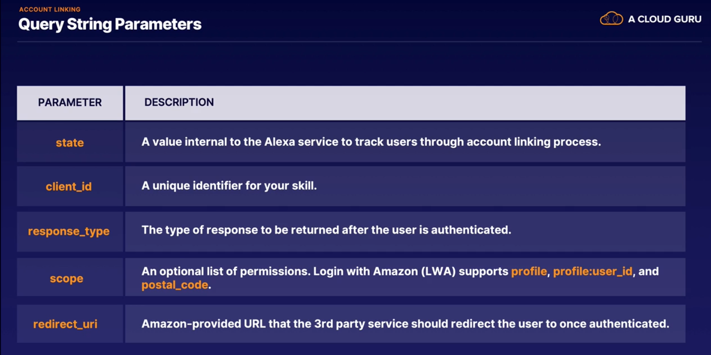

* Considerations
    * Account linking URLs must be HTTPS URL on port 443
    * A certificate is needed from an Amazon-approved certificate authority
    * Some perceived account linking use cases can be achieved via the Customer Profile API
    
### ISP

* ISP allows skill developers to sell premium content directly from an Alexa Skill
* ISP is for digital goods
* Users can pay using payment associated with Amazon account
* skill developer sets up tax forms for earnings

* 3 Product Types
    * entiltlement that unlocks features. this product type never expires
    * Consumables
        * Product that can be purchased, used, and then purchased again
    * Subscriptions
        * Product can be purchased and used for a set period of time
        
* Manage Products
    * Product Creation
        * Create product and associate with your skill
    * Add intents and slots
    * Back-end Logic
        * Add logic that makes buy, upselll, and cancel requests
    * Development and testing
        * Reset entitlements during development process

* InskillProducts API
    * Product ID for each product
    * Products that can be offered for sale
    * Know what the user has already purchased
    * for consumables, know how many units purchased as of today
    
### Amazon Pay

* Allows skill developers to sell physical goods and services

* skill developer needs an Amazon Pau merchant account
* Skill developer sells things like movie tickets, flowers, t-shirts, etc

### Security & Privacy

* Set the skill_id attribute object
* Skill rejects any request where skill id doesn't match
* Lambda trigger does the verification check

* Non-AWS Endpoint
    * Valid Certificate
    * Self-Signed certificates - only development
    * Verify Requests
        * Service must verify that incoming requests were sent by Alexa
* Privacy
    * Cannot misuse customer PII (personally identifiable information)
    * Provide a privacy notice on the skill's detail page
    * Only use data in the way that users have agreed to
    * Ensure data complies with privacy notice and applicable laws
    * Cannot collect via voice or recite sensitive PII
    

## Chapter 7

### Device Testing

* Register the Device
* Test your skills on your device
* Switch between accounts by saying, "Alexa, switch accounts"

* Test Steps
    * Invocation Name
        * Alexa should easily understand your invocation name
    * Utterances
        * Test your utterances and variations. The Correct intents should be triggered by utterances
    * Slots
        * Test slots fo user errors; Include missing or incorrect values
        
### Console Testing

* Alexa Simulator
    * Test your skill without an Echo Device
* Manual Json
    * Only Custom skills
* Voice & Tone
    * Test SSML and hear Alexa's spoken output
* Additional Options
     * Use the Skill I/O, Device Display, Device Log Options
     
### Programmatic & CLI

* Utterance Profiler API
    * Test utterances
    * Test frontend
* Skill invocation API
    * Invoke Skill
    * Custom Skills
* Skill Simulation API
    * Simulate skill execution
    * Custom Skills
* Skill Validation API
    * Validate Skill

### Intent History

* Understand user interaction with your skill
* Identify potential improvements to interaction model
* Shows only a subset of utterances
* There are two tabs: Unresolved Utterances and Resolved Utterances
* Don't confuse with the Utterance Profiler

### Custom Errors

* There is a problem with the requested skills response
    * Generic Error
* Issues that cause a skill to not build
* Typing words instead of spelling them out
* Utterances routing to the wrong intent
* Multiple matches on intents
* 8 second timeout exceed

### Beta Testing

* Beta Test your skill before releasing to production
* Beta test development version
* Add or remove users
* End testing
* Access feedback
* Process
    * Beta Test Administrator Email - Enter your email
    * Testes - A list of testers along with their email addresses
    * Email Notification - Each tester receives an email with a custom link. Only one email
* Restrictions
    * 90 days
    * Up to 500 testers
    * One beta version of a skill
* Workflow
    * Remove Tester
        * The tester will receive an email that the test has ended
    * Send a Reminder
        * The tester will receive a reminder email
    * Request feedback
        * The tester will receive an email requesting feedback
* End a Beta Test
    * Email
        * Testers receive an email that the test has ended
    * Lose Access
        * Testers lose access to the development version of the skill
    * Access Live Version
        * Testers regain access to the live version of the skill

## Chapter 8

### Skill Preparation to Publish

* Certification Preparation
    * Testing Complete
    * Alexa Skills store
        * Descriptions
            * Long and short skill descriptions
        * What's New
            * Introduces new features you've added
        * Example Phrases
            * Utterances that display on the skill detail card
        * Icons
            * Small and large icons for your skill
        * Category & Keywords
            * The category and search keywords for your skill
        * Privacy URL
            * Link yo your privacy policy for the skill
        * Terms of use URL
            * Link to the terms of use for the skill
        * Testing Instructions
            * Special rules for testing
    * Certification Process
    * Publish to Alexa Skills store

### Locales

* Languague
    * The languague drop-down on the Build Tab allows you to add languague support
* Availability
    * The Availability item on the Distribution Tav allows you to select the country and regions for your skill
    * 3 Rules
        * Country or Region
            * The skill is distributed in its country or region
        * Language
            * The skill supports the language
        * Device
            * The skill supports the primary language where the device is registered
* Locale Property
    * Determine the language by checking the locale property
    * Create the voice user interface for each language
        * English (US) ,English (UK), English (AU), English (India), English (CA)
        
### Certification Tips

* Doesn't meet invocation name requirements
* Contains advertising
* Recommended skills not owned by developer
* Collects person's physical or mental health condition
* Child-directed skills can't sell physical products
* Infringes on intellectual property rights
* Doesn't implement one of the required built-in intents
* Invocation Name Requirements
    * Can't contain the wake words "Alexa", "Amazon", "Echo", or the words "skill" or app
    * Two-word invocation names not allowed if one of the word is a definite article, indefinite article, or preposition
    * One-word invocation names not allowed, unless unique to your brand
    * Invocation names must contain only lower-case alphabetic characters, spaces between words, and possessive apostrophes
    
### Skill Manifest

* Json representation
* Metadata
* Publishing

* Contains
    * supported interfaces
    * permissions needed
    * Links to privacy and terms of use url
    
### Skill Submission

1) Validation Tests
    * Validation tests verify that all necessary fields are completed
2) Functional Tests
    * Functional tests check for common errors that would case your skill to fail certification
3) Submit for Review
    * Click the "submit for review" button to have amazon certify and publish your skill
    
* Certification Testing
    * Invoke your skill without an intent
    * Invoke your skill with a partial intent
    * Test your utterances and slots
    * Verify the responses
    * Ask the skill for help
    * Stop or cancel the skill
    
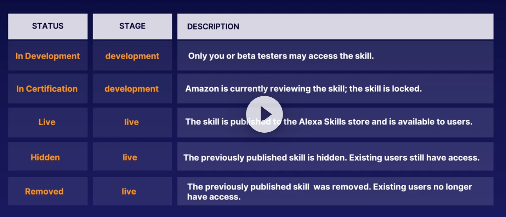

### Alexa for Business

* Empowers organizations to use Alexa in the workplace
* Administrative console
* Deploy and manage shared Alexa devices
* skills on the shared devices
* Unique opportunities for developers

* Private Skills
    * Developers can create private skills
    * They don't appear in the Alexa skills store
    * Skill developer enables for select organizations
    * Skill Distribution
        * 1) Common Locations
            * Skills deployed directly to devices in common locations
        * 2) Manage Users
            * Invite employees to use private skills on their personal devices
        * 3) Location aware
            * Developers can use APIs to make skills location aware

### Metrics

* Reports
    * Monitor usage
    * Analyze user interactions
    * View reports
    * Determine enhancements needed
    
    * Metrics (Summary)
        * The main page that shows high-level information like sessions, unique customers, utterances, intents, ISP statistics, account linking
    * Metrics (Detailed)
        * From the summary page, you can drill down into detailed metrics: customers, sessions, utterances and intents
    * Interaction Path (Analysis)
        * Shows the path users take when interacting with your skill, as well as usage patterns
    * Retention (Usage)
        * Shows the usage of your skill over time. You can display the current week's users and the percentage that return

### Version Management

* Skill Versioning
    * Live skills are locked
        * Once your skill is certified and published, the status is live
    * Development version added
        * This is the version of your skill that you will make changes and updates to during development
    * Displayed together
        * The live and development versions are displayed together in the list of skills
    * Changes require recertification
        * Once the development version is certified, it becomes live and replaces the previous live version
        
* Lambda Versioning
    * Both live and development version point to the same endpoint
    * Two versions of the lambda
    * Lambda versioning
    * Lambda aliases
    
* Hiding vs Removing Skill
    * Hiding
        * Hides skill from new users
        * Doesn't appear in Alexa Skills store
        * Existing users can still use it
    * Removing
        * Hide skill from new users
        * Doesn't appear in the Alexa Skills store
        * Disabled for existing users
        
        
### Working with a Teams

* Teamwork
    * Manage Access
    * Marketers
    * Administrators
    * Developers
    * Analysts
    * Appstore Developer Console
    
* Roles
    * Administrator
        * The account owner with full rights to administer the account
    * Marketer
        * Can edit skill content like short and long description, icons, etc. Cannot access payments and earnings
    * Analyst
        * Everything a marketer can do and includes access to payments and earnings
    * Developer
        * Can change application files; has access to ASK CLI and SMAPI. Cannot access payments and earnings
        

## Chapter 9 - Advanced Skill Types

### Flash Briefing skills

* Short content
* Daily routine
* Text or Audio
* Specific content

* Enable
    * Amazon Alexa App
    * Under Settings
    * Throught voice
    
* Considerations
    * Use a pre-built model
    * No custom intents allowed
    * Voice interaction is not customizable
    * Voice interaction defined by amazon

* Requeriments
    * RSS or JSON format
    * Non-password protected HTTPS Endpoint
    * Provide 1 to 5 unique feed items
    * Provide items in order from newest to oldest, based on the provided data value
    * Content must be at least 10 seconds but no more than 10 minutes
    * Content fewer than 4500 characters
    * Content should be available 24/7
    * No purchases allowed
    
* Possivel Errors
    * Content Not Available
        * Stale date field. Anything older than 7 days will not be played
        * Load new content and update the date element
        * Alexa checks for new content every 15 minutes
        * Verify content is within the specified character limitions
    * Content Not Correct
        * Confirm that your text-to-speech content doesn't contain special characters
        * Do not include HTML, XML, SSML or non-standard ponctuation
        
### Video Skill

* Stream and control videos using your voice
* Devices include Fire TV, Echo show, Smart TVs, etc
* Control without invoking a specific skill name
    * Alexa, play superman
    * Alexa, turn on Fire TV
* Video Skill API vs Custom skill
    * Video Skill API
        * Aware of video devices and services
        * No need to launch skill by name
        * Incorporates videos or movies you produce in Alexa's content catalog
        * Useful for full-length movies and videos
    * Custom Skill
        * Isn't aware of user's devices and services
        * User must remember skill name
        * Videos or movies not a part of Alexa's content catalog
        * Useful for short video clips
* Requirements
    * cloud-enabled video service provider
    * Support for account linking if required to view your content
    * Integration of content in a catalog
    
### Smart Home Skills

* Smart home skill allows you to control and check the status of cloud-connected devices in your home
* Considerations
    * Voice interaction model is defined for you
    * Support many types of services
    * Can customize by adding support for a CustomIntent
    * Invocation name not required
    * Lambda trigger will be Alexa smart Home instead of Alexa Skills Kit
    * Account linking is required
* Troubleshooting
    * Account linking successful but can't locate the device
    * Ensure Lambda trigger is the Alexa Smart Home
    * Verify that you are sending back a valid discovery response
    
### List Skills

* Alexa has built-in lists
* Users can create custom lists
* List skills allow users to interact with their lists
* Create new lists, read, or delete items

* Requirements
    * User has to give permission to access their lists
    * User receives card in the Alexa App when enabling your skill
    * List Skill API contains Lists Read, Lists Write and List Events
    
* Considerations
    * Invocation name not required
    * Easy integration with existing Alexa Lists
    * Can only be created through the CLI (SMAPI)
    * Must use List Events to be considered a list skill
    
#### Music Skill

* Integrate your music service with Alexa
* Play music from your catalog
* Alexa, play music on skill name
* Sends a GetPlayableContent request to your skill
* Skill communicates with music service and sends GetPlayableContent response
* Initiate API response
* Requirements
    * Streaming music service with cloud API
    * Ability to provide music catalog metadata to Amazon
    * Permission to stream the music your skill makes available
* Considerations
    * Voice interaction model defined for you
    * Maximum entities in catalog is 500000
    * Configure skill to receive notifications
    

## Chapter 10

### Alexa skill hosting

* Build Skills
    * Using the AWS ecosystem without having an AWS account
* Author Code
    * Directly from the Alexa Developer Console
    * Write Lambda
* View Logs
    * Directly from the Alexa Developer Console
    * Access CloudWatch
* Use Cases
    * Students, teaching workshops, or easy way to get started
    
* Features
    * AWS Lambda Endpoint
    * Code Tab
    * Alexa skills kit Command Line
    * S3 bucket for media storage
    * S3-backed key-value table
        * Managing session persistence
    * Cloudwatch logs
    
* Considerations
    * Don't need an AWS Account
    * Supports Node.js and Python
    * 75 per Account
    * Usage limited to the free tier
    * Custom skills only
    * Resources hosted in US East (North Virgina)
    

### Notifications & Reminders

* Proactive Events API
    * Proactive message
    * Single user
    * Proactive Events API
    * Broadcast to all users
    * Predefined Schemas
        * AMAZON.WeatherAlert.Activated
        * AMAZON.SportsEvent.Updated
        * AMAZON.MessageAlert.Activated
        * AMAZON.OrderStatus.Updated
        * AMAZON.Occasion.Updated
        * AMAZON.TrashCollectionAlert.Activated
        * AMAZON.MediaContent.Available
        * AMAZON.SocialGameInvite.Available
       
* Alexa Reminders API
    * Reminds users
    * Users have to give your skill permission
    * Modify, edit, and delete reminders
    * Predetermined time
    * Device plays a tone and reads the reminder
    * User will also receive a card in the Alexa app
    * One time or recurring
    
* Don't require (re)-certification