# AWS Certified Networking Specialty

# Chapter 1 - General Networking Fundamentals

## OSI Model

* Layer 1 - Physical
    * Responsible for physical connectivity to the network, and transmission of data
    * Ethernet Cables, Hubs + Repeaters

* Layer 2 - Data Link
    * Moves information between computers and networks. It0s responsible for transmission, format, and error correction
    * Switches, Mac Address, Bridges

* Layer 3 - Network
    * Responsible for routing. It splits the data into packets and adds destination and routing information
    * Network Routers, IP, ICMP

* Layer 4 - Transport
    * Ensures data is sent to the right destination, across networks, and manages error handling
    * TCP + UDP

* Layer 5 - Sessions
    * Defines and manages the rules for communication between two computers
    * Appletalk, Winsock

* Layer 6 - Presentation
    * Defines the format that will be used for data transmission. The data may also be compressed or encrypted at this layer
    * JPG, GIF, MPEG

* Layer 7 - Application
    * Where the user interacts with software like web browsers, social media apps, email
    * Web browser, Email
    
    
### OSI Model Inside AWS

* Layer 2
    * We have switches and Mac Address
    * In AWS we have subnets, instances communicate in layer 2 inside subnets
* Layer 3
    * For instances communicate inside subnet, uses router (layer 3)
    * To communicate with internet uses internet gateway (layer 3)
* Layer 7
    * ELB - ALB
    
## Chapter 2 - General Networking Fundamentals

### IpV4

* Operates at Layer 3
* Ip address are 32 bit numbers separated into 4 bytes
* Are made up two parts: the network ID and the host ID
* Each subnet is limited to a maximum number of hosts based on the subnet mask
* Subnets have reserved addresses that cannot be assigned: The subnet address (represeting the network ID), and the broadcast address

### Private IP Ranges: RFC 1918

* They are non-Routable IP Addresses
* Network Address Translation (NAT) is used to facilitate internet access for hosts using private IP Addresses
* Private IPs
    * Class A - 10.0.0.0/8
    * Class B - 172.16.0.0/12
    * Class C 192.168.0.0/16

## Chapter 3 - IPv6

* All IPv6 Addresses are public IP addresses. NAT is not used
* IPv6 uses 128-bit addresses
* IPv4 and IPv6 are not communication compatible
* Dual stacking allows use of IPv4 and IPv6 on the same host
* IPv6 IP addresses are hexadecimal
    * They contain eight groups of four hexadecimal numbers, separated by colons
    * IPv6 addresses can be abbreviated by removing one or more leading zeros from any the hexadecimal groups
    * Consecutive sections of zeros are replaced with a :: to represent the omitted zeros
    * The (::) double colon can only be used once in an address
        * IPv6 equialent to IPv4 127.0.0.1 is ::1
    * Link-local address
        * IPv4 169.254.x.x
        * IPv6 fe80::/10
        
### IPv6 On AWS

* When you set IPv6 on AWs , you need add it to your VPC as additional CIDR
    * AWS assigned /56 to your VPC
    * It's recommended you assing /64 to your subnets
    
* Cannot create a VPC limited to IPv6

### Services Support Ipv6

* VPC
    * Internet Gateways
    * Security Groups
    * NACLs
    * Route Tables
    * VPC peering
    * VPC Flow Logs
* Route 53
    * Supports AAAA records and health checks of IPv6 Endpoints
* EC2
    * Supports IPv6 via dual stack
* CloudFront
    * Nativately supports IPv6, but legacy cloudfront distributions may require upgrade
* S3
    * Supports S3 buckets and S3 Transfer Acceleration using Stack Endpoints
* Direct Connect
    * Supports single and dual stack configurations on public and private virtual interfaces (VIFs)
* Web Application Firewall
    * Inspects incoming traffic requests for IPv4 and IPv6
* Elastic Load Balancers
    * Resolves IPv6 addresses to the AAAA DNS record for clients, and supports security group configuration for IPv6 traffic when configured to use dual stack IP address
    
## Chapter 4 - Key Switching Fundamentals

### Switching

* Layer 2 Switching is the Data Link Layer of OSI Model
* Switches operate at layer 2, and are used to break collision domains into smaller ones
    * Each pot on a switch is a collision domain which avoids collisions from multiple devices attempting to talk at once
* Network adapters have MAC addresses assigned, and switches use the MAC addresses to send frames between devices
* Devices send ARP requests to learn the MAC address of other devices
* Switches store learned MAC addresses in a MAC address table
* All devices connected to the same switch are considered a broadcast domain
* Trunk port pass traffic for multiple VLANS
* LACP (Link Aggregation Control Protocol) - logically bundles ports together to increase network throughput and add redundancy. The bundling of ports is often referred to as port channel
* VLANs are a logical group of devices the same broadcast domain
* VLAN tagging tells the port on the switch VLAN(s) it belongs to
* Trunk ports are used to allow multiple VLANs to communicate across the same physical switch port
* VLANS is AWS Subnets, but instead have a Layer 2 Switch, have Layer 3 Router

## Chapter 5 - Key Routing Fundamentals

* Routers and IP addresses function at Layer 3
* A router is responsible for forwarding IP Packets between different IP Networks, based on the best path from the routing table
* A NAT device is required for routing between private IPv4 address and internet traffic
* ALL IPv6 addresses are public, so NAT is not required
* Sending traffic between different  VLANs is routing (inter-vlan routing)
* Layer 3 switches are often used for inter-VLAN routing
* When traffic leaves a network, it is forwarded to the router at the next hop
    * The next hop router is the closest router that gives the shortest path to the destination
* Routing protocols are standards for how routers will communicate with each other
    * Commom routing protocols include RIP, IGRP, EIGRP, OSPF and BGP
    
### BGP

* It is the routing protocol that is used to determine the best route for internet-based traffic
* BGP is a path vector protocol. BGP looks at available paths and calculates the best path for the data to travel
* BGP uses a specified criteria to determine which router should be the next-hop router. That criteria includes standards, rules, path, weight, and priority
* AS_Path prepending is an example of how to influence routing path selection. By using prepending, you can make a particular route more preferred or less preferred
* Autonomous Systems (AS) are a collection of routers with prefixes and policies under administrative control of a single entity
* Autonomous Systems are typically operated by ISPs
* To exchange routing information using BGP, a registered autonomous system number (ASN) is required
* Multi-Exit Discriminator (MED) is used to tell neighboring Autonomous Systems which link is preferred for receiving traffic. The Lower the MED value the higher the preference for that link

### Autonomous Systems

* Autonomous Systems (AS) are a collection of routers with prefixes and policies under administrative control of a single entity
* Each AS has globally unique identifier assigned
* Private ASNs must not be exposed to the internet
* Public AS Numbers(ASNs) are assigned by IANA. InOrder to get a public ASN the following is required: A multi-homed network, a BGP4 capable router, and a fully functioning IGP on your network
* BGP uses Keep-Alive signals and a configurable timer to detect if a peer is down. If a peer goes down, it will remove that peer's route from its advertisements
* AS use exterior gateway protocols (BGP) to communicate with other AS
* Networks within an AS use interior gateway protocols (IGPs) like OSPF, IS-IS, RIP, or EIGRP

### IBGP and EBGP

* IBGP is interior Border Gateway Protocol. IGBP is used on border routers (routers in the same AS)
* Interior routers (ie core, or backbone routers) forward data destined for exterior networks to the border routers (the routers that make up the AS)
* Full Mesh is required between BGP peers to support IBGP, because routes are not re-advertised if they are learned via iBGP from a different peer
* EBGP is Exterior Border Gateway Protocol. EBGP is used to exchange routes with external ASes

### Influencing BGP PATH selection

Influencing routes for BGP can be done with several configuration options by making a route appear to be less preferred

* AS_Path preprending is used to artificially inflate the "cost" of a particular path
    * Essentially, a prefix is added manually to make a path seem "less attractive" so that an alternate path is selected instead
* Weight can be used to set a preference for a particular path on the local router
    * This metric is not propagated to other routes
    * Consider if there are two paths, but one path has a slower link or a higher cost to use that link. The higher metric is set on the preferred route
* Local Preference (LOCAL_PREF) allows routers in an Autonomous System to influence which route is used to enter the AS.
    * This metric is replicated to then next-hop neighbor so that it is aware of a particular route being preferred. The higher metric is set on the preferred route
* Multi-Exit Discriminator (MED) is used when local preference settings and the AS path "cost" are the same between two or more routes
    * MED is essentially used as a tie breaker
    * MED influences path selection by applying a metric that sets preference for how other ASes enter the target AS to reach a certain prefix
    * The MED metric is only propagated to adjacent ASes externally, but is also propagated internally within the AS
    * The lower the metric, the higher the priority for the preferred route

## Use Case 1 - Design and Implement an AWS Network Architecture Based on the Given Scenario

### VPC Reserved IP Addresses

AWS Reserves the following IP addresses that include the first our IP addresses and the last IP address of every subnet. The reserved IP addresses are based on the CIDR assigned to the subnet.
For example, the following IP addresses would be reserved on the 192.168.0.0/24 subnet

* Subnet Address: 192.168.0.0
* Broadcast Address: 192.168.0.255
* Subnet Router: 192.168.0.1
* DNS Server: 192.168.0.2
* Future Used by AWS: 192.168.0.3

### DHCP

* DHCP, or Dynamic Host Configuration Protocol, is used to automatically assign IP addresses and other network settings to a device.
* DHCP assigns IP addresses, subnet masks, and gateways, and it can also assign settings for NTP servers, domain names and DNS
* AWS DHCP options also include NetBIOS settings, but NetBIOS is another type of name resolution service. Most organizations no longer use NetBIOS
* DHCP assigned IP addresses are leased by the client
    * When released, the IP address goes back into a pool of unassigned addresses
    * It's possible to create a DHCP reservation, which removes a specific IP address from the pool so that it does not get assigned to more than one host
    * An IP address conflict will occur if two or more hosts have the same IP address
* All EC2 instances are assigned private IP addresses. Public IP addresses are optional, and can be assigned when the instance is launched
    * Static IP addresses are assigned using Elastic IP Address
    * When an Elastic IP address is assigned, the DHCP assigned IP address is release back to the DHCP pool
* Options Sets
    * Once created, DHCP options cannot be changed. Instead, a new option set would have to be created
    * DHCP options are automatically applied to instances every few hours, based on the DHCP lease renewal
    * Private instances in a nondefault VPC receive an unresolvable host name, like ip-10-0-0-202
    * The default DNS option is AmazonProvidedDNS
    * Custom Domain name and DNS servers may be specified, and up to 4 custom DNS servers are supported
    * Custom values are specified in the DHCP Option set
    * NET servers may also be set, based on section 8.3 of RFC2132
    * NetBIOS name servers and node types are also supported
    

### VPC and Subnet Requirements

* Private subnets with virtual private gateway for Site-to-Site VPN are called VPN-Only subnets
* VPCs are allowed block sizes between /16 and /28
* AWS recommends the following CIDR blocks from RFS1918
    * 10.0.0.0 - 10.255.255.255 (10/8 prefix)
    * 172.16.0.0 - 172.31.255.255 (172.16/12 prefix)
    * 192.168.0.0 - 192.168.255.255 (102.168/16 prefix)
* Requirements for adding additional CIDRs to a VPC (Subnets)
    * Network mask must be between /16 and /28
    * CIDR must not overlap with existing CIDRs associated with the VPC or VPC peers, VPN or Direct Connect
    * Secondary CIDRs may be detached from the VPC
    * The size of CIDR blocks is fixed, and cannot be altered
    * Currently, it is only possible to add 4 additional CIDRS to an existing VPC (5 Total)
    * The CIDR must be smaller than the CIDR range of current routes within the VPC
        * If the CIDR is a /24, you cannot add a CIDR with a lower CIDR number (ex: /23)
* IPv6 VPC associations use the /56 CIDR block, and you cannot choose the range of addresses or size of the block
    * Remember, all IPv6 addresses are public
* You can assign a /64 IPv6 CIDR block to a subnet
* Just like with IPv4, Ipv6 reserves five IP addresses: The first 4 IP addresses and the multicast address
* IPv6 does not use nat, as all IPv6 addresses are public

### Route Tables and IGWs

* After adding an Internet Gateway, egress-only internet gateway, virtual private gateway, NAT device, peering connection, or VPC endpoint, you must update the route table for any subnet using these connections
* IPv6 does not use NAT. Private IPv6 instances use an egress-only internet gateway that only allows traffic outbound
* IMPORTANT: the most specific route is used for priority (Ex: 192.168.2.100/32 is used as a priority over 192.168.2.0/24)

### NAT Instance Vs NAT Gateway

* NAT Instance
    * Based on an Amazon Linux AMI
    * Accepts and forwards traffic from private subnets to public IPv4 addresses
    * Customer maintained, limited scalability and HA
* NAT Gateway
    * AWS Managed
    * Can be configured for a highly-available and scalable environment
    * Security Groups not supported - must use NACLs
    * Associates an Elastic IP address with the NAT Gateway
    * Scale NAT Gateway by splitting resources into multiple subnets and adding a NAT Gateway
        * NAT Gateways scales from 5 Gbps to 45 Gbps
        

### Resizing the VPC

* We can add additional CIDR to the VPC
* There are limitations, maximum of 5 CIDRs are allowed per VPC
* VPC block size must be between /28 and /16 and the block must be smaller than the CIDR range of existing routes within the VPC
* The new CIDR cannot overlap CIDRs in the VPC, on VPC peers, or on Direct Connect

## Use Case 2: Implement VPC EndPoints within an AWS Infrastructure

### Gateway Endpoints

* Multiple endpoint routes can be included to different services in a route a table
* Multiple endpoints to the same service must reside in separate route tables
* Routes for Endpoints can only can be changed by modifying the endpoint
* Endpoint routes are automatically deleted when either the endpoint itself is deleted, or the associate route table is removed from the endpoint (again this must be modified at the point)
* Gateways only support IPv4, not IPv6
* Endpoints cannot be transferred between VPCs, or moved to different services
* Cross-region access is not supported. Endpoints must be in the same region as the AWS service being access
* VPC connections, VPC peers, and Direct connect cannot use the endpoint
* Proper DNS resolution is required. Use AWS DNS, or ensure proper name resolution with your private DNS

### Interface Endpoints

* Endpoint-specific DNS hostnames are created for the EndPoint. Private DNS can optionally be enabled for AWS Services
    * A private hosted zone will be created that contains a record set for the default DNS name associated with the service
    * The DNS name will resolve to the private IP address of the Endpoint network interface in your VPC
* When and Endpoint exists, communication is automatically sent using the private IP of the endpoint
    * Any existing public communication to the EndPoint gets moved to Private Link
* Interface EndPoints may be accessed across AWS VPN, Direct Connections, and VPC Peers
* Only One subnet in AZ may use an Interface Endpoint
* All services mat not be available in all AZs through an Interface Endpoint
* Interface Endpoints support up to 10 Gbps of bandwidth per AZ by default
    * Additional capacity may be added automatically based on use
* Check the NACL configuration for your subnet, to ensure that it will not block EndPoint traffic
* EndPoints only support TCP IPv4 traffic
* Endpoints may only connect within the same regions as the VPC, and cannot be transferred
* Can use Security Groups
    
## Use Case 3: Implement an AWS Management Network Infrastructure

### Elastic IPS

* When an EIP is removed from an interface, the instance will automatically lease a new IPv4 address from the DHCP server within a few minutes (This does not apply to secondary ENIS)
* Small fee is is billed per non-used Elastic IPs or Elastic IPs associated to stopped instances
* EIPS are accessible via the Internet Gateway and will not be accessible via AWS VPN.
* If an Elastic IP address is removed from an account, it can be recovered it from AWS CLI, assuming that it has not already assigned to a different account

### Elastic Network Interfaces

* Can have the following attributes
    * Private Ipv4 address assigned by DHCP in your VPC
    * One or more secondary private IPv4 addresses
    * One Elastic IP address (IPv4) per private IPv4 (Max 5 total EIPs per region)
    * Public IPv4 and/or IPv6 addresses
    * Security Group assignments
    * MAC address
    * Source/destination check flag
    * Description
* Can be attached/detached from an instance (except eth0)
    * Eth0 is the primary network interface on an instance and cannot be detached
* The number of IP address per network interface per instance varies based on instance type
* All ENIS must have IPv4 address. IPv6 addresses are optional
* ENIS use the eni-xxxxx identifier
* A network interface may be assigned multiple IPv4 addresses
* Use cases for attaching multiple network interfaces to an instance
    * Adding network and security appliances within a VPC
    * Dual-homed instances with workloads in different subnets - Same AZ
    * Failover Scenario: Move the ENI to a new Instance and all associated traffic follows the instance. This is a low cost failover option
    * Create a distinct management network: Monitoring and management tools are used from the management network
* Elastic Network Adapters
    * Elastic Network interfaces are different from Elastic Network Adapters (ENAs)
    * An ENA is a custom interface used to optimize network performance on some instance types
* Linux and Windows Server instances will automatically configure the private IPv4 address and gateway on he operation system when dual-homed
* Adding an ENI cannot be used to aggregate bandwidth. NIC teaming or port-channel bandwidth aggregation is not supported
* Attaching dual-homed network interfaces to the same subnet may produce unanticipated issues, such as asymmetric routing. Consider using a secondary private IP address on the eth0 interface instead
* AMIs may have a script preinstalled by AWS called ec2-net-utils, which can automate configuration of network interfaces

## Use case 4: Implement Placement Groups to Resolve a Network Latency issue Between servers

### Placement Groups

* Is a logical grouping of instances to provide optimized network throughput and performance
* No cost associated with creating a placement group
* 3 Types
    * Cluster - A low latency instance group in a single AZ. Best when performance is the primary concern
    * Partition - Spreads instances across logical partitions, ensuring that instances do not share underlying hardware with instances in other partitions
    * Spread - Spreads instances across underlying hardware. Spread placement groups are designed for high availability
    
#### Cluster Placement Group

* Recommended for applications that benefit from low-network latency, high-network throughput (or both) and where the majority of the traffic is between instances within the group
* Cannot span multiple AZs
* As best practice, instances in a placement group should all be deployed together
    * Adding an instance to a placement group later could cause the new instance to be deployed on a different host
* When an instance in a placement group gets stopped, there is no guarantee that it can be restarted on the same hardware, due to insufficient capacity
    * To alleviate this issue, it's best to stop and start all of the instances, so that they will be forced to new hardware with adequate capacity for entire group
* All nodes can talk to all other nodes within the placement group, at a full line rate of 10 Gbps and 25 Gpbs aggregate
* Instances that support enhanced networking will see the lowest latency and highest packet-per-second network performance
* The types of instances that can be launched into a cluster placement group is limited
* Traffic to and from S3 buckets in the same region, over the public IP or VPC endpoint can use all available instace aggregated bandwidth
* Mixed instance types are supported, but AWS recommends using the same instance type for all instances, to minimize the risk of the required capacity not being available
* Network traffic to the internet, and over Direct Connect connections, to on.premises locations is limited to 5 Gpbs

#### Partition Placement Group

* Instances in different partitions do not share underlying hardware with instances in other partitions. This minimizes the impact of hardware failures to only one partition
* Partition groups may be used to spread large distributed workloads across distinct hardware, to reduce the likelihood of correlated failures
* EC2 will attempt to distribute instances evenly across the number of specified partitions. It's possible, instead, to specify a particular partition
* A partition group can only have seven partitions per AZ. Partition group can span multiple AZS within the same region
* Partition group are currently only available using CLI or API

### Spread Placement Group

* Places each EC2 instance on distinct underlying hardware
* Recommended for apps having a small number of critical instances that need to be kept separate from each other
* Spread Groups reduce the risk of simultaneous failures that would occur if all instances were on the same hardware
* Mixing instance types is acceptable, as each instance is on distinct hardware
* Spread Groups are not supported on dedicated instances
* Up 7 running instances per AZ

### Enhanced Networking

* ENA (Enhanced Networking Adapter) drivers provide fast packet processing and are licensed under the open source Data Plate Development kit.
* Enhanced networking can not be managed from the AWS console
* The available bandwidth will vary based on the instance type, and not all instance types support enhanced networking
    * The latest AMI (Amazon Linux 2), already have enchanced networking enable on the instances
* ENAs can utilize up 25 Gbps of bandwidth, depending on the instance type
* ENAs cannot be configured from the AWS Console
    * They must be configured using the AWS cli, or AWS Tools for EC2 for Powershell
* Intel 82599 Virtual Function (VF) interface
    * Use AWS Ec2 describe-instance-attribute to verify if SR-IOV support is enabled
    * SR-IOV (Single-Root Input/Output virtualization) offers higher I/O performance and lower CPU utilization than traditional virtualized network interfacces
        * SR-IOV allows a physical PCI adapter to be shared in a virtual environment
        * The PCI adapter looks like multiple virtual network interfaces to the host hypervisor, allowing multiple virtual machines to utilize the adapter
* Jumbo frames are Ethernet frames with payloads larger than 1500 bytes, which can improve network performance.
    * Jumbo frames (MTU 9001) can be used within the VPC, but traffic leaving the VPC is set to MTU 1500
    * Jumbo Frames can be used between VPC Peers
    
## Use case 5: Design an AWS VPC using IPv6

### Enable IPv6 on a VPC

* An IPv6 address may be assigned during the creation of a VPC, using VPC creation wizard
* IPv6 may be manually enable on an existing VPC
* Instances launched with an IPv6 address associate the IPv6 address with eth0
* IPv6 address persist with the instance and are removed when instance is terminated
* All assigned IPv6 addresses are globally unique and public so they are reachable over the internet
* Security Groups and NACLs may be used for controlling access to an instance with an IPv6 address
* IPv6 Addresses are assigned as an additional address on an instance. The IPv4 address cannot be removed. The IPv4 address can be a private address
* To use IPv6 addresses, the VPC and subnet must have an Ipv6 CIDR assigned

### Migrating to IPv6

* Step 1: Associate an Ipv6 CIDR block with your VPC and subnets. You cannot disable IPv4. The VPc will operate in dual-stack mode
* Step 2: Update your route tables with routes for IPv6 Traffic. For public routes to a default gateway, you will need a route for ::/0 as default route
* Step 3: Update security group and NACL rules to include Ipv6 addresses
* Step 4: Verify and change your instance type if necessary
* Step 5: Assign Ipv6 addresses to your instance, ensuring they are within the range assigned to the subnet
* Step 6: It may be necessary to manually configure the instance if the AMI was not initially configured to use DHCPv6

### Private IPv6 Subnets

Configuring IPv6 for private use requires additional configuration. To keep an instance private, you will need to consider the following

* Configure security and NACLs that restrict access to the instance
* Create an egress-ony internet gateway
* Add a route that directs the appropriate traffic to the egress-only gateway
* Egress-only internet gateway key facts
    * Egress-only internet gateway are stateful
    * Security groups cannot be associated with an egress-only internet gateway
    
## Use case 6: Review, Select, and implement a VPC Peering Solution

### VPC Peering

* Can communicate both IPv4 and IPv6
* Can made between same region (infra-region), different regions (inter-region), on the same AWS account or different AWS account
* Uses existing infra, and does not require a gateway or VPN connection
* One-to-one relationship
* Active VPC peering are limited to 50, and outstanding VPC peer connection requests limited to 25
* Enabling DNS resolution for VPC peering allows the public DNS name of the instance to resolve to the instance private IP address
* Inter-region VPC peering limitations
    * Security group rules cannot reference peer VPC security groups
    * IPv6 is not supported
    * MTU maximum is 1500
* Inter-region peer traffic is encrypted and sent across the AWS private network
* A security group may be updated with the security group of the peer VPC, if it is in the same region, or the CIDR block block of a peer VPC if it is in different region
* Routes are required for VPC peer communication, and have target id of pcx-xxxxx
* The most specific route takes priority if routes to different VPC peers overlap
* Support for PrivateLink access over VPC peers was recently added, which allows access to VPC endpoints
* Transit Gateway makes VPC peering easier

#### VPC Peer Connection Lifecycle

* Initiation request state: can fail or go to pending-acceptance
* Pending-acceptance: Expires in 7 days
* Expired: Expired request visible for 2 days
* Rejected
* Provisioning
* Active: Once active, connection can be deleted but not rejected

#### Mutiple VPC Peers

* HUB and Spoke: A single VPC in the center (with access to all other VPCS), this is typical when using management VPC, or a central file storage VPC
* Full Mesh: All VPCs have direct connection to all other VPCs
* Not supported
    * Overlapping CIDR Blocs
    * Transitive peering -Need Use transit gateway. Not supported Native
    * Edge-To-Edge routing through a gateway or private connection
        * VPN or Direct connection
        * Internet Gateway
        * Private subnet through a NAT device

## VPN - Design and Implement VPN Solution

### VPN Overview

* AWS Site-to-Site VPN: IPsec VPN communication between a VPC and remote Work. The AWS side of the connection uses a virtual private gateway (VGW). The VGW provides two VPN endpoints (tunnels) for automatic failover
* AWS Client VPN: Client-managed, client based VPN service used to securely access AWS resources from your on-premises network. Sessions are connected using secure TLS VPN session and an OpenVPN based client
* AWS VPN CloudHub: If there are multiple remote networks, the VGW can function as a hub for site-to-site communication between the networks
* Third party software VPN appliance: An EC2 Instance in the VPC running a 3rd party software VPN Appliance. VPN appliances may be found in AWS Marketplace.
* VPN can be used to connect a VPC and on-premise data center, two different VPCs in the same or different Regions
* VPN termination endpoints are required both sites. The endpoint is responsible for the VPN protocols being used, processing packets including encapsulation and encryption
* VPC termination points can be an EC2 Instance, or a VGW

### AWS Managed Site-to-Site VPN

* Internet Key Exchange (IKEv2)
* NAT traversal
* 2 and 4-byte ASN
* Cloudwatch metrics for monitoring
* Reusable IP addresses for customer gateways
* Encryption options, including AWS 256-bit encryption, SHA-2 hasshing and Diffie-Helman groups
* Configurable Tunnel options
* Customer private ASN for Amazon side of BGP sessions
* 2 separate tunnel to different AZs (AWS Side)

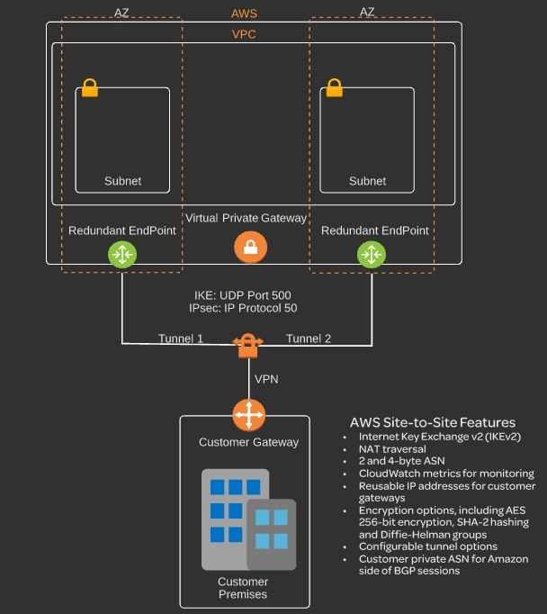

#### Site-to-Site VPN Routing

* The type of device you use for your on-premises VPN will determine if you will use static or dynamic routing
    * You cannot create static routes when using BGP
    * The preferred mechanism is dynamic routing, featuring BGP. If the on-premises device supports it
    * BGP advertises the routes to the Virtual private gateway
* Routes must be added to the route table, in order to direct any traffic destined for the customer gateway to use the VGW as the target
    * You can also enable route propagation to automatically propagate the routes to the route table for you (so you don't have to create the route manually)
    * The VGW only recognizes IP prefixes that have been added statically, or via BGP
    * There is a hard limit of 100 BGP route advertisements per route table. Use route summarization if you have more than 100 prefixes
        * Static routes are limited to 50 per route table
* The VGW advertises the IP ranges of the VPC to which it is attached via BGP advertisements to your VPN termination endpoint
    * The VGW uses BGP over TCP port 179 and supports BGP configuration options, like AS prepends and Multi-Exit Discriminator (MED)
* Path Selection after route propagation
    * The longest prefix match (the most direct route/route with the longest subnet mask) is used as the priority route
    * If propagated routes from Site-to-Site VPN or AWS Direct Connect overlap with the local VPC route, the local route is preferred. This is true even if the propagated route is more specific
    * Propagated routes from Site-to-Site VPN or AWS Direct connecting with the same destination CIDR as other existing routes are, then the static routes whose target is an IGW, VGW, network interface, Instance ID, VPC peer connection, NAt Gateway, or a VPC endpoint is selected
* If routes overlap within a Site-to-Site VPN and longest prefix match cannot be applied, then routes are prioritized as follows
    * BGP propagated routes from AWS Direct Connection
    * Manually added static routes
    * BGP propagated routes from a Site-to-Site VPN
    
#### Customer Gateway

* Customer Side from AWS Site-to-Site VPN
* May be configured with static routing or dynamic routing (BGP)
* Tunnel configuration cannot be modified once it's set
* Configuration four primary components
    * IKE security Association: Used to exchange keys used to establish the IPsec security
        * 32-bit (8-64 characters) pre-shared key (PSK) to establish the initial IKE association
        * IPSEC: IPSec Security Association: Handles the tunnel's encryption and authentication
        * Tunnel interface: Receives traffic going to and from the tunnel
            * A /30 CIDR block from the 169.254.0.0/16 range for use inside the VPN tunnel (there are some excluded ranges that cannot be used)
        * BGP: BGP peering optional but preferred, and is used to exchange routes between the Customer Gateway and Virtual Private Gateway
* NOTE: The VPN connection is not active until traffic is generated from the customer side of the VPN Connection
    * To keep the tunnel active, initiate regular traffic, i.e ICMP ping. The tunnel will close if idle for 10 seconds
    
#### VGW and VPN High Availability

* AWS side of the site-to-site VPN Connection
* VGW will have an assigned BGP ASN, but can specify an alternative private ASN number
    * Private ASNs range from 64512-65534
    * Use AS_Path prepending to influence route selection and avoid asymmetric routing
* The VGW is redundant device with endpoints in two different AZs
    * Customer Gateway is not redundant
    * HA and redundancy may be achieved by adding a second Customer Gateway
* Using BGP dynamic routing is also recommended, instead of manually created static routes
    * BGP has inherent failover capability and functionality that allows for streamlined selection of preferred path and failover

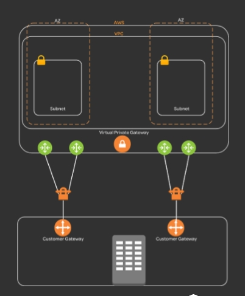    

### Software VPN

* EC2 with software VPN

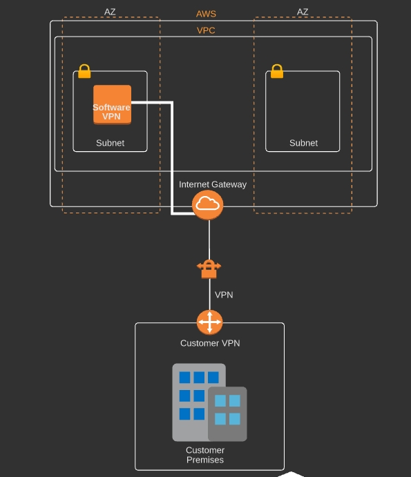    

### AWS Client-to-Site VPN

* based OpenVPN software
* client establish client VPN Endpoint
    * AWS Recommends associate at least two subnets in different AZs to client establish client VPN Endpoint
* Can apply security groups to restrict access to client vpn endpoints

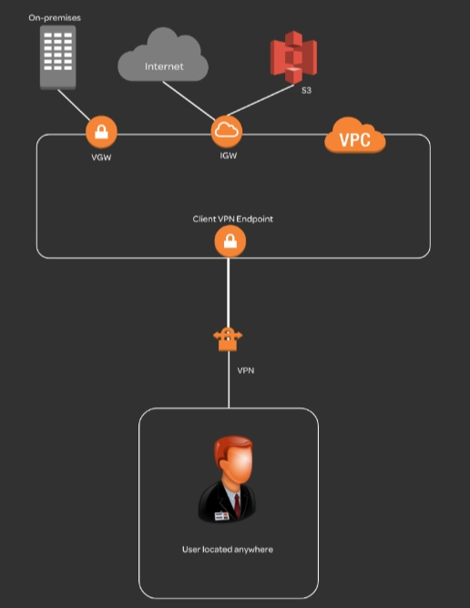 

### Monitoring

* Baseline
    * Monitor state of The VPN and data in or out of the tunnel
    * AWs provides tool to monitoring
* Cloudwatch Alarms
    * Cloudwatch can monitor the VPN, based on a single metric that you specify, and take actions based on the metric value relative to a provided threshold over a time period (Send SNS Topic)
    * aws cloudwatch list-metrics --namespace "AWS/DX"
* Consider monitoring
    * TunnelState
    * TunnelDataOut
    * TunnelDataIn

### AWS VPN CloudHub

* Allows multiple VPN connections to be attached a single VGW
* This can be used to provide redundant connections from a single datacenter for redundancy, so that if one Customer Gateway fails the redundant Customer Gateway can be used
    * When using it for redundant connections, the prefix should be the same (0.0.0.0/0)
* Multiple distinct dataceneters can also be connected to AWS VPN cloudHub
    * With multiple datacenters, the prefizes should be different each site to the VGW
* Connected VPNs may access the VPC viua the VGW, and other connected VPNs as well
    * VPN Cloudhub operates on a hub-and-spoke model that can be used with and without a VPC
* Different BGP ASNs are required for each VPN
* Routes will need to be updated within the VPC in order to route traffic to each VPN

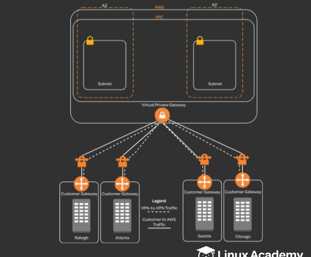

### Transit VPC

* Transit VPC build upon software VPNs, and make it possible to connect multiple geographically dispersed VPCs and remote networks
* This strategy allows for transitive routing between the member VPCs, the transit VPC, and the on-premises environment
* Transit VPC solves Edge-to-Edge routing
* Transit VPC has Ec2 instances with VPN software that advertises routes to each VGW with BGP
* Transit VPG has VPN connection to each VPC Member and on-prem

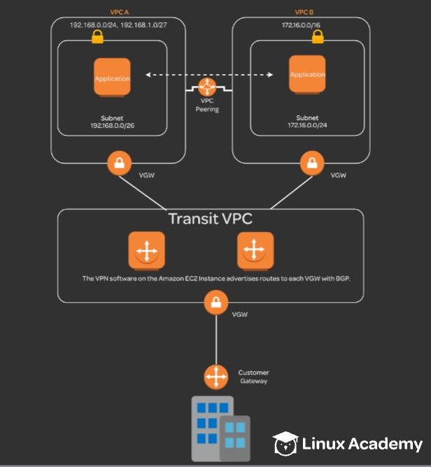

## Transit Gateway

* Hub-spoke model
* Only single connection is required from each VPC, VPN, and Direct Connection 
* Transit Gateway is used as a hub that controls how traffic is routed between all connected networks
* Routes from connected VPCs/networks can be automatically propagated to Transit Gateway
    * Transit Gateway maintains a routing table with routes for all connected networks. Static and Dynamic routing are supported
* Equal Cost Multipath (ECMP) is supported between on-premises gateway connections, enabling load balancing over multiple paths. ECMP can be used to aggregate bandwith
* 5 Transit Gateways per account are supported, and a single VPC can have maximum 5 Transit Gateway attachements
    * Transit Gateway limits include 5000 attachments, 1.25 Gbps per VPN, 50 Gbps per VPN, 50 Gbps maximum bandwidth per VPC, and up to 10000 routes
* Transit gateway routes do not propagate to VPC route tables. Entries must be made manually
* Overlapping CIDRs are not supported
* Can Attach VPN
* Need for Transit Gateway
    * The inability to create transitive relationships
    * A lack of edge-to-edge routing, meaning any VPN will have to connected directly to each VPC that it needs connectivity with
    * A complex management structure with no centralized management point

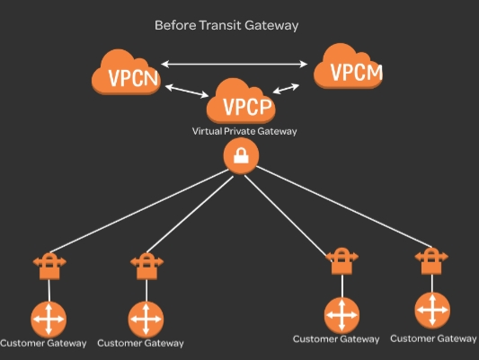

## Direct Connect

* Provides a private connectio from an on-premises environment to tha AWS network
* Connection can be a 1 GB or 10 GB
    * Less 1 GB require customer to use Direct Connect provider
* The customers extend their backbone network into the AWS Direct Connect provider's location, where a patch is available into the AWS network

* Requirements
    * Connection Type
        * Dedicated Conenctions: 1 Gbps or 10 Gbps. Supports up to 50 Virtual interfaces (VIF)
        * Hosted connections: Sub 1 GB with AWS Direct connect partner at 50-500 Mbps, and 1 Gbps, 2 Gbps, 5 Gbps, and 10 Gbps from select partners. A Hosted connection supports a single VIF
        * Hosted VIFS: Newer AWS partners are not allowed to provision Hosted VIFs because of the potential for over subscription, but some existing providers may still have this offering
    * Must use single-mode fiber with 1000 BASE-LX transceiver for 1 Gigabit Ethernet connection, or a 10GBase-LR transceiver for a 10 gigabit ethernet connection
    * Auto-negotiation must be disabled on the port and port speed, and full-duplex must be manually configured
    * 802.1Q VLAN encapsulation is required across the entire connection, including intermediary devices
    * The router that will be used to connect to the Direct connect must support BGP and BGP MD5 authentication
    * Bidirectional forwarding is optional
    * A Letter of Authorization-Connection Facility Assignment (LOA-CFA) is required for authorizing the connection into the AWS Network
    * Create the Direct connect connection in AWS console, specifying the name, Direct Connect location, and port speed
    * Download the LOA-CFA from the AWS Direct Console. (typically within 72 hours of the request submission), and create the cross-network connection. Create one LOA per connection, per data center
    * LOA-CFA expires after 90 days
    * Port-hour billing starts 90 days after the connection is created in the AWS console, or when the connection between your router and Direct connect endpoint is established.
    * AWS provides the router configuration necessary for connection to the AWS network
    * Hosted connections are purchased from an AWS Direct Connect Partner. The partner provisions the connection for you and authorizes the hosted connection to your account. You must accept the connection before you can use it
 
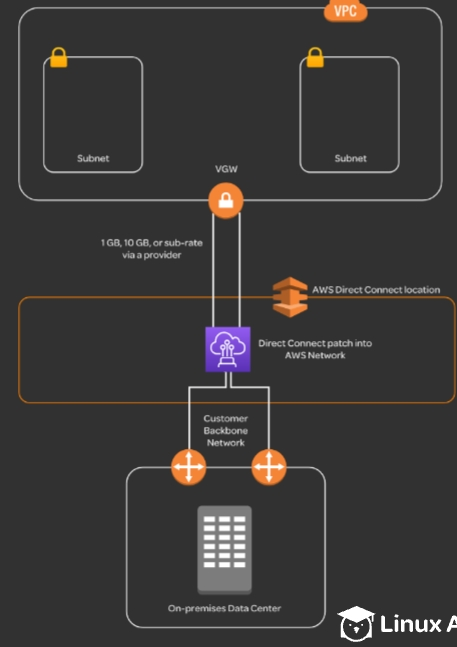

### Public and Private VIFs

* Virtual Interfaces (VIFs)
    * VIFs are logical connections between your router and the AWS Direct Connect router.
    * A max 50 VIFs may be created per physical interface
    * Both public and private VIFs can be created on the same Direct connect connection
    * All traffic on the Direct connect utilizes 802.1Q VLAN Tagging
    * VLAN tagging ensures that traffic is directed between the customer network and appropriate Public or Private VIF
* Public VIFs
    * Allow connection to AWS public endpoints such as S3, DynamoDB with dedicated network performance
    * Allow connectivity to all AWS public IP spaces via AWS advertised routes globally, except in China
    * Can be utilized to access VPCs in different regions. The network traffic used to access these public services remains on the AWS global network backbone
    * VIFS are 802.1Q VLAN Tags that are provisioned on the physical interface. BGP peers are configured on either end of the VIF
        * BGP is used on the VIF for dynamic route selection
    * Hosted accounts are accounts that utilize sub-rate throughput across a physical Direct Connection
        * VIFs for hosted connections may be created once they're accepted in the target AWS account
    * Prerequisites
        * Assign an ASN. A public ANS can be used if the ASN has been registered with IANA for public use. A private ASN can be used, but AS Path prepending will not work with a private ASN
        * Setting a unique and unused VLAN ID for the 802.1Q Vlan Tag, as all traffic for the VIF must be tagged
        * BGP peer public IP address (must be public on a Public VIF)
        * MD5 authentication
        * Specifying any prefixes you want to be advertise (advertised globally except China)
        * Jumbo Frames
            * The default is MTU 1500, but you can enabled jumbo frames by enabling MUT 9001 on the VIF. When using Jumbo Frames, the MTU size must be updated throughout the data path (the application and peer routes)
* Private VIFs
    * Allow connections to private services such as VPC.
    * Private VIFs can connect to a Direct Connect Gateway, which can associated with one or more VGWs in any AWS region except China
    * Non-AWS prefixes are not advertised
    * Hosted connections are also supported with private VIFs
    * If you choose to have AWS auto-generate the BGP peer IP CIDR, the IP address for both ends of the connection will be from 169.254.0.0/16 range
    * Prerequisites
        * Configuring the VGW and specifying the Amazon side ASN
        * Creating a Private VIF in the AWS Direct Connect console
        * Configuring the VIF with unique 802.1Q VLAN tag
        * VIF name and owner information (or Account ID if this is for another account)
        * Customer-side BGP Peer IP (option for AWS to generate: 169.254.0.0/26)
        * MD5 authentication for BGP peers (with an option for AWS to generate it)
* There is a maximum of 50 VIFS max per VGW ( think 50 BGP sessions per VPC)
* When utilizing hosted VIFs, the AWS Direct Connect owner hosts VIFS and can assign them to different accounts if desired
    * This means that the payer account is different than the account that will use the VIF
    * The VIF will show up in the other account as a VIF, and once accepted, the acceptor has full management of that hosted VIF

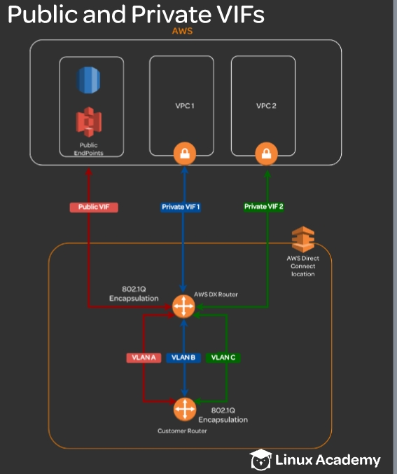

### LAG

* A link aggregation group uses the Link Aggregation Protocol (LACP) to aggregate multiple connections at single Direct Connect endpoint.
* This allows the connections to be treated and managed a single connection
* LACP allows for aggregation of bandwidth across multiple links
* The links are treated as active-active links
* All connections in a LAG must use the same bandwidth (1Gb or 10 Gb)
* All connections in the LAG must terminate at the same direct connect endpoint

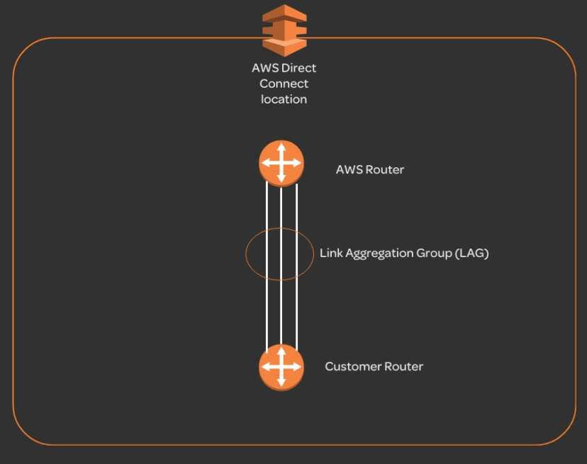

### Direct connect Routing

* Route for a VPC are selected and processed in the following order
    * VPC local routes are preferred (even over more specific propagated routes)
    * Longest prefix match
    * Propagated routes from the VGW
        * Direct Connect BGP routes
        * VPN static routes
        * VPN Dynamic routes
* Once they are passed to the Direct Connect Router, the routes are processed in the following order
    * Longest prefix-global
    * Local preference-global
    * AS-Path-Direct Connect location
        * If AWS network cost is equal, local preference is used
    * Routes considered equal can be load balanced
    * Static Routes
    * Propagated routes from the VGW
        * Direct connect BGP routes
        * VPN static routes
        * VPN dynamic routes
* Bidirectional forwarding is automatically enabled for each Direct connect virutal interface
    * But you must also enable it on your router
    * Bidirectional forwarding allows for faster routing reconvergence due to path failure
    * If bidirectional forwarding detects path failure, another route is selected

* Routing Scenarios

    * Basic Path selection on active/active links
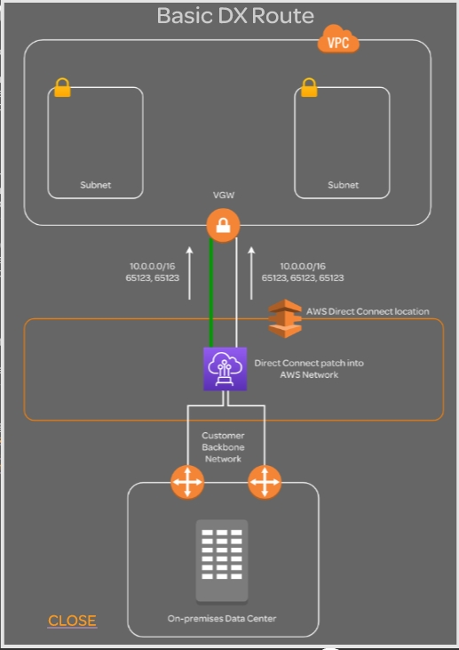
    * Route Selection with two datacenter
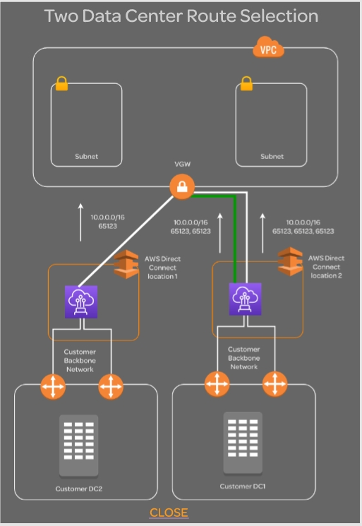
    * Longest prefix Match
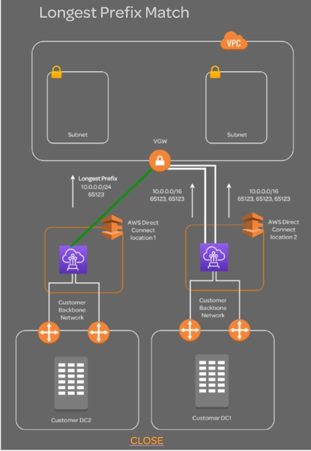
    
### BGP Communities

* A BGP community is metadata applied to a route prefix during route advertisement, to influence route selection
* The BGP ASN number and the BGP community number are advertised together
* For example, an ASN number of 65511 and a BGP community number of 5533 would be displayed as 65511:5533
* The following BGP communities are used to influence route selection
    * Public VIF route scoping (applied by you)
        * 7724:9100 - Local AWS Region
        * 7724:9200 - Continental Regions
        * 7724:9300 - Global/All regions
    * Scoping applied by AWS to public VIFs (applied by AWS)
        * 7724:8100 - Local (Home) Region
        * 7724:8200 - Continental Regions
        * No tag - Global
    * Private VIF egress route manipulation (local-pref)
        * 7724:7100 - Low preference
        * 7724:7200 - Medium preference
        * 7724:7300 - High Preference

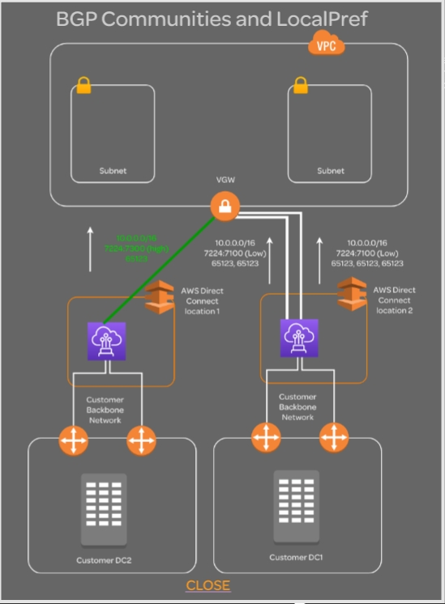

### Direct Connect Gateway

* When a private VIP requires connectivity to a single VPC in one region, the VIF can be directly attached to the VPC. But if there is a requirement to connect across multiple regions, Direct connect Gateway is what should be used
* Direct connect Gateway simplifies not only global connectivity across regional boundaries, but also BGP peering and VPC attachment
* Direct connect Gateway is redundant distributed peering point that mediates and aggregates Direct Connect peering and VPC attachment
* The Direct Connect Gateway attaches to the VGW associated with the VPC
* Creating the gateway requires providing an name and Amazon side-ASN
* The gateway can only be used for vpc attachment. Cannot be used for any AWS public VIF connectivity
* Each VGW may only be attached to a single Direct Connect Gateway
* Maximum of 10 VGWs can be attached to a Direct Connect Gateway, and a maximum of 10 VPCs may be attached to a single Direct Connect Gateway
* Hosted VIFs may also be attached to a Direct Connect Gateway
* Each Direct connect Gateway supports up to 30 private VIFS per gateway
* Make sure there are at least 2 VIF attachments for high availability, preferably across different Direct Connect routers (LAG connections would be on the same router)
* AWS has added multi-account support for Direct Connect Gateway. A maximum of 10 VPCs from multiple accounts may be associated with a Direct Connect Gateway
* The VPCs and the Direct Connect Gateway must be owned by the same AWS payer account
* Route advertisements managed with Direct connect Gateway
    * Overlapping CIDRs are not supported
    * Inter-VPC communication is not supported. Use VPC peering instead
    * VPC CIDRs are advertised as is. There is no route summarization or manipulation at Direct connect Gateway
    * Each Private VIF supports a maximum of 100 route advertisements on a VIF, because of route propagation
    * Cross communication between VIFS attached to the gateway is not supported
    * VPNs and Direct Connect Gateway both attach to a VGW, but cross communication is not support

### Redundancy and Resilient

* Single Data Center Redundancy

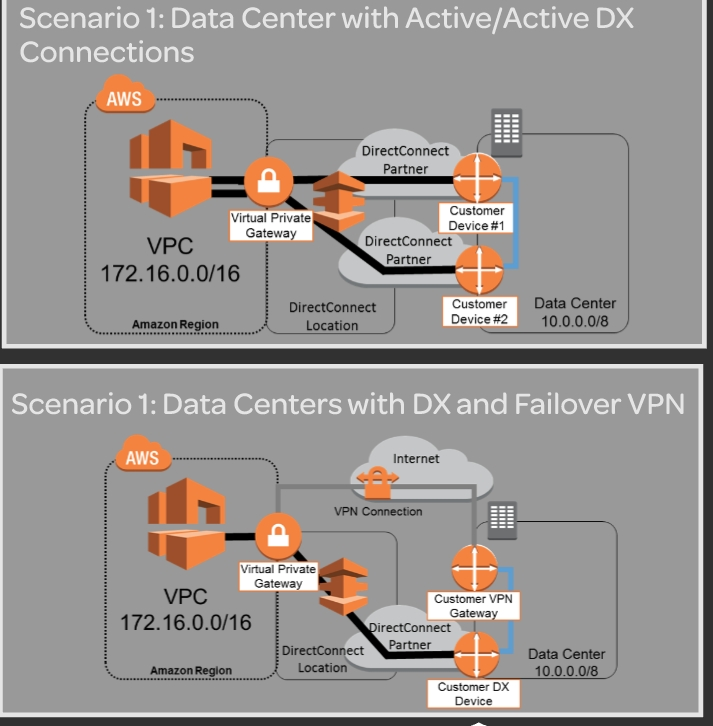

* Multi-Data Center Redundancy

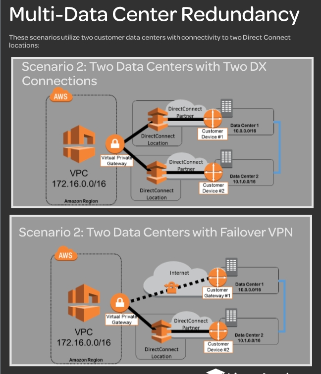

### Billing

* Based on port hours and outbound data transfer. There is no charge for inbound data transfer, and outbound data transfer is billed per GB
* Pricing for hosted connections vary based on capacity

### FAQs

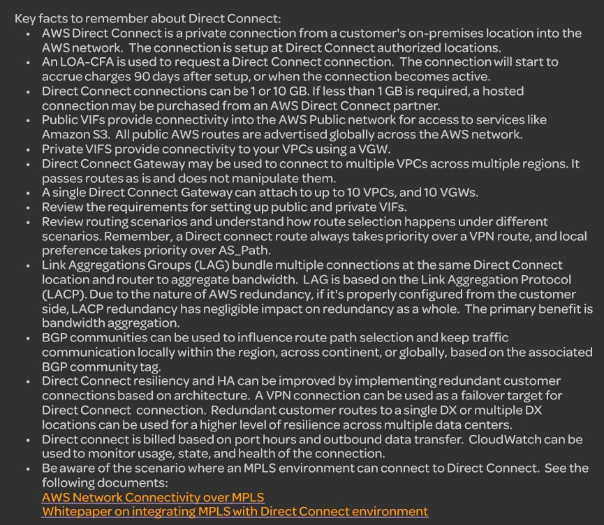

## DNS

### Delegating a subdomain to Route 53

* If you have a domain name that is hosted elsewhere, but would like to host the sub-domain on Route 53 without migrating the parent domain, you can create a hosted zone for the subdomain
    * You will need to create a Public Hosted zone for the subdomain. Do not modify NS or SOA records, and do not create additional records for NS or SOA
    * Update the parent DNS records by adding NS records for the subdomain. This delegates responsibility for the subdomain to Route 53
    * Also, ensure that the parent DNS service does not add an SOA record for the subdomain. Do not modify or delete the SOA record for the parent
    
### Dns Records

* NS (Name Server): Specifies which server is delegated as authoritative for the domain
* A record: points a domain/sub-domain name to an IP address
* AAAA record: Used for resolving hostnames to Ipv6
* CNAME (Cannonical Name): Point domain/sub-domain names to other domain names
* MX (Mail Exchanger): Directs email to a mail server. MX records always point to a domain name, not an IP Address
* Alias records: Can be used to resolve alternate names to an apex record.
* CAA (Certificate Authority Authorization): These allow domain owners to declare which certificate authorities are allowd to issue certificates for a domain
* NAPTR (Name authority Pointer Record): Typically used for internet telephony, the records are used to map servers and user addresses
* PTR: Used for Reverse DNS lookup, these use the IP address to get the associated domain name
* SOA (Start of Authority): Contain administrative info about a zone and is transferred with that zone to other servers
* SPF (Sender policy Framework): They specify a list of authorized host names/IP addresses that mail can originate from for a domain
* SRV (Service Record): This is a special record that allows for specifying the port in addition to the IP
* TXT (Text Record): These allow the addition of text about the server, network, or other info

* Records have additional detail such as TTL. Once a record is retrieved, the requesting server will cache the data for the time defined in the TTL

### Routing Policies

* Determines how Route 53 will respond to queries
* Health checks can be used with routing policies
    * If a resource is determined to be unhealthy, it will be removed from consideration before the routing policy is applied
* Routing Policies
    * Simple: default. Used when single resource performs function for the domain. Ex: load balancer in front of a website
    * Weight: Multiple resources can be associated with weight DNS. These resources perform the same function, and Route 53 will respond to DNS queries by selecting a resource from the group based on the weight
        * The lower the weight, the smaller amount of traffic that resource will receive
        * A value of zero will stop all traffic to that resource
        * The higher the weight, the more frequently that resource will receive traffic
    * Latency-Based: Traffic routed based on the lowest network latency for the end user
        * This option works best when resources are in multiple AZs or Regions
    * Failover: Are used for active-passive failover. If resource fails a health check, the passive resource becomes active
    * Geolocation: Chooses the route based on the geographic location of user
        * Works by using a database to map IP addresses to locations
    * Multivalue: Allows multiple values to be returned in response to a query. These values might be for IP address of web servers
        * It can be used as a type of round-robin method for seleting a resource
    * Health Checks - Route 53 health checks the health of resources, including web servers and applications
        * Monitoring includes health of a specific resource, like a web server, the status of other health checks, or cloudwatch alarms
        
### Hybrid DNS

* AWS DNS resolver is what resolves domain names from the VPC's private hosted zone within Route53
    * Cannot resolve domain names across VPN or Direct Connect, as it does not answer queries from outside its own network
* Route 53 resolver endpoints use ENIs for inbound and outbound (bi-directional) DNS resolver queries between on-premises and VPCS
    * The endpoints can resolve queries for VPCs in multiple accounts, as long as the resources are all in the same region, and are using Resource Access Manager
* Each VPC uses the + 2 resolver for the VPC, and forwards to the DNS Resolver Endpoint ENI in the hub VPC

* Scenario 1: An on-premises client needs to resolve the DNS name of a server inside of a VPC. The on-premises server contacts an EC2-based DNS server acting as forward

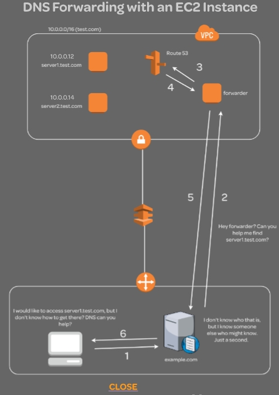

* Scenario 2: An on-premises client needs to resolve the DNS name of a server inside of a VPC. The on-premises server contacts a DNS Endpoints (Inbound Point)

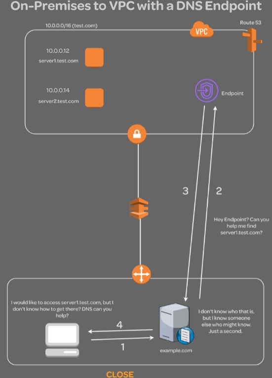

* Scenario 3: A server in a VPC needs to access on-premises client. Route 53 uses (Outbound Endpoint) a conditional forward rule to query the on-premises DNS server

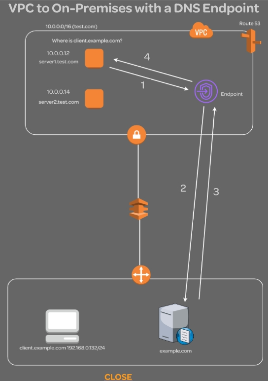

* Prior to the introduction of Route 53 DNS Endpoints, the DHCP options set in the VPC would have to be updated with the DNS forwards as a custom DNS server. This was because the forwarder had to device if the requests should have been set to Route 53, or the on-premises DNS server

### AD DNS Forwarding

* Active Directory can be used to forward DNS Queries for non-authoritative domains
* It is an alternative way to setup DNS resolution between on-premises and the VPC
    * AWS supports DNS forwarding using Simple AD or AWS Directory Services and Microsoft Active Directory
    
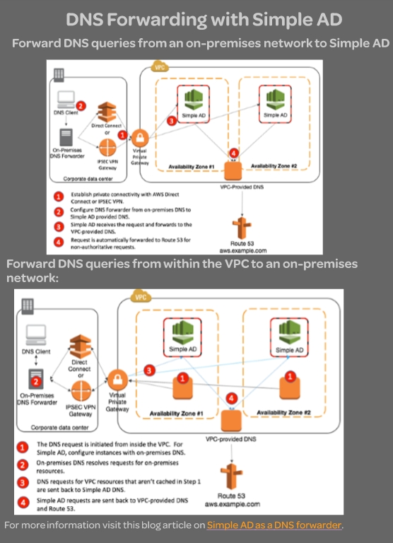

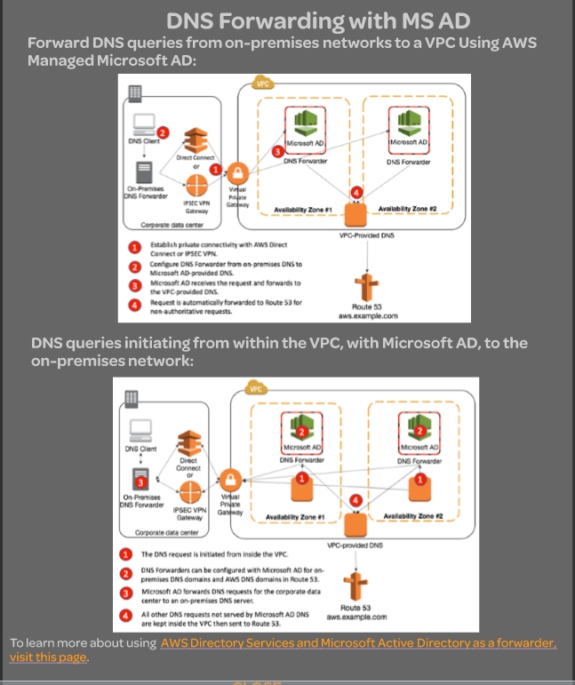

### Shuffle Sharding

* Needs a fault tolerant client
* Works for servers, queues and other resources
* Fixed assignements
* Needs a routing mechanism: per-customer DNS Names, pre-resource DNS names or a shuffleSharding-aware routing

### DNS filtering to your NAT instance with Squid

## Load Balancers

* Types
    * Application Load Balancer:  Works at layer 7 of the OSI Model (HTTP/HTTPS)
    * Network Load Balancer: Works at Layer 4 (TPC)
    * Classic Load Balancer: Works at layer 4 and 7 of the OSI Model (TCP and HTTP/HTTPs)
* Minimum of /27 subnet required for the Load balancer and a minimum of 8 free IPs
* SGs and NACLS may be applied. The rules will need to allow communication between the private instances and ELB
* Connection Dranning ensures that client connections are closed before an instance is taken out of service. The default is 5 minutes, but it can be anywhere between 1 sencond and 1 hour
* SSL negotiation between the clients and ELBs are called security policies
    * The security policy is a combination of SSL protocols, SSL ciphers, and server order preference
    * SSL 2.0 is deprecated; SSL 3.0 and TLS 1.0, 1.1., 1.2 are supported
* Access logs are published every 60 minutes, but the interval can be either 5 or 60 minutes

### Classic Load Balancer

* Designed for EC2-Classic
* Supports multi-Az environment
* Health checks
* SSL Offloading
* Sticky sessions - Sessions maintained based on duration or may be controlled by an application cookie
* Supports Layer 4 and 7
    * Layer 4 to applications that only require TCP
    * Layer 7 is used for HTTP/HTTPS, X-Forwarded, and sticky session
* Proxy Protocol can be used to add a human-readable header to the request header and can include information such as source IP, destination IP and port numbers

### Network Load Balancer

* Operates Layer 4
* EC2, microservices and containers as targets
* Can maintain low latency - Being capble of handling millions of requests per second
* Optimized for unpredictable traffic patterns, and supports using a single static IP address per Availability Zone
* Both Static and Elastic IP support
* TLS Termination
* Health checks- Application health checks can check a URL on target
* DNS Failover using route 53 is possible. The NLS will redirect to another AZ if fail instances are unhealthy in particulary AZ
* Flow Logs are supported and Cloudwatch Logs
    * Access logs can be enable to capture information about the TLS connections that the listener receives. This provides visibility into sucessful and failed TLS Handshakes, so that they may be reviewed
 
### Application Load Balancer

* Operates Layer 7
* Evaluates listener rules to determine what rule to apply, and then selects a target from the target group. The target rules can route requests do different target groups based on contents of the application traffic
* Instances can be added and removed from the target group as needed
* Ec2 instances, containers (ECS), IP addresses and Lambda functions as targets
* Path-based routing is supported
* Host-based routing supported . supports multiple domains using a single load balancer
* Supports Custom HTTP responses
* ALB supports redirecting requests from one URL to another
* Users may optionally be authenticated using corporate or social identities before routing requests
* Health checks are the target level, which allows for auto scaling based Cloudwatch metrics
* Supports AWS WAF
* Sticky Sessions. Maintained based on duration or AWS ALB Cookie. Application based cookies not supported
* ALB supports IP based targes, which allows for targets outside of the VPC ( on-premises)

### ELB Sandwich

* At times virtual load balancers may offer features that are not native on AWS
* It is possible to use combination of Load Balancers with Virtual load balancer applicances running on an EC2 Instance
* The ELB is accessed using the fully qualified Domain name (FQDN) of the load balancer
    * Route 53 record can optionally be used to reference the load balancer
* The first level load balancer, in this case, balances the load across the virtual load balancer instances
    * Ex: HA Proxy or F5 LTM Big-IP Virtual
* The virtual load balancer then forwards traffic onto the second layer of ELBs, which then load balance the front end application tier
* Virtual Load balancers sometimes have issues forwarding to a FDQN, and this can cause issues whtn the IP address of the Load Balancer changes.
    * Recommended use FDQN and a Route 53 Alias record to reference the load balancer
    * If the virtual applicance has trouble resolving FDQNs for the next hop, use a Network Load Balancer as the sencond ELB tier
    * The NLB uses a single IP per AZ, which the virtual load balancers can point to instead of having to perform periodic lookups and caches of Classic Load Balancer's IP

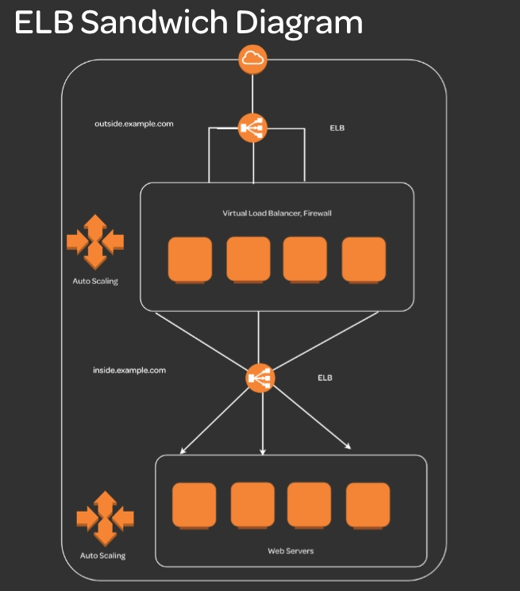

## Cloudfront

* Supports HTTP or WebSocket protocols (dynamic and static web pages, applications, images, media files or other file downloads) 
* Supports RTMP distributions, can stream media files using Adobe Media Server and Adobe RMTP
    * When using RMTP distributions, cloudgron admins must distribute media players as well as the media files themselves
* Origin can be combination of EC2, S3 buckets, media services or non-AWS origins
* Origin data is copied to web distribution
* Cache-control headers set by the origin server control how long the data stays cached on Cloudgront
* Setting TTL for objects in cloudfront distribution can also control cache time
* Objects that need to be removed before the cache expires can simply be invalidated
* Cloudfront assigns a domain name to the distribution and, if desired, a Route 53 alias
* HTTPS - In wbe distributions, Cloudfront can require HTTPS for requests
    * Users can also be redirect if they access an HTTP endpoint
    * Pulls from origins can also use HTTPS, but note that HTTPs is not supported between S3 and cloufront
    * Connections between CLoudfront and origins support TLS1.1, TLS1.2 and SSL3
    * The origin protocol policy can be set to HTTP only, HTTPs only, Or Match viewer
    * To for https between Cloudfront and origins set the Origin Portocol setting in cloudgront to Match Viewer
        * The viewer protocol policy must also be set to require HTTPS
* AWS ACM
    * Can manage certificates from cloudfront and renewal
    * Self-signed certificate between the origin and Cloudfron is not supported
* Access Logs
    * Cloudfront can create log files that include detailed information about all requests received for bot RTMP and Web
    * S3 is required as a location to store logs
* Cloudfront Security
    * Supports custom headers to requests from origin
    * The header can be used to help validate that requests made to your origin were actually sent from Cloudfront
    * The origin can be configured only allow requests that contain the custom header values specified
* Field-Level Encryption
    * This allows secure user-submitted data uploads, and encrypts the data at the edge location
    * The data remains encrypted until the hand-off to your application
    * A private key is required to decrypt the data
    * Encrypt specific fields in a Post request ( like a credit card number on a purchase form)
* WEB WAF
    * Integrates with AWS Shield, WAF and Route 53 to create security perimeter against things like DDoS attacks
    * Cloudfront can essentially absorb the attach by moving the primary attack surface away from your critical infra and data
    * WAF can be used for controlling access to Cloudfront data
        * Can specify Ip address as criteria for allowing or blocking access
        * Unauthorized access wil get HTTP 403 forbidden error response
* Private Content
    * Signed URLs: Valid only during a specific time frame and, optionally, can be restricted to specific IP address
    * Signed cookies: Requires authentication via public and private key pairs
    * OAI: restrict access to an s3 bucket to a special Cloudfront server associated to the distribution
        * This ensures that cloudfront is not bypassed for direct access to the bucket
* Lambda Edge
    * For costumization of content that is delivered to cloudfront
    * Inspect cookies and rewrite URLS for A/B testing of website
    * Rturn different objects based on user device type
    * Return different objects based on cookies
    * Generate an HTTP response based on origin requests
    
## Application Architectures in Hybrid Cloud Infrastructure

### AWS Directory Service

Active Directory integrates with AWS Directory Services. In scenario where Active Directory or LDAP are required for cloud or hybrid cloud environments, AWS recommends the following services:

* AWS Directory Service for Microsoft Active Directory (Standard allows up to 5000 users and 30000 directory objects, or Enterprise Edition with to 500000 directory objects). AWS Directory Service for Microsoft Active Directory supports AD-aware workloads and application services such as Amazon Workspaces, Workdocs, QuickSight, Chime, Connect and RDS for Microsoft SQL Server
    * It it also used for LDAP support in Linux Applications
* AD connector is recommended if the on-premises users are the only ones that need to log into the AWS application or service. The connector also allows Amazon EC2 instances to join the on-premesis Active Directory domain
* Simple AD is a low cost, low sale directory with basic Active Directory and LDAP compatibility
    * Is available in two sizes, with small supporting up to 500 users and large up to 5000
    * It does not support multi-factor authentication or trust relationships
    * Compatibility with Workspaces, WorkDocs, QuickSight and workMail
    * Designed for use as stand-alone directory, to support either windows workloads with basic AD features or linux workloads that require and LDAP service
    
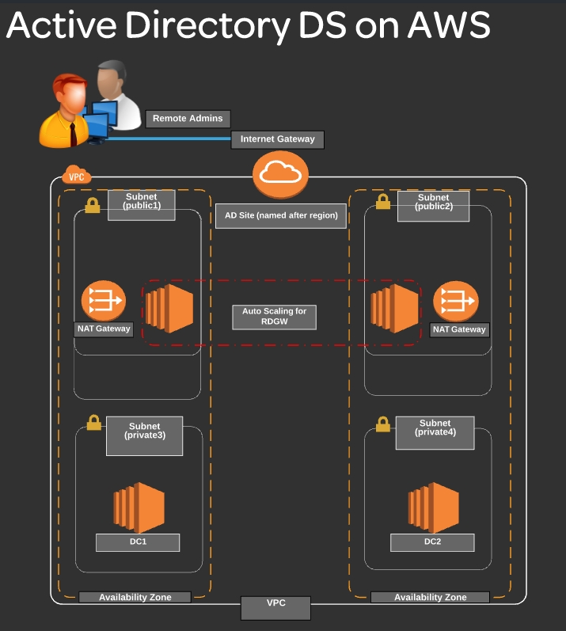

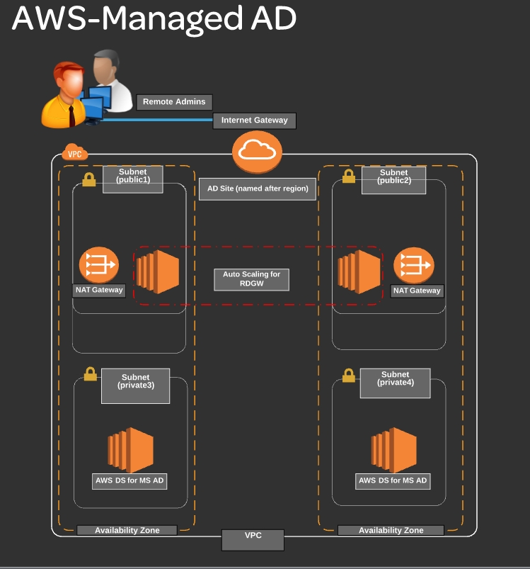

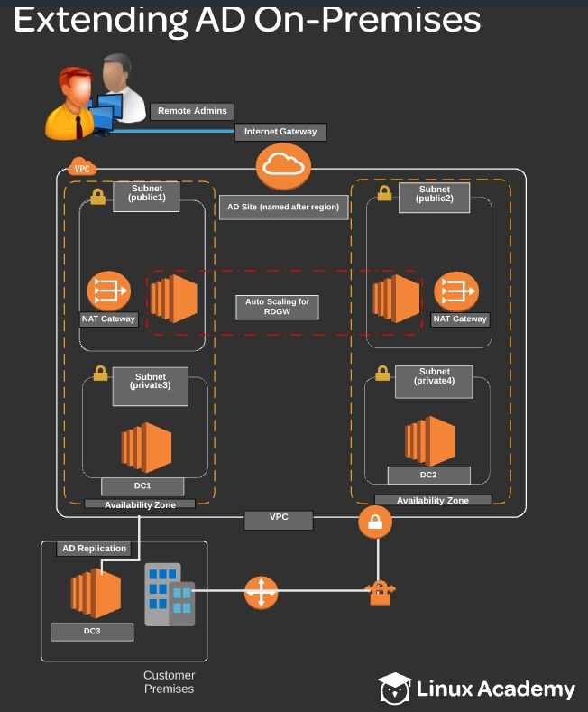

### Storage in Hybrid Architecture

* Accessing S3 from on-premises Networks
    * A public VIF can be used in a hybrid environment to access S3, as S3 is a service that the AWS public network can access
    * A proxy server (i.e Squid proxy) can direct traffic to the VPC Endpoint from inside the VPC. So a private VIF directs traffic into the VPC, where a NLB could optionally be used to then direct traffic to the proxy server
        * The proxy server would direct all traffic to the Endpoint. The clients would use settings that direct to the load balancer.
        * The proxy EC2 instances might become a bottleneck for network throughput
        * A transit VPC architecture can be used to achieve this architecture
* Accessing EFS Storage
    * A private VIF can be used to mount an EFS file system to on-premises servers
    * EFS mount targets may be accessed by IP using NFS mount commands from the client
    * Port 2049 must be allowed through the security group and NACL configuration
    * Using DNS forwarding or the /etc/hosts file can resolve the EFS mount names
    * The AWS EFS utilities can provide TLS encryption using STunnel and simplified file system mounting
* Storage Gateway
    * Enables on-premises applications to use AWS Cloud Storage. There are 3 types of gateways
    * File Gateways - support S3, using protocols like NFS
    * volume Gateway are for using EBS storage, and allow the use of the ISCSI protocol
    * Virtual tape library supports using virtual media changer, virtual tape drives and virtual tapes
    * Storage Gateway uses S3 Endpoints to access Amazon public IP services like S3
    * Virtual and physical appliances are available. Storage Gateway provides low latency by caching frequently accessed data, while keeping the data in the cloud
    
### Public VIF to S3

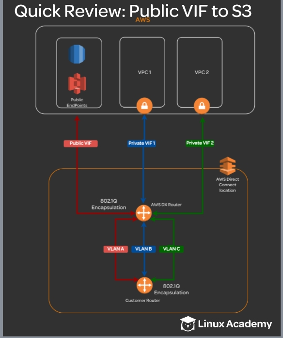

### VPN Over AWS Direct Connect

If an application requires consistent network performance, Direct Connect is a good option.
Direct connect, however, does not provide encrypted communication across the connection.
A VPN can be established on DX Connections. This allows for encrypted, IPSec communication across the DX connection, providing encrypted communication with a low-latency, consistent bandwidth solution

## Implementing AWS Cloud Services with Specific Network Requirements

### Workspaces

* Managed Desktop as a Service
* Provisions cloud-based Microsoft Windows
* Each desktop is provisioned as dual-homed
    * One Interface has access to a customer specific VPC
    * Other has access to an AWS management VPC that allows external connectivity
* A private CIDR in the range of one of the following is automatically assigned to the management VPC
    * 172.31.0.0/16
    * 192.168.0.0/16
    * 198.19.0.0/16
    * Must ensure that your VPC CIDRs do not overlap with the assigned management VPC CIDR
* Workspaces requires the following
    * A client device that supports AWS Workspaces
    * A VPC with one public and two private subnets
        * Directory Services requires two subnets in multi AZs
    * A directory service for authenticating users
        * AWS Managed AD and simple AD are supported
        * Active Directory (Simple AD or AWS Managed) and AWS Directory Services are both supported. In a hybrid environment, the on-premises AD server works with AWS Directory Services so that users can use their existing user credentials
    * Security Groups
    * A round trip time for latency under 100 ms
        * It it's between 100 ms and 250 ms, the user can access the Workspaces but performance is degregaded
    * A VPC the connection that supports a maximum MTU of at least 1200
    
### APP Stream 2.0

* Is a secure application streaming service that allows for streaming desktop applications from any device with a web browser, without rewriting the applications
* Application performance is responsive with features like instant on. Instant on is a features of always-on fleets
* Always-on fleets are best for users that need high-available and instant access to applications
* On-demand fleets require up to two minutes to start
* Networking Requiremnts:
    * HTML5-compatible web browser
    * A VPC with a subnet for APPStream 2.0, or two subnets for high availability
        * Every user is connected to a separate instance
    * Security Groups are used to control access to AppStream 2.0

### Lambda
    
* IP address requirements vary based on invocation count for lambda functions. The current soft limits is 1000 for region
* For HA, use multiple subnets that span AZs
* Security Groups are used to control access to each Lambda function
* Lambda functions cannot be assigned public IP addrsses. A Nat Gateway or Nat Instance would be required for Internet Access

### ECS

Four modes for container network connectivity

* Bridge is the default option and it bridges from a containers internal network to a common docker network
* The host option maps containers directly into the host network
* AWSvpc lets you attach an ENI directly to each container. This is the only option available when using containers with AWS Gargate
* For instance based Amazon ECS each instance in the cluster needs an IP address in the subnet. If using awsvpc mode each container will require an IP address in the subnet
* Security Groups are used to control access based on ports required by the containers
* Public IP addresses, NAt or HTTP proxy are reqired for container instances to access the ECS service endpoint

### EMR

* Managed Hadoop framework for fast processing of large amounts of data
* Launch in a Single AZ for performance and cost optimization
* DNS hostnames must be enabled within the VPC
* The private CIDR that is assigned to the VPC must be 10.0.0.0/8, 172.16.0.0/12 or 192.168.0.0/16 range. Using Public IP addresses can be cause DNS name resoltion issues
* Connectivity to the public AWS environment is required for access to S3 for logging and Amazon SQS for debugging support.
    * DynamoDb access may also be required if EMR will interact with DynamoDB tables
    * VPC Endpoints may be used to access these services

### Elastic Beanstalk

* Internet accessibility through the use of a public IP address or NAT
* Outbound UDP port 123, for NTP time synchronization in the security group
* Inbound rule for EC2 or a load balancer (i.e port 80/443)
* The default VPC is used for Elastic Beanstalk if no customization is made
    * If customized, a VPC with appropriate network connectivity is required
    * Security gorups and NACL vary, depending on the application
    
### RDS
 
 * A VPC with at least two subnets in different AZs
    * When subnet groups are created, RDS requires subnets in at least two different AZs
    * The DB instance IP addresses is selected from a subnet in the preferred AZ
* Public access to a database requires DNS hostnames and DNS resolution to be enabled in the VPC

### Database Migration Service

Requires access to the internet with public IP or Nat gateway, and security groups with appropriate ports (based on the database being migrated)

### Redshift

* Enchanced VPC forces all traffic to flow through the VPC
    * equires a network path between your cluster's VPC and data resources
* A VPC with subnet redshift, and enough IP address for each node plus, including the leader node
* A security group to control access to the cluster
* Enabled DNS hostnames on the VPC
 When using enchanced routing, a VPc endpoint is required for connectivity to S3. If access is for S3 in another region, then a public IP, internet Gateway or NAT is required
 
## Manage, Optimize and Troubleshooting the network

### Network performance basis

Factors that can affect network performance

* Bandwidth is the maximum rate of transfer over the network. Bandwidth is typically measured in Mbps or Gbps. The actual transfer rate will vary from bandwidth as latency protocol, and other factors will affect throughput
* Latency is the delay between two points, cn be measured in one-way trip or Round Trip Time (RTT) between two points. The ping command is often used to check RTT
* Jitter is typically seen with voice applications. Jitter is caused by a variance in delay over time for things such as processing delays
* Throughput is the rate of data transferred sucessfully. Bandwidth, latency and packet loss affect throughput
* Packet loss is the percentage of packets dropped in transmission. TCP based applications are sensitive to packet loss
* MTU specifies the largest packet that can be sent over a network. MTU 1500 is commonly used for most traffic on the internet and WAN environments. Jumbo frames are packets larger than 1500 bytes but are commonly express as MTU 9001. Remmeber, traffic leaving VPC(i.e VPC Peering) uses a MTU size of 1500. So does Direct connect and traffic crossing IGW
* The type of instance selected affects networking speeds and server features
* Placement Groups enable higher bandwidth and lower latency between members of the placement group
* Instances can be launched as EBS Optimized. EBS optimized instances achieve dedicated troughput between EC2 and EBS with speeds between 500 and 4000 Mbps. This speed varies based on the type of instance. EBS optimized images also max out I/O performance for the instance and EBS storage
* Nat Gateway is horizontally scalable within an AZ, and can forward up to 10 Gbps of traffic. Nat Gateways are preferred over NAT Instances for performance and scalability
* Enchanced networking provides lower latency and higher throughput. We previously discussed Enchanced networking and Placement Group
* Jumbo frames provider higher throughput. MTU 9001 is recommended, with placement groups. Jumbo frames is supported within a VPC, but not for inter-VPC communication
* VPN endpoints support 1.25 Gbps per tunnel. ECMP (Equal cost Multipath) is supported for load balacing traffic across both links
* Cloudwatch monitors metrics including NetworkIn, NetworkOut, NetworkPacketsIn and NetworkPackests out for an instance.
    * VPN metrics include tunnel status, and data in and data out
    * DX connection metrics include TunnelSate and bit rate for inbound and outbound data packet rate, health of fiber and CRC Error count checks