# AWS Certified Solutions Architect Professional

[Cantril Git](https://github.com/acantril/aws-sa-pro)

[Solutions Architect – Professional (SAP-C01) Sample Exam Questions](https://d1.awsstatic.com/training-and-certification/docs-sa-pro/AWS-Certified-Solutions-Architect-Professional_Sample-Questions.pdf)

## General Terms
 
### RTO VS RPO

* RTO - Recovery time objective
    * Time between the DR event and full recovery
    * Influenced by process, staff, tech and documentation
    * Generally lower values cost more
* RPO - Recovery point objective
    * Time between last backup and the incident
    * Amount of maximum data loss
    * Influences technical solution & cost
    * Generally lower values cost more
 
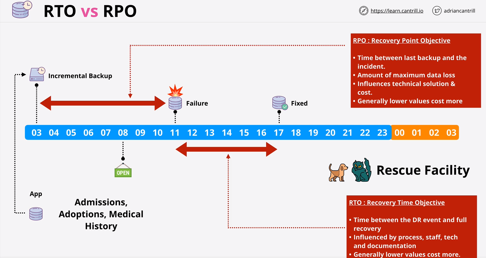

## Advanced Permissions & Accounts

### Security Token Service (STS)

* Generates Temporary credentials (sts:AssumeRole*)
* Similiar to access keys
* They expire and don't belong to the identity
* Limited Access
* Used to access AWS resources
* Requested by an Identity (AWS or EXTERNAL)

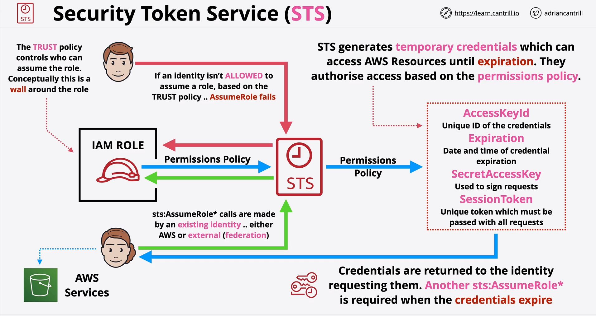

* Revoking IAM Role Temporary Security Credentials
    * Roles can be assumed by many identities
    * Who all get the same permissions
    * Temporary credentials can't be cancelled
    * All assumptions = the Roles permissions policy
    * Credentials can last hours
    * Delete Role, change permissions impact ALL assumers
    * Changing the Trust policy has no impact on existing credentials
    
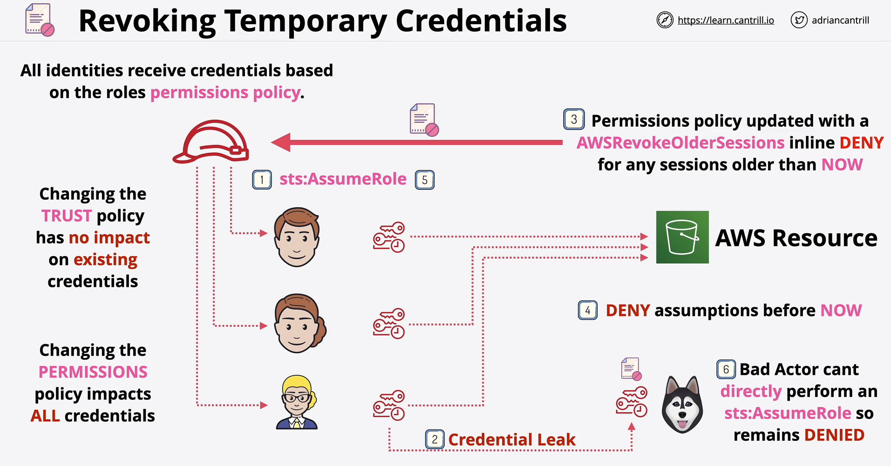

### Permissions Boundaries

* Boundaries can be applied to IAM Users or IAM Roles
* Only identity permissions are impacted by boundaries
    * Any resource policies are applied in full
* Permissions boundaries don't GRANT any access on their own. They define maximum permissions and identity can receive

### Policy Evaluation Logic

* Same Account
    * Explicit Deny
    * Organization SCPs
    * Resource Policies
    * IAM identity Boundaries
    * Session Policies
    * Identity Policies

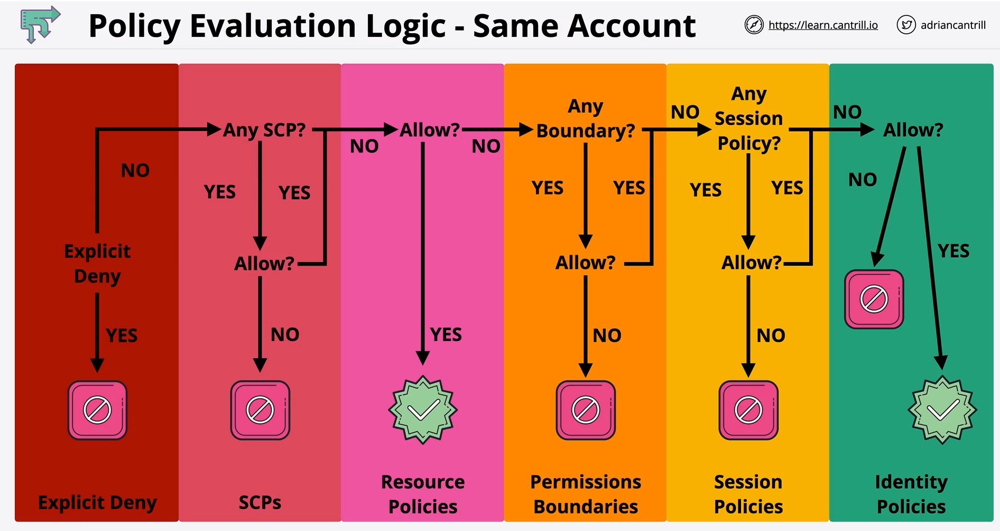

* Different Account
    * Both accounts need aprove

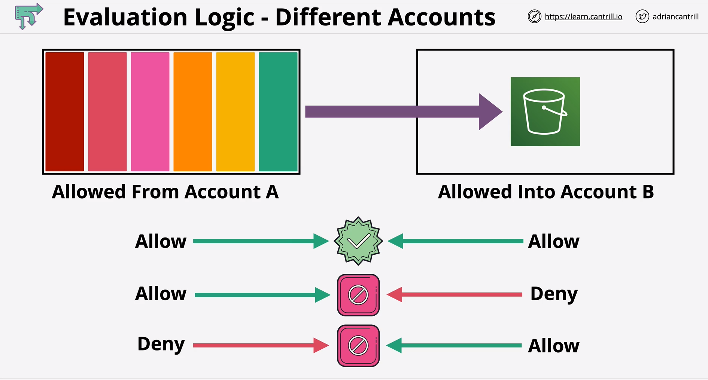

### Resource Access Manager (RAM)

* Share AWS resources between AWS Accounts
* Products need to support RAM
* Shared with Principals (Accounts, OU's or ORG)
* Shared resources can be accessed natively
* No charge for using RAM - Only the service cost
* Substantial changes to traditional AWS Architectures
* Owner account creates a share, provides a name
* Owner retains full ownership
* Defines the principal with whom to share
    * If participant is inside an ORG with sharing enabled its accepted automatically
    * For non ORG accounts, or sharing with AWS Organizations is not enabled - you need to accept an invite
 * VPC Owners create and manage the VPC $ Subnets and can share to participants
 * Participants can provision services into the shared subnets, read and reference network objects but not modify or delete them
 * Participants cannot view or modify resources created by other participants - But resoruces can communicate via L3 networking
 * VPC Owners cannot delete or modify resources created by participant VPCs
 * Some resources can be shared with any account, some only with ORG Accounts
 

## Advanced Identities & Federation

### SAML

* SAML 2.0 (Security Assertion Markup Languague)
* Open standard used by many IdP's (e.g MSADFS)
* Indirectly use on-premises IDs with AWS (Console & cli)
* Enterprise identity provider ... SAML 2.0 Compatible
* Existing identity management teams
* Single source of truth ... more than 5000 users
* Uses IAM Roles & AWS Temporary Credentials ( 12 Hour validity)

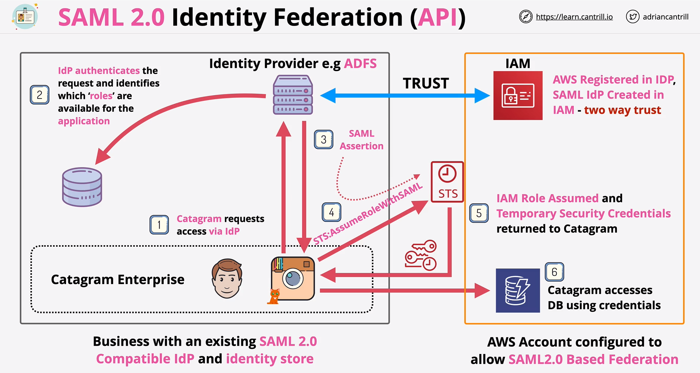

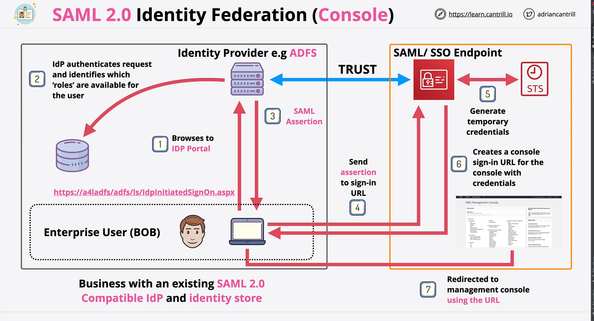

### AWS SSO

* Manage SSO Access - AWS Accounts and External Applications
* Flexible Identity Source
* AWS SSO - Built-in identity Store
* AWS Managed Microsoft AD
* On-premises Microsoft AD (Two way trust or AD connector)
* External identity Provider - SAML2.0
* Preferred by AWS vs traditional 'workforce' identity federation
* Integrates with OnPrem Active Directoy via AD Connector or Trust
* Provides centralised permissions management across accounts
* Support business applications (dropbox, slack, ...)
* Support custom SAML Applications

### Cognito

* Authentication, Authorisation & User Management
* Web and Mobile Applications
* Login ..to cognito directly or other identity providers
* Exchange for AWS credentials
* Access AWS resources using those credentials
* Data Synchronisation, identity Merging, managed login UI

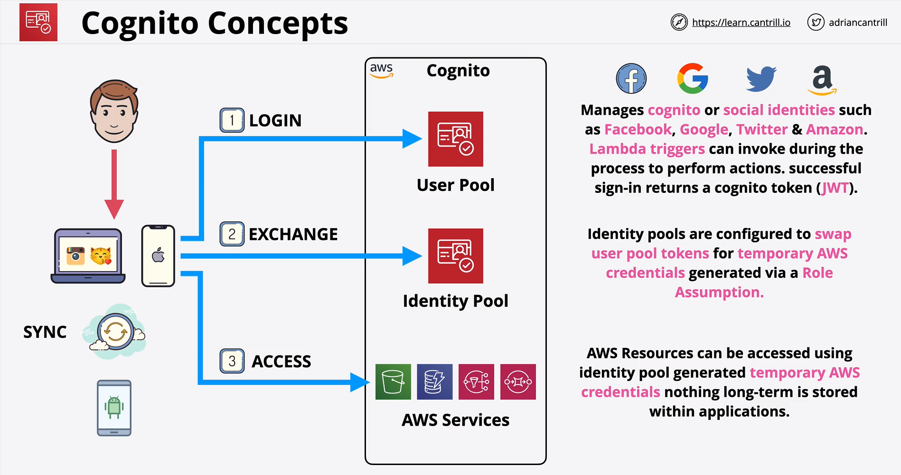

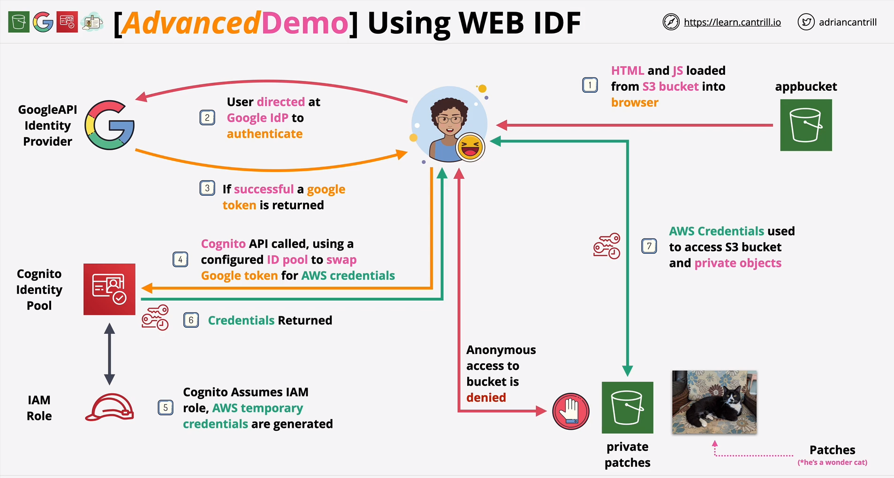

### Workspaces

* Desktop-As-A-Service (DAAS) - Home-working /office
* Similiar to Citrix/Remote Desktop - Hosted by AWS
* Consistent desktop from anywhere - apps and state
* Windows & Linux - Various sizes
* with or without AWS provided Apps & Custom Images
* Monthly or Hourly Pricing
* Uses Directory Service (Simple, AD, AD Connector) for authentication and user management
* Workspaces use an ENI in a VPC ... use VPC networking
* Windows - Access FSx and EC2 windows resources
* Or on-premises resources over VPN or Direct Connect
* At-rest encryption (EBS + KMS)

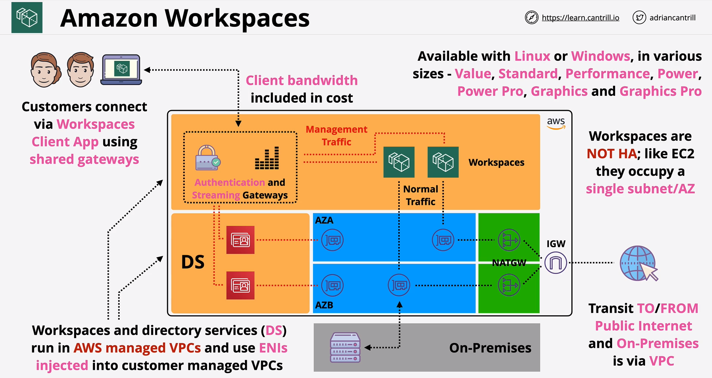

### Directory Service

#### Microsoft AD

* Built using Microsoft Active Directory 2012 R2
* Managed using Standard Active Directory tools
* Supports Group Policy and single sign-on (SSO)
* Supports schema extension - MS AD Aware Apps
* Sharepoint, SQL, Distributed File System (DFS)
* Two sizes - standard (30000) & Enterprise (500000)
* Used for AD authentication/authorisation of products and services within AWS
* Highly-Available by default (2AZ+)
* Includes monitoring, recovery, replication, snapshots and maintenance - configurable; managed by AWS
* Supports one-way and two-way external and forest trusts with on-premises active directory
* Directory in AWS - Can operate through a network link failure to any connected on-premises systems
* Supports RADIUS-based MFA
* Best choice for more than 5000 users and if you need trust relationships between AWS and your on-premises directories
* Automatic Patching and maintenance
* Integrates with RADIUS/MFA
* Trusts & Schema Extensions & Actual Microsoft AD
* Support AWS Services which support authentication and authorization via Directory Service
* Microsoft AD is the only directory service type which supports AD Native Schema extensions
* These are required by some AD Applications
* An existing on-premises directory can be extended as part of a SSO process or during a migration into AWS. Existing corporate identitoes can be used to sign-in to AWS workloads. Use microsoft AD when you want /need an AWS directory presence
* Identity Federation with other cloud platforms & applications such as Azure AD or Miscrosoft 365
* EC2 Windows and Linux Instances configured for authentication, authorization and management
* Supports one-way or two way trust
* Exam Tips - Microsoft AD
    * If need natively microsoft AD
    * If need support microsoft schema extensions and trusts
    * Integrates with Radius with MFA (AD Connector also supports)
    * Use DirSync Server or MS ADFS Server
    * Larger number of users
    * If want continue running if the link beetween on-prem and aws failure
    * Pick AD connector instead of this if don't want any directory data in AWS
    
#### AD Connector

* A Pair of directory endpoints running in AWS (ENIs in a VPC)
* Supports directory-aware AWs products
* Redirects requests to existing directory servers
* No directory data stored in AWS ... all redirected
* Use existing on-premises AD with directory compatible AWS services - without any identity data in AWS
* Proof of concepts, where you need to use existing identities
* Two sizes (Small and Larger)
    * No explicit limits
    * Controls the amount of compute allocated
* Multiple AD Connectors can be used to spread load
* Requires 2 subnets within a VPC in different AZs
* Connector requires 1 or more directory server(s) to be configured
* Requires a working network connection (via Direct Connect or VPN)
* Exam Tips
    * No local identity data in AWS
    * This mode is useful for a proof of concepts where you need to use on-premises identites but don't want to configure a full AWS based directory
    * There are risks for larger deployments - failure of the network connectivity will impact functionally
    

## Networking

### Route 53

* Simple
* Failover
* Weight
* Latency-based
* Geolocation
    * Country
    * Continent
    * Default
* Multi-value
    * Simple Routing with Health Checks
    
### IPv6

* Nat is not used, because every IPv6 is public routable
* Each VPC can be Ipv6 enabled which allocates an IPv6 CIDR
    * example 2600:1f18:8e1:2200::/56
    
### VPC Structure

* How many AZs
    * How many AZ-failures have to be tolerated? 1 (Buffer AZ)
    * AZ's in region (6) minus Buffer AZs(1) = 5 (Nominal AZs)
    * Minimum APP Requirements? 5 Nominal Instances
    * Nominal Instances / Nominal AZs (5/5)... optimal 1 per AZ
* How many Subnets
    * Number of APP subnets * AZs = number of subnets needed
    

## Storage Services

### FSx For Windows

* Fully managed native windows file servers/shares
* Designed for integration with windows environments
* Integrates with Directory Service or Self-Managed AD
* Single or Multi-Az within a VPC
* On-demand and Scheduled Backups
* Accessible using VPC, Peering, VPN, Direct Connect

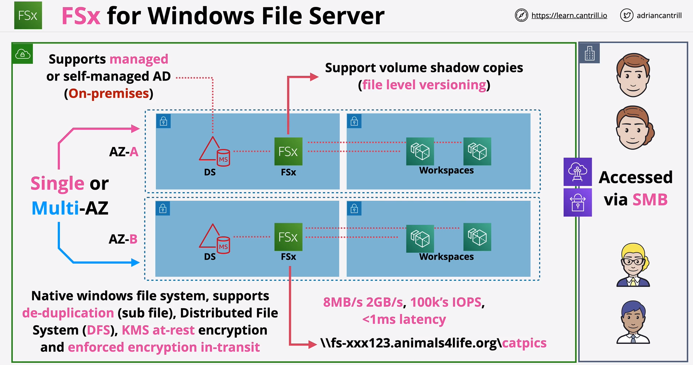

* Key Features and Benefits
    * VSS - User - Driven Restores
    * Native file system accessible over SMB
    * Windows permission model
    * Supports DFS .. scale-out file share structure
    * Managed - no file server admin
    * Integrates with DS and your own directory

### FSx for Lustre

* Managed Lustre - Designed for HPC - Linux Clients (POSIX)
* Machine learning, Big Data, Financial Modelling
* 100's GB/s throughput & sub milisecond latency
* Deployment types - Persistent or scratch
    * Scratch - Highly optimised for short term no replication & fast
    * Persistent - longer term, HA (in one AZ), self-healing
* Accessible over VPN or Direct Connect

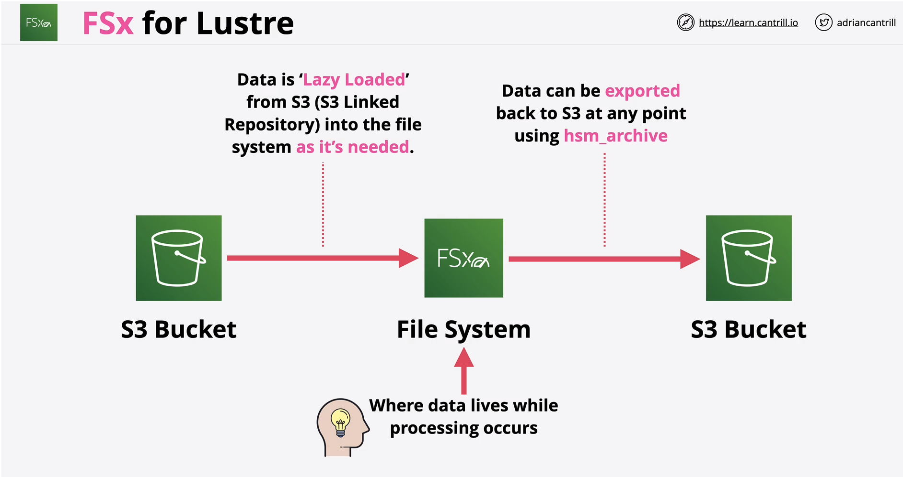

* Metadata stored on Metadata targets (MST)
* Objects are stored on called object storage targets (OSTs)(1.17 TiB)
* Baseline performance based on size
* Size - min 1.2TiB then increments of 2.4 TiB
* For Scratch - Base 200 MB/s per TiB of Storage
* Persistent offers 50 MB/s, 100 MB/s and 200 MB/s per TiB of Storage
* Burst up to 1300 Mb/S per TiB (Credit System)

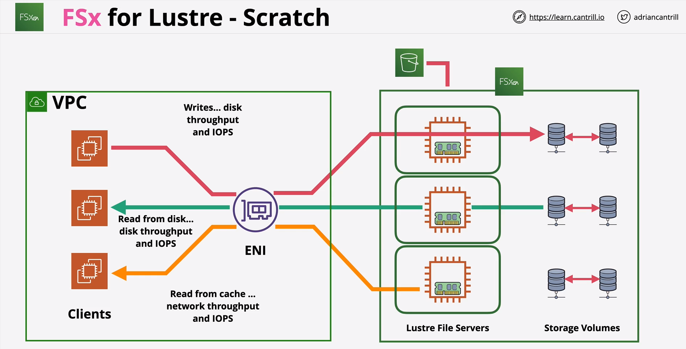

* Scratch is designed for pure performane
    * Short term or temp workloads
    * NO HA... NO REPLICATION
    * Larger file systems means more servers, more disks and more chance of failure
* Persistent has replication within one AZ only
    * Auto-heals when hardware failure occurs
* You can backup to S3 with both (Manual or automatic 0-35 day retention)

### EFS

* EFS is an implementation of NFSv4
* EFS Filesystems can be mounted in Linux
* Shared between many EC2 Instances
* (By Default) Private service, via mount targets inside a VPC
* Can be accessed from on-premises - VPN OR DX
* Access via Lambda!! - Larger File Systems
    * Needs to be configured to use VPC Networking

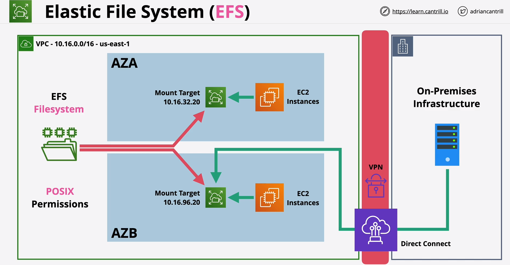

* Linux Only
* General Purpose and Max I/O Performance Modes
    * General Purpose = default for 99,9% for use cases
    * Max I/O - > For data analytics and high performance (In this case, can consider FSx For Lustre)
* Bursting and Provisioned Throughput Modes
* Standard and infrequent Access (IA) Classes
    * Lifecycle Policies can be used with classes
* File System Policy
    * Can Prevent root access by default
    * Can Enforce Read Only access
    * Can Enforce in-transit encryption for all clients
    

### S3
 
#### Storage Classes
 
 * Standard
    * Objects are replicated across at least 3 AZs in the AWS Region
    * Billed a GB/m fee for data stored
    * Billed per 1000 requests
    * No retrieval fee, no minimum duration, no minimum size
    * 99,99 (11 9) durability
    * Content MD5 Checksums ans Cyclic redundancy checks (CRCs) are used to detect and fix any data corruption
    * Use this class to Frequently accessed data which is important and Non Replaceable
    * S3 Standard has a miliseconds first byte latency and objects can made publicly available
* Infrequent Access
    * Differences for S3 Standard
        * Retrievel fee
        * Minimum duration charge of 30 days - Objects can be stored for less, but the miimum billing always applies
        * Has a minimum capacity charge of 128 KB per object
    * It's cost effective for data not frequent access, for data not stored short term or very tiny objects
    * Should be used for long-lived data, which is important but where access is infrequent
* One Zone - IA
    * The Difference for Infrequent access is does not provide the multi AZ resilience model
        * Only one AZ is used within the region
        * 99,99 (11 9s) durability unless the AZ fails
    * Should be used for long-lived data which is NON-Critical & replaceable and where access is infrequent
* Glacier
    * Normal
        * Same durability, stored in at least 3 AZs like Standard
        * Objects cannot be made publicly accessible... any access of data (beyond object metadata) requires a retrievel process
            * Data in Glacier is retrieved to S3 Standard-IA temporarily
                * Expedited -> 1 - 5 Minutes
                * Standard -> 3 - 5 Hours
                * Bulk -> 5 - 12 Hours
                * That means the Glacier has first byte latency = minutes or hours
        * 40 KB min size
        * 90 Day min Duration
        * Should be used for archival data where frequent or realtime access isn't needed. Minutes-hours retrieval
    * Deep Archive
        * 40 kb min size
        * 180 Day min duration
        * Retrieval
            * Standard (12 hours)
            * Bulk (up to 48 hours)
        * Should be used to archival data that rarely if ever needs to be accessed - hours or days for retrieval. e.g. Legal or Regulation data storage
* Intelligent-Tiering
    * Has 4 tiers
        * Frequent Access
        * Infrequent Access
        * Archive
        * Deep Archive
    * Monitors and automatically move objects not acessed for 30 days to a low cost infrequent access tier and eventually to archive of deep archive tiers
    * Objects are accessed, they are moved back to the frequent access tier. There are no retrieval fees for acessing objects, only a 30 min duration
    * Archive configurations can be set on buckets (prefix & tags)
    * To move objects even colder tiers when objects aren't accessed (90 or 180 day minimum)
    * Has a monitoring and automation cost per 1000 objects
    * Frequent access tier costs the same as S3 Standard and the others are also equivalents
    * Should be used for long-lived data, with changing or unknown patterns

#### Lifecycle Configuration

* A Lifecycle configuration is a set of rules
* Rules consist of actions on a bucket of groups of objects
    * Transition Actions
        * Works like waterfall. Objects can be transition to all storage classes below
        * S3 Standard -> S3 Standard - IA -> S3 Intelligent Tiering -> S3 One Zone-IA -> S3 Glacier -> S3 Glacier Deep Archive
        * Considerations
            * Smaller objects can cost more in Standard IA and S3 Intelligent Tiering (because minimum size)
            * Standard IA and One Zone IA -> minimum of 30 days before transition
            * A single rule cannot transition to Standard-IA, Intelligent-tiering or One Zone-IA and then to either Glarcier type ... within 30 days (duration minimus)
    * Expiration Actions
        * Can delete versions (current and previous) after x days
        * Can delete previus versions x days after becoming previous version
        * Can clean up expired object delete markers
        * Can clean up incomplete multipart uploads

#### S3 Replication

* Two Types
    * Cross-Region Replication (CRR)
    * Same-Region Replication (SRR)
* Replication Configuration
    * Applied to source Object
    * Use SSL
    * Use IAM Role to be assumed by source bucket
    * In Different Account
        * It's necessary add Bucket Policy to trust in Source Bucket IAM Role
    * Options
        * All objects or a subset
        * Storage class 
            * default is to maintain
        * Ownership
            * Default is the source account
        * Replication Time Control (RTC)
            * Guarantteed 15 minute replication SLA - Without this is Best Effort
            * Adds monitoring
            * Only use if have restrictments requirements to make sure the destination bucket and source are the same as close is possible
    * Considerations
        * Not retroactive & Versioning (Source and Destination) needs to be ON
        * One Way replication - Source to Destination
        * Can replicate Unencrypted, SSE-SS3 & SSE-KMS (with extra config) objects
            * Not capable replicate objects using SSE-C
        * Source bucket owner needs permissions to objects
        * No system events, Glacier or Glacier Deep Archive cannot be replicated
        * Deletes are not replicated
    * Why Use
        * SRR 
            * Log Aggregation (several logs buckets)
            * PROD and TEST Sync
            * Resilience with strict sovereignty
        * CRR
            * Global Resilience Improvements
            * Latency Reduction
            

#### S3 Encryption

* Bucket are not encrypted, objects are
* Two Types
    * Client-Side Encryption
        * The AWS cannot see the data
        * You create the key, manage the key and the encryption. S3 only use to storage
    * Server-Side Encryption
        * Server-Side Encryption with Customer-Provided Keys (SSE-C)
            * Client Manages Keys
            * AWS Manages Encryption
            * Client provides plain text object and Key in PUT - Aws Encrypts and generate as hash and discards the key
            * Client needs provide the same key in decryption (An generated Hash by AS will identify if is the same Key)
            * Save CPU requirements of encryption and decrypt process
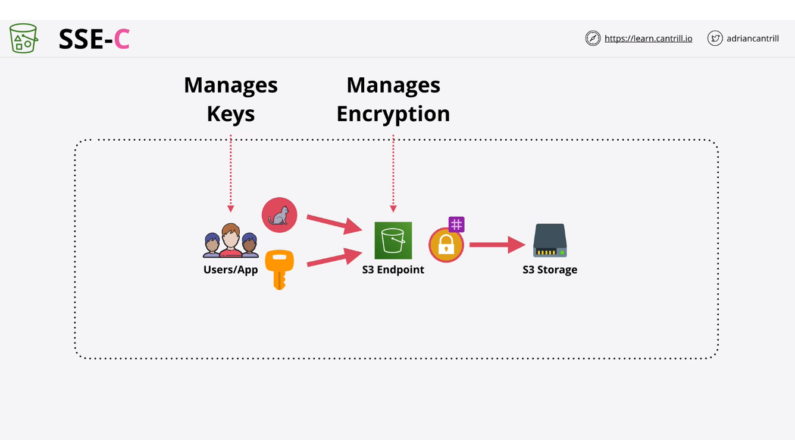
        * Server-Side Encryption with Amazon S3 Managed Keys (SSE-S3)
            * AES256
            * AWs Manages Encryption & keys
            * AWS Creates a Master Key to all objects, this keys encrypt a new key used to encrypt the object. Uncrypted key is discarded
            * Not suitable
                * If you need control the keys and key material
                * If you need role separation. Example: If you have a S3 Full administrator and don't have him have possibilty to decrypt the data
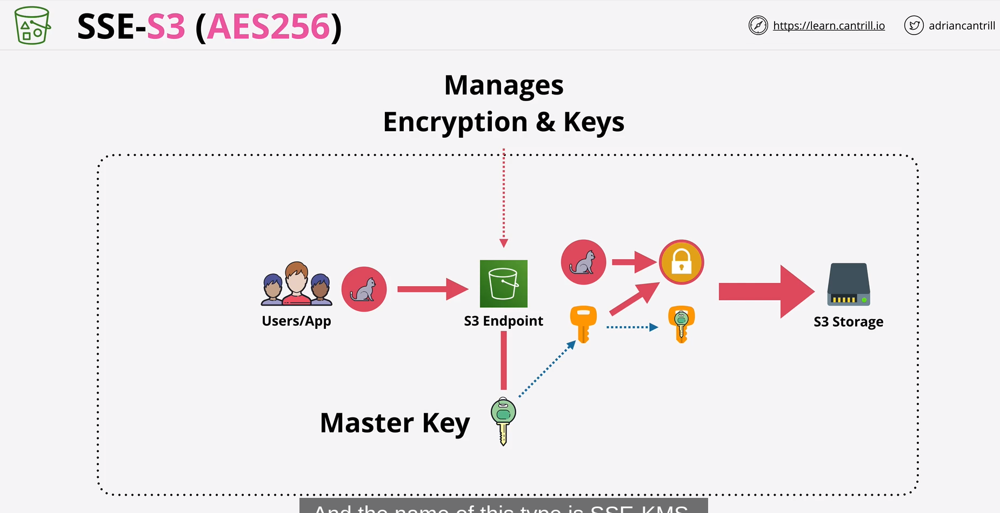
        * Server-Side Encryption with Customer Master Keys (CMKs) Stored in AWS Management Service (SSE-KMS)
            * Similiar with SSE-S3, but master key is handle by KMS Service
            * Provides role separation. Controls CMK rotation
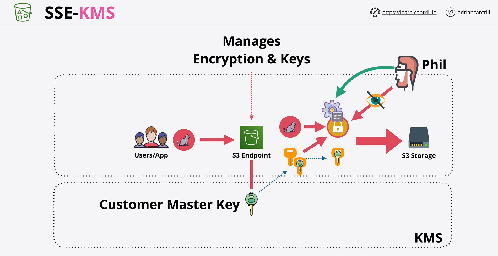

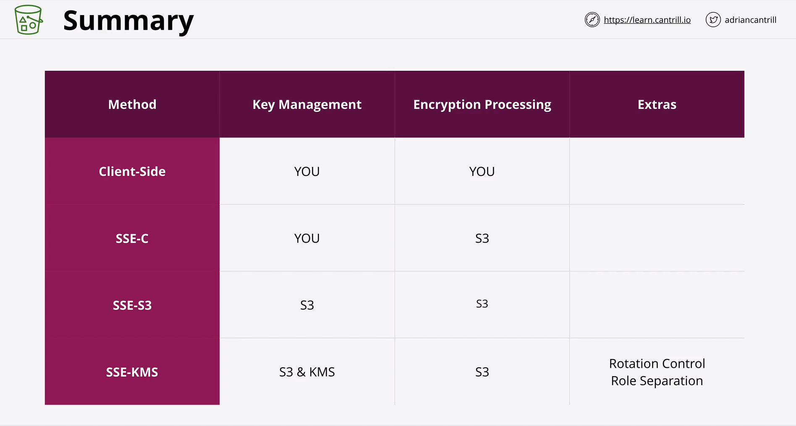

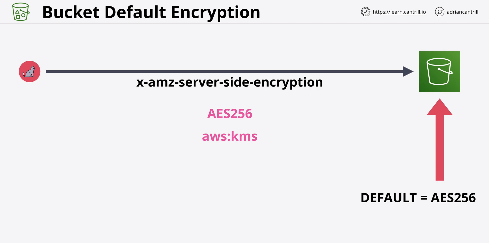

#### Presigned URLs

* Can be used to PUT or GET Requests
* You can create a URL for an Object you have no access too
* When using the URL, the permissions match the identity which generated it
* Access denied could mean the generating ID never had access .. or doestn't now
* Don't generate with a role .. URL stops working when temporary credentials expire

#### S3 Select and Glacier Select

* S3 can store huge objects (up to 5TB)
* You often want to retrieve the entire object
* Retrieving a 5TB Object ... takes time
* Filtering at the client side doesn't reduce this
* S3/Glacier select let you use SQL-Like statements
    * Only to select part of the object, pre-filtered by S3
* Supported files: CSV, JSON, Parquet, BZIP2 compression for CSV and JSON
* SQL-like expression provided to S3 select, selection happens at the S3 service
    * Data delivered by S3 is pre-filtered
    * Up to 400% faster
    * Up to 80% cheaper
    

#### S3 Object Lock

* Object Lock enabled on new buckets (Support req for existing)
* Write-Once-Read-Many (WORM) - No Delete, No Overwrite
* Requires Versioning - individual versions are lock
    * Can't be disabled, and object lock once enabled, can't be disabled too
* S3 Object Lock Retention Period
    * Specify DAYS & YEARS - A Retention Period
    * Compliance Mode
        * Can't be adjusted, deleted, overwritten
            * even by the account root user
        * Until retention expires
    * Governance Mode
        * Special permissions can be granted allowing lock settings to be adjusted
        * S3:BypassGovernanceRetention
            * Needs to provide the header x-amz-bypass-governance-retention:true (console default)
* S3 Object Lock Legal Hold
    * No retention
    * Set on an object version - ON of OFF
    * No Deletes or changes until removed
    * s3:PutObjectLegalHold is required to add or remove
    * Prevent accidental deletion of critical object version
* A bucket can have default object lock settings or define per object

### Amazon Macie

* Data Security and Data Privacy Service
* Discover, Monitor and Protect Data ... stored in S3 Buckets
* Automated discovery of data i.e PII, PHI, Finance
* Managed Data Identifiers - Built-In - ML/Patterns
    * Credentials, finance, Health, personal identifiers
* Custom Data Identifiers - Proprietary - Regex Based
    * Regex
    * Keywords - optional sequences that need to be in proximity to regex match
    * Maximum Match Distance - How close Keywords are to regez pattern
    * Ignore Words - if regex match contains ignore words, it's ignored
* Findings
    * Policy Finding
        * Policy:IAMUser/S3BlockPublicAccessDisabled
        * Policy:IAMUser/S3BucketEncryptionDisabled
        * Policy:IAMUser/S3BucketPublic
        * Policy:IAMUser/S3BucketSharedExternally
    * Sensitive data findings
        * SensitiveData:S3Object/credentials
        * SensitiveData:S3Object/CustomIdentifier
        * SensitiveData:S3Object/Financial
        * SensitiveData:S3Object/Multiple
        * SensitiveData:S3Object/Personal
* Integrates - With Security Hub & Finding events to Event Bridge
* Centrally manage ... either via AWS ORG or one Macie Account inviting

### EBS and Instance Store

#### EBS

* Network Storage - Separate from EC2
* Provisioned in one AZ - risk of failure
* Volumes can be resized and snapshotted
* Can be detached and reattached
    * Generally 1 EBS Volume is attached to one EC2
    * Multi-attach for io1 is the exception
* Follow instances between EC2 Hosts
* Different types & performance for volumes
* Per instance max storage performance
* Types
    * HDD (MB/s focussed or low cost)
        * No boot Volumes
        * Burst MIB/s pool - replenishes when consuming less than base MiB/s
        * Not use for Boot, High IOPS, low latency
        * Two Types
            * st1
                * Frequently accessed
                * throughput optimized
                * 40 MiB/s per TiB base
                * 250 MiB/s per TiB Burst
                * 500 Mib/s max IOPS
                * May be used for streaming requiring consistent fast throughput with low price requirement, Bid data, wharehouse
            * sc1
                * Infrequently acessed
                * 12 MiB/s per TiB base
                * 80 MiB/s per TiB Burst
                * 250 Mib/s max IOPS
                * throughput-oriented storage for large volumes where is infrequent access
    * SDD
        * Based (IOPS Focus) 
            * Can be boot volumes
            * Burst IOPS pool - replenishes when using less than base IOPS
            * gp2 
                * 1 GiB-16TiB
                * Max 16K IOPS (3 per GiB)
                * linked to size
                Max throughput per volume 250 MiB/s
            * io1/io2
                * 4 GiB
                * 16 TiB
                * Max 64K IOPS
                    * (50 or 500 per GiB)
                    * IOPS controllable independent of size
               * Max throughput per volume 1000 MiB/s
* Raid
    * Raid 0 - striped
        * So two volumes can achieve 128k IOPS
        * Data is spread across n disks . Size * n capacity. IOPS * n IOPS
        * EC2 Instances maximum 160k IOPS limit (network)
            * 3 io1/io2 volumes in raid 0 can achieve 192 k iops -> wasted capacity
    * Raid 1 - mirror
        * Can tolerate 1 volume failures

#### Instance Store

* Disks physically in an EC2 Host
* A Selection allocated to Ec2 Instances
* Data lost if hardware fails or instance moves between hosts
    * Stop and start trigger instance moves host
* Size cannot be adjusted because the disks are physical
* High performance (IOPS and MB/s) because they are locally connected
* Temporary nor for persistent data
* Can be striped (Raid 0 for even higher performance)

#### Exam Tips

* Cheap = ST1 or SC1
* Throughput ... streaming ... ST1
* Boot -> Not ST1 or SC1
* GP2 can deliver to 16K IOPS
* IOP1/IOP2 - up to 160k IOPS
* More than 160K IOPS - Instance Store

## Compute, Scaling & Load Balancing

### Regional And Global AWS Architecture

* Global
    * Global Service Location & Discovery
        * Globally DNS is used for service discovery and regional based health checks and request routing
    * Content Delivery (CDN) and optimisation
        * Are used to cache content globally - as close to end users as possible to improve performance
    * Global Checks & Failover
* Regional entry point
    * Scaling & Resilience
    * Application services and components
    
### EC2 

#### Purchase Options

* On-demand
    * No interruption
    * No capacity reservation
    * Predicatable pricing
    * No upfront cost
    * No discount
    * Usage
        * Short term workloads
        * Unknown workloads
        * Apps which can't be interrupted
* Spot
    * Cheapest
    * Never user Spot for workloads which can't tolerate interruptions
    * Non time Critical
    * Anything which can be rerun 
    * Bursty Capacity needs 
    * Cost sensitive workloads
    * Anything which is stateless
* Reserved
    * Unused Reservation still billed
    * Partial coverage of larger instance
    * Reservations are for 1 year or 3 years terms, you pay for the entire term
    * Purchase
        * No upfront
        * Partial upfront
        * All upfront means no per second fee
    * Types
        * Standard
        * Scheduled Reserved
            * Ideal for long term usage which doesn't run constantly
            * Batch Processing daily for 5 hours starting at 23:00
            * Weekly data, sales, analysis ... every Friday for 24 hours
            * 100 hours of EC2 per month
            * Doesn't support all instance types or regions
            * 1200 hours per year
            * 1 year term minimums
* Dedicated Host
    * Pay per Host
    * Use for software which is licensed based on sockets or cores in physical machine
    * Host affinity links instances to hosts
* Dedicated Instances
    * You don't own, or share the host
    * Extra charges for instances, but dedicated hardware
    * Where requirements say you can't share hardware

##### Capacity Reservations

* Order Priority
    * Reserved Instances
    * On-demand Instances
    * Sport Instances
* Options
    * Regional Reservation
        * Needs to commit to 1 or 3 years
        * Provides a billing discount for valid instances launched in any AZ in that region
        * While flexible they don't reserve capacity within an AZ - Which is risky during major faults when capacity can be limited
            * They are launched with same priority as on-demand instnaces
    * Zonal reservations
        * Needs to commit to 1 or 3 years
        * Apply to one AZ providing billing discounts and capacity reservation in that AZ
        * Full Price & No capacity reservation in another AZs
    * On-Demand capacity reservations
        * Can be booked to ensure you always have access to capacity in an AZ when yiu need it
        * Full on-demand price
        * No term limits - but you pay regardless of if you consume it
        

##### Savings Plan

* A hourly commitment for a 1 or 3 year term
* Types
    * General compute $ aumonts ($20 per hour for 3 years)
        * EC2
        * Fargate
        * Lambda
    * Ec2 Savings Plan
        * Flexibility on Size & OS
        * Cheaper than General compute if only use EC2
* Products have on-demand rate and a savings plan rate
* Resource usage consumes savings plan commitment at the reduced savings plan rate
    * Beyond your commitment ... on-demand is used

#### Networking

* Primary ENI
    * Cannot deattached/removed
* Additional ENI
    * Can be added in and removed from other subnets (multi homed) but not in other AZs
* ENIs
    * 1 or more secondary private IPv4 (depending on instance type)
    * 1 or more Ipv6 Addresses
    * 1 Mac Address
    * 1 or more SGs
    * 1 Elastic IP per private IP
    * 1 public Ipv4 address not configured on OS
    * SRC/dest check

* Use cases
    * Management or Isolated networks
    * Software licensing (MAC)
    * Security or Network appliances
    * Multi-homed instnaces with workloads/roles on specific subnets
    * Low budget & simple HA solutions

#### Placement Groups

* Cluster
    * Pack Instances close together
    * Best Pratices is launch all in same of time
    * All instances have direct connections to each other
    * Same Rack, sometimes same host
    * 10 Gbps p/stream
    * Lowest latency and max PPS possible in AWS
    * Cannot span AZs
    * Can Span VPC peers - but impacts performance
    * Requires supported instance type
    * Recommended use the same instance type
    
* Spread
    * Keep instances separated
    * Can span multiple AZs
    * Limit 7 Instances per AZ (Hard Limit)
    * Provides infrastructure isolation
    * Each instance runs from a different rack
        * each rack has its own network and power source
    * Not supported for dedicated instances or Hosts
    * use case: small number of critical isntances that need to be kept separated from each other
   
* Partition
    * Groups of instances spread apart
    * Can span multiple AZs
    * Divided into partitions - Max 7 per AZ
    * Each partition has its own racks - no sharing beetween partitions
    * Can decide which partition want launch
    * If launch 7 instances, one in each partition is equivalent to spread groups
    * Instances can be placed in a specific partition or auto placed
    * Great for topology aware applications such as HDF, HBase, and Cassandra
    * Contain the impact of failure to part of an application

    
#### Bootstraping Vs Ami Backing

* Boostrapping
    * Provision EC2 Instance
    * Add a script to user data
    * Flexible but takes time
* Ami Backing
    * Quicly & less flexible
    
### ELB

* Needs 8+ free IPs per subnet and a /27 (Recommend (And correct Answer), but the minimum is /28) or larger subnet to allow for scale

* Cross-zone LB is enable by default on ALB
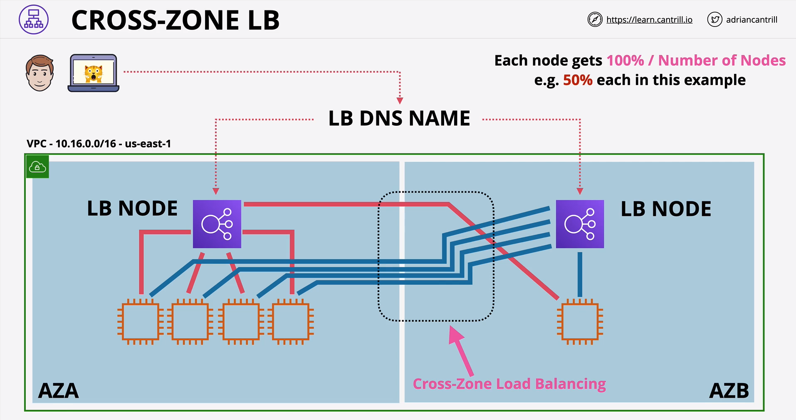

* ELb is a DNS A Record pointin at 1+ Nodes per AZ
* Nodes can scale
* Classical Load balancer
    * Not really layer 7, lacking features, 1 SSL per CLB (Don't support SNI)
* ALB
    * HTTP/S/websocket
    * 1 SSL per Rule
    * L7 content type, cookies, custom headers, user location and app behaviour
    * HTTP HTTPS (SSL/TLS) always terminated on the ALB - no unbroken SSL
    * A new connection is made to the application
    * ALBs Must have SSL certs if https is used
    * ALBs are slower than NLB ... more levels of network stack to process
    * Health checks evaluate app health cheks on layer 7
    * Rules direct connections which arrive at a listener
    * Processed in priority order
    * Default Rule = catchall
    * Rule conditions: host-header, http-header, https-request-method, path-pattern, query-string & source-ip
    * Actions: forward, redirect, fized-responde, authenticate-oidc & authenticate-cognito
* NLB
    * TCP/ TLS / UDP
    * Layer 4 load balancer
    * No visibility or understanding of HTTP or HTTPS
    * No headers, no cookies, no session stick
    * Really fast
    * SMT, SSH, Game Servers, financial apps (no https)
    * health checks just check ICMP / TCP handshake ... Not app aware
    * NLBS can have static IPs
    * Forward TCP to instances ... unbroken encryption
    * Used with private link to provide services to other VPCs
    * use for: unbroken encryption, static ip for whitelist, the fatest performance, protocolos not http/https, private linkk
* Session Stickeness 
    * per target group
    * Locks a session to 1 backend instance
    * Creates cookie AWSALB which is held by the client
    * Valid duration 1 second to 7 days
    * Sessions move on expiry or instance failure
    * Enable if an app doesn't use external sessions
    * Look for question keywords logout, lost carts, lost progress
    
### ASG

* Uses Launch Templates or Configurations
* Has a minimum, Desired and Maximum size
* Scaling Policies
    * Manual Scaling
        * Manually adjust the desired capacity
    * Scheduled Scaling
        * Time based adjustment
    * Dynamic Scaling
        * Simple
            * CPU aboves 50% +1
            * CPU Below 50% -1
        * Stepped
            * Bigger +/- based on difference
        * Target Tracking
            * Desired Aggregate CPU = 40% .. ASG handle it
* Cooldown Periods
* ASG can use the Load balancer health checks rather than EC2 status checks - Application Awareness
* Scaling Process
    * Launch and Terminate - Suspend and Resume
    * AddToLoadbalancer - add to LB on launch
    * AlarmNotification - accept notification fom CW
    * AZRebalance - Balances instances evenly across all of the AZs
    * Healthcheck - Instance health checks on/off
    * ReplaceUnhealthy - Terminate unhealthy and replace
    * ScheduledActions - Scheduled on/off
    * Standy - use this for instances 'InService vs Standby'
* Final Points
    * ASGs are free
    * Only the resources created are billed
    * Use cool downs to avoid rapid scaling
    * think about more, smaller instances - granularity
    * use with ALBs for elasticicty - abstraction
    * ASG defines when and where, LT defines What
    
#### ASG Lifecycle hooks

* Custom Actions on instances during ASG Actions
* Instance Launch or Instance terminate transitions
* Instances are paused within the flow ..they wait
    * until a timeout (then either CONTINUE or ABANDON)
    * Or resume the ASG Process CompleteLifecycleAction
* Integrates with EventBridge or SNS Notifications

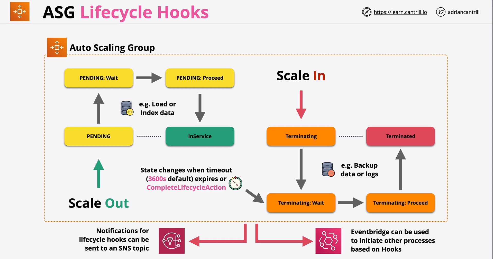

## Monitoring , Logging & Cost Management

### Cloudwatch

* Metric
    * Namespace = container for metrics. Ex AWS/EC2 & AWS/Lambda
    * Datapoint = timestamp, value, (optional) unit of measure
    * Metric .. time ordered set of data points
        * CPUutilization, NetworkIn
    * Every metric has a MetricName and a namespace and a Dimension
    * Dimension is a name/value pair
        * cpuutilization Name = Instanceid, value=i-11111
        * Can agregate metrics ex: AutoScalingGroupName, ImageId, InstanceType
        * Not all and Not custom
    * Resolution
        * Standard - 60s granularity
        * High
            * 1s
    * Retention
        * Sub 60s retained for 3 hours
        * 60s for 15 days
        * 300s for 63 days
        * 3600 for 455 days
        * As data ages, its aggregated and stored for longer with less resolution
    * Statistic - Aggregation over a period (Min, Max, Sum, Average)
    * Percentile
* Alarm
    * State Alarm or OK
    * Value of metric vs threshold over time
    * One or more actions
    * Period
    * Evaluation Period
    * Datapoints to alarm
    * Condition
* Logs
    * Regional Service
    * Ingestion
        * Source AWS, on-premises, IOT or any application
        * CWAgent  - System or custom application logging
        * VPC Flow Logs
        * CloudTrail
        * route53 - Log DNS requests
    * Log group
        * Retention
        * Permissions
        * Encryption
    * Export
        * S3 Export - create-export-task
            * Up to 12 Hours, not realtime
            * can't encrypt with KMS, only with sse-s3
        * Subscriptions
            * Per Log Group
            * Create subscripion filter
                * Permissions
                * Destination
                    * Kinesis data firehose to s3 -> (buffer of 60s or data aumont) not real time. near realtime
                    * Real Time
                        * AWS Managed Lambda function allows logging data to be delivered in realtime to Elasticsearch
                        * Custom Lambda function can be used to export data to nearly any destination in real time
                        * Kinesis data stream occurs in realtime allowing data to be used within other systems which integrate with KCL
            * Metric filter
                * Scan log data, generate a cloudwatch metric

### CloudTrail

* 90 Days stored by default in Event History
* Enabled by default - no cost for 90 day history ... no S3
* to customise ... create 1 or more trails
* Management Events (only by default) and Data Events
* One Trail
    * One Region
    * All Regions
    * Export to S3 or cloudwatch logs
* Works For Global Service Events and region
* NOT Realtime - There is a delay

### AWS X-Ray

* Track sessions through Application
    * Distributed tracing
* Components
    * Tracing Header - first service generates ... it's unique (trace id), used to track a request through your distributed application
    * Segments - Data Blocks - host/ip, request, response, work done (times), issues
    * Subsegments - more granular version of the above, calls to other services as part of segment (endpoints etc)
    * Service graph - JSON Document detailing services and resources which make up your application
    * Service Map - Visual version of the service graph showing traces
        * Shows the flow through a distributed app, response time, requests and any errors or issues
* EC2 - X-Ray Agent
* ECS - Agent in Tasks
* Lambda - Enable option
* Beanstalk - agent preinstalled
* api Gateway - per stage option
* SNS & SQS
* Requires IAM permissions

### Cost Allocation Tags

* Have to be enabled individually
    * per account for standard accounts or ORG Master of ORGS
* AWS-Generated - aws:createdBy or aws:cloudformation:stack-name
* Added to resources after they are enabled by AWS
* User-defined tags can also be enabled user:something
* Both are visible in cost reports and can be used as a filter
* Can take up to 24 hours to be visible and active
* Not retroactive

### AWS Trusted advisor

* Account level - no agents to install
* Cost optimization, performance, security, fault tolerance and service limits
* 7 free core checks with basic & developer support plans
    * S3 bucket permissions - Not Objects
    * Security Groups - Specific Ports unrestricted
    * IAM use
    * MFA on Root account
    * EBS Public Snapshots
    * RDS Public Snapshots
    * 50 service limit checks
* Anything beyond requires business or enterprise
    * core 7 checks
    * 115 Further cheks
    * Access via the AWS support API
    * Cloudwatch integration - react to changes

## Databases

### RDS

* Database Instance
    * Multiple created database instances
    * Database CNAME (RDS access only via CNAME)
    * Controlled by Security Group
    * Storage allocated
        * gp2
        * io1
        * Magnetic
            * historic usage
* Multi-AZ
    * No free tier - Extra cost for standby replica
    * Sync Replication
    * Standby can't be directly user
    * 60-120 seconds failover
        * Offer HA not Fault Tolerance
    * Don't use to scale/reads
    * Same Region only (Other AZs in the VPC)
    * Backups taken from standby (removes performance impact)
    * Failover can occur: AZ Outage, Primary Failure, Manual Failover, Instance type change and software patching
 
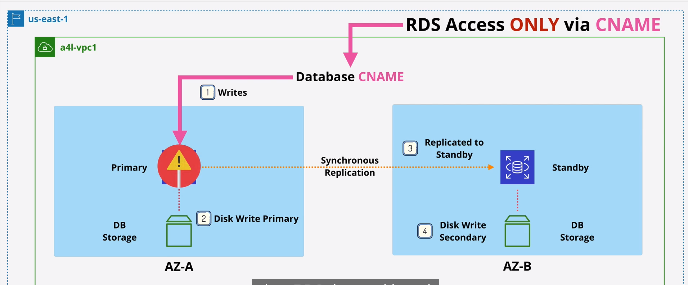

* Backups and Restores
    * Manual snapshots
        * Stored in AWS Managed S3 Buckets
        * First snap is full
            * Size op consumed data
            * Then onward = incremental
        * Single AZ Can impact performance
        * Don't expire - will live besides the database lifetime
        * Recover for data corruption
    * Automatic Backups
        * Stored in AWs Managed S3 Buckets
        * Are same snapshots but automatically
        * Ocuurs in backup window
        * Automatic cleanup
        * Retention period (0 -> Disabled to 35 days)
        * Transaction Logs
            * Every 5 minutes Transaction logs are stored in AWS S3 Managed buckets
            * Can lower your RPO value
    * Restore
        * Creates a NEW RDS Instance - new address
        * Snapshots = single point in time, creation time
        * Automated = any 5 minute point in time
        * Backup is restored and transaction logs are replayed to bring DB to desired point in time
        * Restores aren't fast - Think about RTO
* Read Replicas
    * Asyncronous replication
    * CAn have 5x direct read replicas per DB instance
    * Each providing an additional instance of read performance
    * Read-replicas can have read-replicas - but lag starts to be a problem
    * Global performance improvements
    * Offer near 0 RPO
    * Read replicas can be promoted quickly - low RTO
        * Failure only - watch for data corruption
    * Read only - until promoted
    * Global availability improvements - global resilience
* Security
    * encryption
        * SSL/TLs (in transit) is available for RDS, can be mandatory
        * RDS supports EBS Volume encryption - KMS
            * Handled by Host/EBS
            * AWS or Customer Managed CMK generates data keys
                * Data keys used for encryption operations
            * Storage, Logs, Snapshots & replicas are encrypted
            * encryption can't be removed when added
        * RDS MSSQL and RDS Oracle Support TDE
            * Transparent Data Encryption
            * Encryption handled within the DB engine
            * RDS Oracle supports integration with cloudHSM
                * Much stronger key controls (even from AWS)

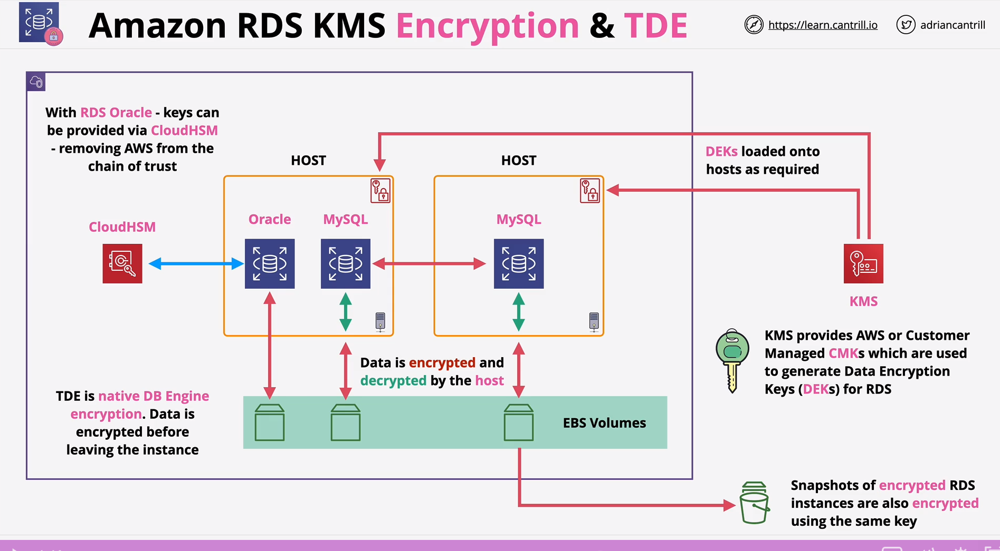
    * IAM Authentication
        * Needs be enabled
        * Can map local rds users with iam intenty
        * Using roles/policies
        * Only handles authentication. Authorisation is handler by DB engine
    
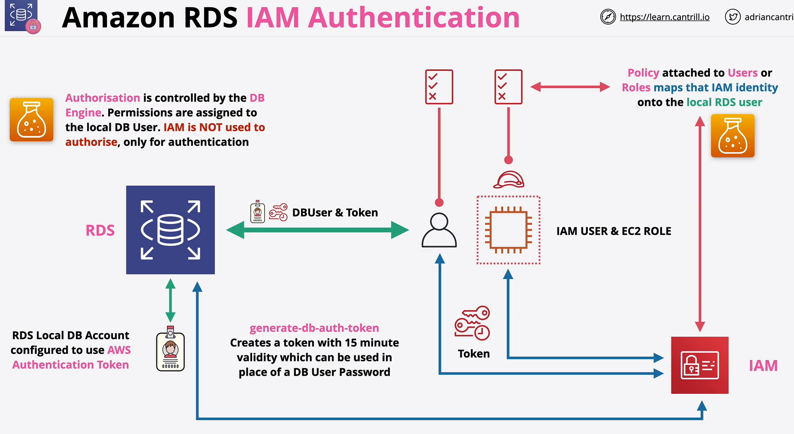

### Aurora

* Uses a cluster
* A single primary instance + 0 or more replicas
* No local storage - uses a cluster volume
* Faster provisioning & improved availability & performance
* up to 15 Replicas
* Cluster volume Max 64 Tib
    * 6 Replicas 3 AZs
    * Syncronaztion is on disk Level, no database instance
    * Automate repair disk failure - no need snapshots and backups to failure
    * Based on SSD by default - high IOPS, low latency
    * Storage is billed based on what's used
    * High water mark - billed for the most used
* Replicas can be added and removed without requiring storage provisioning
* Endpoints
    * Cluster Endpoint
        * Points for Primary
    * Reader Endpoint
        * Points to read replicas and primary
    * Each Instance has their own point
* No free tier
* Doesn't support Micro instances
* Beyond RDS SingleAZ(micro) Aurora offers better value
* Compute - hourly charge, per second, 10 minute minimum
* Storage - GB-Month consumed, IO cost per request
* 100% DB Size in backups are included
* Backups work in the same way as RDS
* Restores create a new cluster
* Backtrack can be used which allow in-place rewinds to previous point in time
    * Enabled cluster basis
    * Backtrack window
* Fast clones make a new database MUCH faster than copying all the data - copy-on-write
    * The clone database only store the data that change in original or the changes you made on the clone
* Multi-Master Writes
    * Default Aurora mode is Single Master
    * Failover takes time
        * Replica needs to be promoted to R/W
    * In Multi-Master mode all instances are R/W
        * Replication is on instance
    * Required for fault tolerance application
    * The application needs load balanced across the instances
* Serverless
    * Scalable - ACU - Aurora Capacity Units
    * Aurora Serverless cluster has a MIN & MAX ACU
    * Cluster adjusts based on load
    * Can go to 0 and be paused
    * Consumption billing per-second basis
    * Same resilience as Aurora (6 copies across AZs)
    * Connection via proxy fleet (Instance on proxy fleet) managed by AWS
    * Uses cases
        * Infrequently used applications
        * New applications
        * Variable workloads
        * Unpredicatable workloads
        * Development and test databases
        * Multi-tennant
        
### DynamoDB

* NoSQL Public Database-as-a-Service - Key/Value &Document
* No self-managed servers or infra
* Manual / Automatic provisioned performance IN/OUT or On-Demand
* Highly Resilient ... across AZs and optionally global
* Really fast ..single-digit miliseconds (SSD based)
* Backups, Point-int-time recovery, encryption at rest
* Event-driven integration .. do things when data changes
* Tables
    * Grouping of Items with the same PRIMARY KEY
    * Primary Key
        * Simple partition
        * Composite (Partition & Sort)
    * Each item must have a unique value for PK and SK
    * Item MAX 400Kb
    * 1 WCU = 1Kb per Second
    * 1 RCU = 4 KB per second
* On-Demand Backups
    * Full copy of table - Retained until removed
    * Restore
        * Same of Cross Region
        * With or Without indexes
        * Adjust encryption settings
* Point-in-time Recovery (PITR)
    * Not enabled by Default
    * Continuous record of changes allows replay to any point in the window
    * 35 day recovery window
    * 1 Second granularity
    * New Dynamo DB Table
* Access via console, cli, api ... 'No SQL'
* Billed based RCU, WCU, Storage and features
* Capacity Model
    * On-Demand - unknow, unpredictable, low admin
        * price per million R or W units
    * Provisioned
        * RCU and WCU set on a per table basis
    * Every option consumes at least 1 RCU/WCU
    * Every table has a RCU and WCU burst pool (300 seconds)
* Operations
    * Query
        * Accepts a single PK value and optionally a SK or Range
        * Capacity consumed is the size of all returned items
        * Further filtering discards data - capacity still consumed
        * Can only query on PK or PK and SK
    * Scan
        * Moves through a table consuming the capacity of every item
        * You have complete control on what data is selected, any attributes can be used and any filters applied, but scan consumes capacity for every ITEM scanned through
* Consistency Model
    * Eventual Consistency
        * If can tolerates outdate data
        * 1 RCU = 8 KB
    * Strong Consistency
* WCU Calculation
    * ROUND UP (ITEM SIZE / 1 KB) * number items per second
* RCU Calculation
    * ROUND UP (ITEM SIZE / 4 KB) * number items per second
    * Eventually consistent is the result / 2
* Indexes
    * Alternative Views on table
    * Local Secondary Index
        * Must be created with a table
        * Max 5 per table
        * Alternative SK
        * Shares RCU and WCU with the table
        * Atributed - ALL, KEYS_ONLY & INCLUDE
        * Indexes are sparse, only items which have a value in the index alternative sort key are added to the index
            * Good to scan operations
    * Global Secondary Index
        * Can be created at any time
        * Default limit of 20 per base table
        * Alternative PK and SK
        * GSI have their own RCU and WCU allocations
        * Attributes - ALL, KEYS_ONLY & INCLUDE
        * Alternative PK and SK
        * Are sparse
        * Always eventually consistent. Replication beetween Base table and GSI is Asyncronous
    * Carefull with projection
    * Use GSIs as default, LSI only when strong consistency is required
    * Use indexes for alternative access patterns
* Streams and Triggers
    * Time ordered list of ITEM changes in table
    * 24 hour rolling window
    * per table basis
    * Records Inserts, updates and deletes
    * Different view types influence what is in the stream
        * Keys_Only
            * Only Get the Primary Key (Partition Key and Sort Key)
        * NEW_IMAGE
            * The Entire Item after the change
        * OLD_IMAGE
            * The Entire Item before Change
        * NEW_AND_OLD_IMAGES
            * The Two Items (Pre and Post Change)
            * On Insert and Delete operations, the Pre Item or Post Item will be blank (depend of the operation)
    * Triggers
        * Item changes generate an event
        * That event contains the data which changed - Depends of view type
        * A action is taken using that data
        * AWS = Streams + Lambda
        * Reporting and Analysis
        * Aggregation, Messaging, Notifications
* Accelerator (DAX)
    * Needs DAX SDK
    * Cluster - 3 Azs
        * Primary Node writes
        * Two read replicas
        * Nodes are HA. Primary failure = election
        * In Memory cache - Scaling - Much faster reads, reduced costs
        * Scale up and Scale out
        * Deployed within a VPC
    * Two types of cache
        * Item Cache
            * Holds results of (Batch)GetItem
        * Query Cache
            * Olds data based on query/scan parameters
    * Is accessed via an endpoint. Caches Hits are returned in microseconds, Misses in miliseconds
    * Write-through is supported, data is written to Dynamo then DAX
    * If cache Miss occurs data is also written to the primary node of the cluster
* Global Tables
    * Provides multi master cross region replication
    * Tables are created in multiple region and added to the same global table (becoming replica tables)
    * Last writer wins is used for conflict resolution
    * Reads and Writes can occur to any region
    * Generally sub-second replication between regions
    * Strongly consistent reads only in the same region as writes
    * Provides Global HA and global DR
    
### AWS ElasticSearch

* Not serverless. It runs in a VPC
* Log analytics, monitoring, security analytics, full text search and indexing, clickstream analytics
* Logstash - Similiar to CWLogs, needs logstash agent installed

### AWS Athena

* Serverless Interactive Quering Service
* Ad-hoc queries on data - pay only data consumed
* Schema-on-read - table-like translation
* Original data never changed - reamins on S3
* Schema translates data =>relational like when read
* Output can be sent to other services
* Queries where loading/transformation isn't desired
* ocasional / Ad-Hoc queries on data in S3
* Cost conscious
* Query AWS Logs - VPC Flow logs, cloud trail, ELB logs, cost reports
* AWS Glue Data Catalog & web server logs
* Athena Federated Query .. other data sources
    * uses data source connectors that run on AWs lambda to perform federated queries
    * data source connectors translate between target data source (Isn't S3) and athena

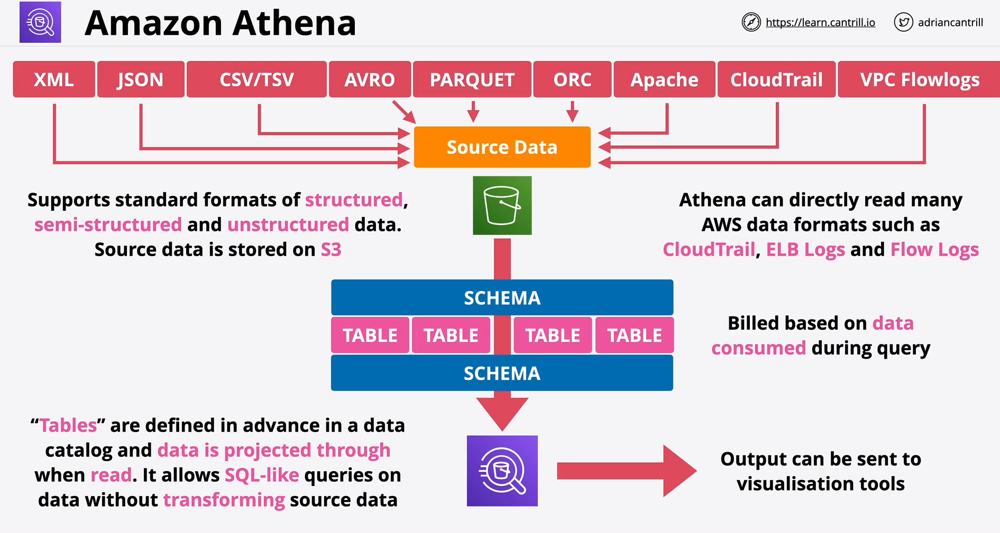

### Neptune

* Managed Graph Database Service
* DBs where relationships are as important as data
* Runs in a VPC - private by default
* MultiAz & Scales via read replicas
* Continours backup to S3// point in time recovery
* Like RDS ... but for Graph sytle data
* Nodes are things within a GraphDB. They can have attributes and tags
* Relationships are directional, named relationships between noedes. They can be fluid and followed in both directions
* Use Cases
    * Social Media ... anything involving fluid relationships
    * Fraud prevention
    * recommendation Engines
    * Network and IT operations .. dependancies
    * Biology and other life sciences

### Quantum Ledger (QLDB)

* Immutable append-only ledger based database
* Cryptographically verifiable transcation log
* Transparent - full history is always accessible
* Serverless - Provides Ledger and Tables - no servers
* 3 AZ resilience & replication within each AZ
* Can stream data to Amazon Kinesis
* Document DB Model
* ACID - Transfer A->B ... other both work or none work
* Use Cases
    * Finance
    * Medical
    * Logistics
    * Legal

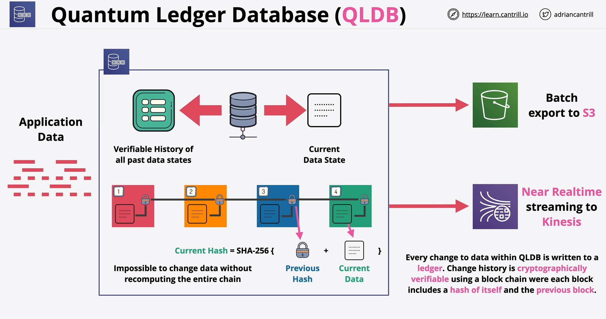

## Data Analytics

### Kinesis Streams

* Kinesis is a scalable streaming service
* Producers send data into a kinesis streams
* Streams can scale from low to near infinite data rates
* Public service & highly available by design
* Persistence
    * Default 24 Hour
    * Up to 7 days
* Multiple consumers access data from that moving window
* Kinesis data record max 1 MB
* Shard
    * 1 MB Ingestion
    * 2 MB consumption
* Kinesis Firehose
    * Move data from Kinesis stream to other aws services such as S3
* SQS vs Kinesis
    * SQS
        * Decoupling, workpools, Asyncrhonous communication
        * 1 production group, 1 consumption group
        * No persistence of messages, no window
    * Kinesis
        * huge scale ingestion
        * Multiple consumers ... rolling window
        * Data ingestion, Analytics, Monitoring, App clicks
* Kinesis streams are realtime ~200ms
        
### Kinesis Firehose

* Fully managed service to load data for data lakes, data stores and analytics services
* Automatic scaling ... fully serverless ..resilient
* Near Real time delivery (~60 seconds) - Not Real TIME
* Supports transformation of data on the fly (lambda)
    * Can optionally store the unmodified data on S3
* Billing - volume through firehose
* Support destinations
    * HTTP endpoints
    * Splunk
    * Redshift
        * Delivery to redshift uses S3 bucket as an intermediate
        * Redshift Copy data from S3
    * Elasticsearch
    * S3
* Producers can send records to data streams or send directly at firehose
* Firehose can also read from a data stream as consumer
* Firehose offers near realtime deliver
    * Delivery when buffer size in MB(1) fills or Buffer interval in seconds (60) passes

### Kinesis Data Analytics

* Real time processing of data
* Ingests from Kinesis Data Streams of Firehose
* Destinations
    * Firehose (S3, Redshift, Elasticsearch & Splunk) - Losts realtime and passes to near-realtime
    * AWS Lambda
    * Kinesis Data streams
* Use Cases
    * Streaming data needing real-time SQL processing
    * Time-series analytics .. elections / e-sports
    * Real-time dashboards - leaderboards for games
    * Real-time metrics - Security & Response teams

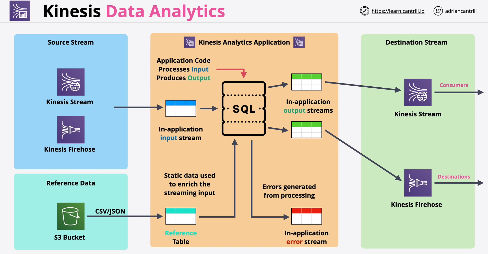

### EMR

* Map Reduce
    * Data Analysis Architecture - huge scale, parallel processing
    * Two Main Phases - MAP and REDUCE
    * Optional Phases - Combine & Partition
    * Data is separated into 'splits' ..each assigned to a mapper
    * Mapper Perform operations at scale - customisable
    * Reduce - Recombine Data into Results
    * HDFS - Hadoop File System
        * Traditionally stored across multiple data nodes
        * Highly Fault tolerant - replicated between nodes
        * Name Node - provides the namespace for file system & controls access to HDFS
        * Block segment of data on HDFs ... generally 64 MB
* AWs managed implementation of Apache Hadoop
    * And spark, hbase, presto, flink, hive, Ping
* Can be operated long term ... or use ad-hoc (transient) clusters
* Run in ONE AZ in a VPC using EC2 for compute
* Auto Scales - Spot, instance fleet, reserved, on-demand
* Big Data processing, manipulation, analytics, indexing, transformation and more ...(data pipeline)

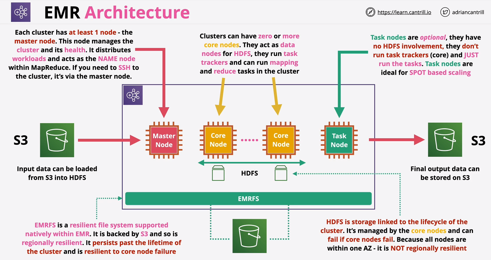

### Redshift

* Petabyte-scale Data warehouse
* OLAP (Column based) not OLP (row/transaction)
* Pay as you use ... similiar structure to RDS
* Direct Query S3 using Redshift Spectrum
* Direct Query other DBs using federated query
* Integrates with AWS tooling such as Quicksight
* SQL-like interface JDBC/ODBC connections
* Architecture
    * Server based (not serverless)
    * One AZ in a vpc - network cost/performance
    * Leader Node - Query input, planning and aggregating
    * Compute Node - performing queries of data
    * VPC security, IAM Permissions, KMS at rest encryption, CW Monitoring
    * Redshift Enhanced VPC Routing - VPC Networking
* Resilience and Recovery

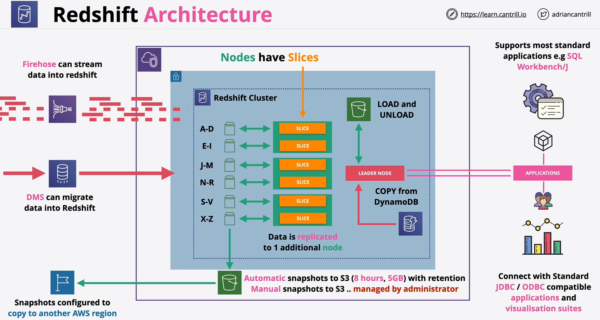

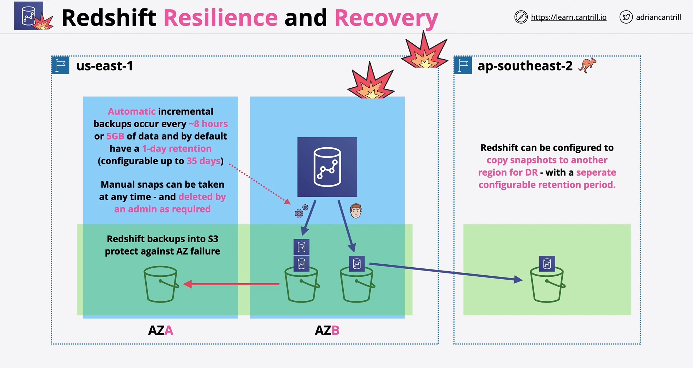

### Batch

* AWS Managed Batch processing product
    * Jobs that can run without end user interaction or can be scheduled to run as resources permit
* AWS Batch lets you worry about defining jobs ... it handles the underlying compute and orchestration
* Commonly used in the same type of lambda architecture but when more substantial compute is required - resources or time
* Components
    * Job - Script, Executable or Docker Container. Can be dependant on other jobs
    * Job Definition - Metadata for a Job. Including Permissions (IAM), Resource config, Mount Points
    * Job Queue - Can have Priorities
    * Compute Environment - Managed or unmanaged compute. Can use ECS environement you manage

* Key Tips
    * Lambda has a 15 minute execution time limit and limited disk space
        * EFS access fixes this ... But this means VPC Lambda
    * Fully serverless but limited runtime selection
    * Batch is Not Serveless, it uses docker, any runtime
    * No time limit or effective resource limit
* Compute Managed vs Unmanaged
    * Managed
        * AWs batch manage capacity based on workloads
        * On-demand or spot instances - size/type
        * You can determine you own max spot price
        * VPC - Private / Public, requires VPC gateways
    * Unmanaged - you manage everything

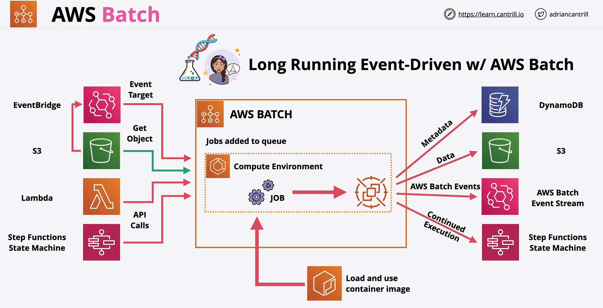

### AWS Quicksight

* Business Analytics & Intelligence (Ba/BI) service
* Visualisations, Ad-hoc analysis
* Discovery and integration with AWS Data Sources
* Works with external data sources
* Tips: dashboards or visualisation
* Sources
    * Athena, Aurora, Redshift, Redshift Spectrum
    * S3, AWS IOT
    * Jira, Github, Twitter, SalesForce
    * SQL Server, Mysql, PostgreSQL
    * Spark, snowflake, presto , teradata

## App Services, Containers & Serverless

### ECS

* ECS if you use containers
* Large Workload - price conscious - EC2 Mode
* Large Workload - overhead conscious - Fargate
* Small / Burst workloads - Fargate
* Batch / Periodic worklods - Fargate

### SNS

* Public AWS Service - network connectivity with Public Endpoint
* Coordinates the sending and delivery of messages
* Messages are <= 256kb payloads
* Topics - permissions and config
* Publisher send messages to Topic
* Topic have subscrivers
    * HTTP(S)
    * EMAIL(-JSON)
    * SQS
    * Mobile Push
    * SMS messages
    * Lambda
* Used by other Services like Cloudformation
* Can apply filters by subscribers
* Fanout workloads using multiple SQS as subscribers of SNS Topics
* Delivery Status - (including HTTP, Lambda, SQS)
* Delivery Retries - Reliable Delivery
* HA and Scalable (Region)
* Server side encryption (SSE)
* Cross Account via Topic Policy

### SQS

* Public, Fully Managed, HA Queues - Standard or Fifo
* Messages up to 256kb in size - link to large data (use S3)
* Receive messages are hidden (visibilityTimeout)
    * then either re-appear (retry) or are explicitly deleted
* Dead-Letter Queues can be used for problem messages
* ASGs can scale and lambdas invokes based on queue length
* Types
    * Standard
        * At-least-once
        * Order not guarantee
    * Fifo
        * Exactly once
        * Order guarantee
        * Performance - 3000 messages per second with batching, or up to 3000 messages per second on standard
* Billed based on requests
* 1 request = 1-10 messages up to 64kb total
* Polling
    * short ( immediate ) - return 0 request if queue is empty. You pay for the request
    * long (waittimeseconds) - waits for messages. Less requests
* Encryption at rest (kms) & in-transit
* Queue Policy to give access to external accounts

### Amazon MQ

* Use when need a standards compliant solution for migration
* Open-source message broker
* Based on Managed Apache ActiveMQ
    * Comptabile JMS API, protocols such as AMQP, MQTT, OpenWire and STOMP
* Provides Queues and Topics
* One-to-One or One-to-many
* Single Instance (Test, Dev, Cheap) or HA Pair (Active/Standby)
* Not Public Service - VPC Based
* No AWs native integration ... delivers activeMQ product which you manage
* Considerations
    * SNS/SQS
        * default - new implementations
        * AWs integration ( loggin, permissions, encryprtion, service integration)
    * Amazon MQ
        * Migrate from existing service with little application change
        * Is needs jms api or protocols such AMQP, MQTT, OpenWire and STOMP
        * Remember, need private networking

### Lambda

* Environment has direct memory (indirect cpu - based on memory) allocation
    * Memory 128Mb to 3 GB - 128Mb steps
* 512 MB storage available as /tmp
* timeout 900s (15M)
* Billed for the duration that function runs
* Deployment package
    * 50 Mb Zipped
    * 250 MB unzipped
* Docker is not support (anti pattern) for the exam
    * Custom runtimes such as Rust are possible using layers
* Use Cases
    * Serverless applications
    * File Processing (S3, S3 Events, Lambda)
    * Database Triggers (dynamoDB, Streams, Lambda)
    * Serverless Cron (Eventbridge / CW Events + lambda)
    * Realtime Stream Data Processing (Kineis + lambda)
* Networking Modes
    * Public - Default
        * Best performance
    * VPC Networking
        * 90 seconds initial setup
        * No invocation delay
        * Needs EC2 permissions to create ENIs
* Security
    * Execution Role
        * What lambda can access
    * Resource Policy 
        * controls what services and accounts can invoke lambda functions
* Logging
    * Cloudwatch, Cloudwatch Logs & X Ray
    * Logs from Lambda executions - Cloudwatch logs
    * Metrics - invocation success/failure, retries, latency ... stored in cloudwatch
    * Can be integrated with x-ray for distributed tracing
    * Cloudwatch logs requires permissions via execution role
* Invocation
    * Synchronous
        * CLI/API invoke lambda function, passing in data and wait for response
        * Lambda function responds witd data of fails
        * Api Gateway uses synchronous invocation
        * Result (success of failure) returned during the request
        * Errors or retries have to be handled within the client
    * Asynchronous
        * Typically used when AWS Services invoke lambda functions
        * If processing of the event fails, lambda will retry between 0 and 2 times(configurable). Lambda handles the retry logic
        * The lambda function needs to idempotent reprocessing a result should have the same end state
        * Events can be sent to DLQ after repeated failed processing
        * Lambda supports destinations (SQS, SNS, Lambda & Eventbridge) where successfull or failed events can be sent
    * Event Source Mapping
        * Typically used on streams or queues which don't support event generation to invoke lambdas (kinesis, DynamoDB Streams, SQS, Amazon Kafka)
        * Read/poll from the stream or queue and deliver event batches to lambda. Event batches are processed OK or FAIL as a batch
        * Permissions from the lambda execution role are used by the event source mapping to interact with the event source
        * SQS Queues or SNS topics can be used for any discarded failed event batches
* Versions
    * Version is the code + the configuration of the lambda
    * Its immutable - Never changes once published. Has its own ARN
    * $Latest points at the latest version
    * Aliases (DEV, STAGE, PROD) point at a version - can be changed
* Starts
    * Cold Start - Is a full creation and configuration including the function code download
    * Warm start - the same execution context is reused
    * Provisioned concurrency can be used. AWS will create and keep x contexts warm and ready to use ... improving start speeds

### Cloudwatch Events & Event Bridge

* EventBridge is .... CloudWatch Events v2
* A Default Event Bus for the Account
* In Cloudwatch Events this is the only Bus (implicit)
* EventBridge can have additional event buses
* Rules match incoming events ... (or schedules)
* Route the events 1+ Targets e.g. Lambda
* EventBridge supports on-prem events

### Advanced Gateway

* Highly available, scalable, handles authorisation, throttling, caching, CORS, Transformations, OpenAPI Spec, Direct integration and much more
* Can connect to services/endpoints in AWS or On-premises
* Support HTTP APIs, Rest APIs, and Websocket APIs
* Cloudwatch logs can store and manage full stage request and response logs. Cloudwatch can store metrics for client and integration sides
* API Gateway Cache can be used to reduce the number of calls made to backend integrations and improve client performance
* Authentication
    * Cognito
    * Custom Authorization - Lambda
    * Authenticate via IAM using headers to pass credentials
* Endpoint Types
    * Edge-optimized
        * Routed to the nearest Cloudgront POP
    * Regional
        * Clients in the same region
    * Private
        * Endpoint accessible only within a VPC via Interface Endpoint
* Stages
    * Each stage has unique own endpoint
    * Support roolback deployment
    * Can be enabled for canary deployments. If done, deployments are made to the canary not the stage
        * Can be configured so a certain percentage of traffic is sent to the canary.
            * This can adjusted over time - or the canary can be promoted to make it the new base stage
* Errors
    * 4xx - Client Error - Invalid request on client side
        * 400 - Bad Request - Generic
        * 403 - Access Denied - Authorizer denies ... WAF Filtered
        * 429 - Api Gateway can throttle - this means you've exceeded that amount
    * 5XX - Server Error - Valid request, backend issue
        * 502 - Bad Gateway Exception - bad output returned by lambda
        * 503 - Service Unavailable - backing endpoint offline? Major Service issues
        * 504 - Integration Failure/Timeout - 29s limit
* Caching
    * Configured by Stage
    * Cache is defined per stage within API Gateway
    * Cache TTL default is 300 seconds
    * Configurable min 0 and max 3600s
    * Cache size 5000 Mb to 237 Gb
    * Can be encrypted
    * CAlls are only made to backend integrations if request is a cache miss
    
    

### Step Functions

* Lambda Problems
    * 15 minute max execution time
    * Can be chained together
    * Gets messy at scale
    * Runtime Environments are stateless
    
* State Machines
    * Serverless workflow ... Start -> States -> End
    * States are THINGS which occur
    * Maximum Duration 1 year
    * Standard workflow and Express Workflow
        * Express
            * High Volume
            * Event processing workloads, such as IOT
            * Streaming data processing and transformation
            * Mobile applications backends
            * Used for highly transactional and need much more in terms of processing guaranttes
            * Up to 5 minutes
    * Started via Api Gateay, IOT Rules, EventBridge, Lambda, Manually, .....
    * Amazon States Languague (ASL) - Json Template
    * IAM Role is used for permissions
* States
    * SUCCEED & FAIL
    * WAIT
    * CHOICE
    * PARALLEL
    * MAP - List of things and perform actions for all items
    * TASK (Lambda, Batch, DynamoDB, ECS, SNS, SQS, GLUE, SageMaker, EMR, Step Functions, ...)

### Simple Workflow Service

* Uses Instances/Servers
* Workflow 
    * Activity Tasks
    * Activity Worker
    * Decider
    * 1 year max runtime
* SWF Vs Step Functions
    * Default - Step Functions - Serverless / Lower admin
    * AWS Flow Framework - Choose SWF
    * External Signals to intervene in the Process - SWF
    * Launch Child Flows - Return to Parent - SWF
    * Bespoke / complex decisions - SWF ( custom decider applications )
    * Mechanical Turk - SWF

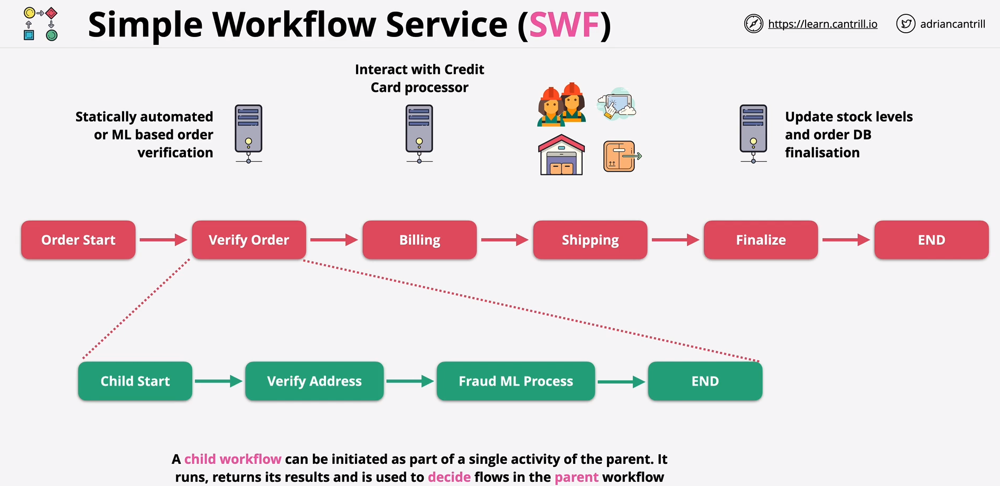
    
    
    

### Amazon Mechanical Turk

* Managed human task outsourcing - API's - extend your app with humans
* Requesters post Human Intelligence Tasks (HITs)
* Workers earn by completing HITs
* Pay per Task, Perfect for tasks suited to humans rather than ML
* Qualifications - worker attribute, can require a test and can be a requirement to complete HITs
* Data Collection, manual processing, image classification
* Can create data to use for ML Training
* List of 1000 Vets and Cupcake stores - find telephone number, opening hours, ...

### Elastic Transcoder & MediaConvert

* File-based video transcoding services
* MediaConvert (MC) is "sort of" Elastic Transcoder (ET) v2
* Serverless - pay for resources used
* Add Jobs to pipelines (ET) or Queues (MC)
* MC supports EventBridge (CWEvents) for jog signalling

* ET is legacy, default to MediaConvert
* MC support more codecs, and is designed for larger volume & parallel processing
* Mc supports reserved pricing
* ET for WebM (VP8/VP9)
* ET For animated GIF
* ET for MP3, Flac, Vorbis and WAV

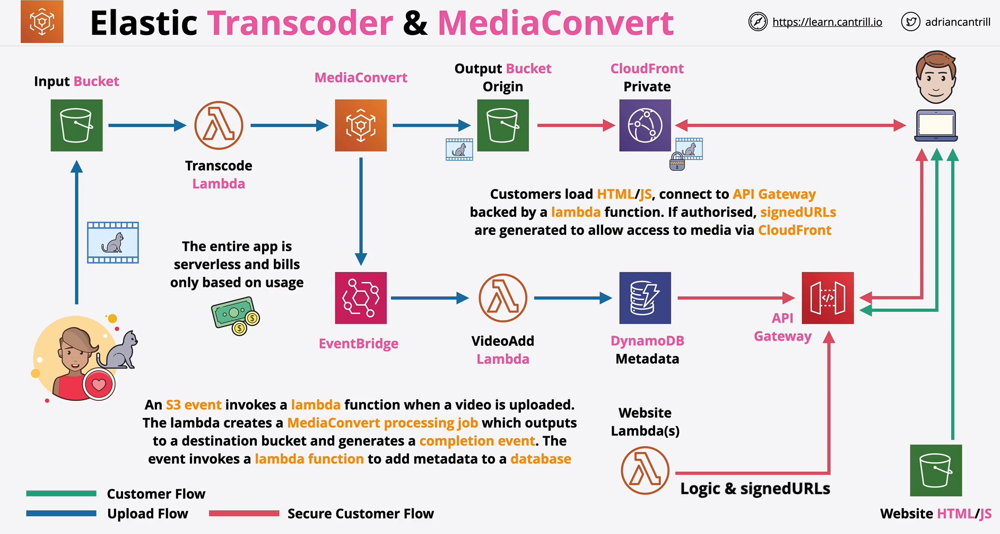

### AWS IOT

* AWS IOT Core is a suite of products - not one thing
* Used for managing 100000 of IOT devices
* Temp, wind, water sensors, lights, valve control
* Provisioning updates & control
* Unreliable links - device shadows
* Rules & event-driven integration with AWs services
* Greengrass
    * Extends some AWS Services to the Edge
    * Some compute, messaging, data management, sync, and ML capabilities
    * Locally run lambda
    * Locally run containers
    * IOT Device Shadows locally - synced back to AWS
    * Local messaging - MQTT
    * Local Hardware access for lambda

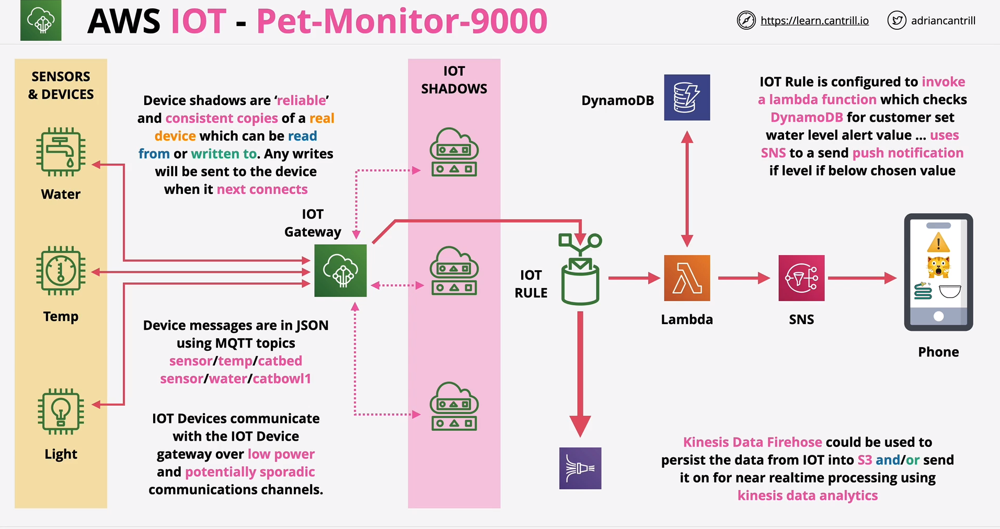

### SAM

* AWS SAM template specifition
    * Extension of CloudFormation
    * Transform, Globals & Resources (CFN & SAM)
* AWS SAM command line interface
* ... local cli to build SAM apps
* ... local testing (including local lambda invocation)
* ... deployment into AWS

## Caching, Delivery And Edge

### Cloudfront

* Origin - The source location of your content
* S3 Origin Or Custom Origin
* Distribution - The Configuration Unit of Cloudfront
* Edge Location - Local cache of your data
* Regional Edge Cache - Larger version of an edge location. Provides another layer of caching

* Behavior Configuration
    * Trusted Signers are essentially accounts that can generate signed urls or signed cookies
    
* TTL
    * When object expires, the origin returns 304 Not Modified or 200 OK. The object only is transferred if the object were modified
    * Default TTL (behaviour config) = 24 Hours (validaty Period)
    * Minimum TTL and Maximum TTL (configured in behavior and are the limits)
        * Origin Header : Cache-Control max age(seconds)
        * Origin Header: Cache-Control s-maxage(seconds)
        * Origin Header: Expires (Date & Time)
        * Custom Origin or S3 (Via Object metadata)
* Invalidations
    * Cache invalidation ... performed on a distribution
    * ... applies to all edge locations ... takes time
    * /images/whiskers1.jpg
    * /images/whiskers*
    * Invalidations have cost. If needs invalidate several times, uses Versioned file names ... whiskers1_v1.jpg // _v2.jpg
        * Needs update application to new version
        * Advantages
            * Client Cache browser won't be use (Name changed)
            * Logging is more effective
            * Less expensive because don't need to regulary invalidate
            * File Version

* SSL
    * Cloudfront Default Domain Name (CNAME)
    * SSL supported by default ... *.cloudfront.net cert
    * Alternate Domain Names (CNAMES)
        * Verify Ownership (Optionally HTTPS) using matching certificate
        * Generate or import in ACM in us-east-1
    * HTTP or HTTPS, HTTP => HTTPS, => HTTPS Only
    * Two SSL Connections: Viewer => Cloudfront and Cloudfront => Origin
        * Both need valid public certificates ( and intermediate certs)
       
* SNI
    * SNI is a TLS extension, allowing a host to be included
    * Resulting in many SSL Certs/Hosts using a shared IP
    * Old browsers don't support SNI ... CF charges extra for dedicated IP
    
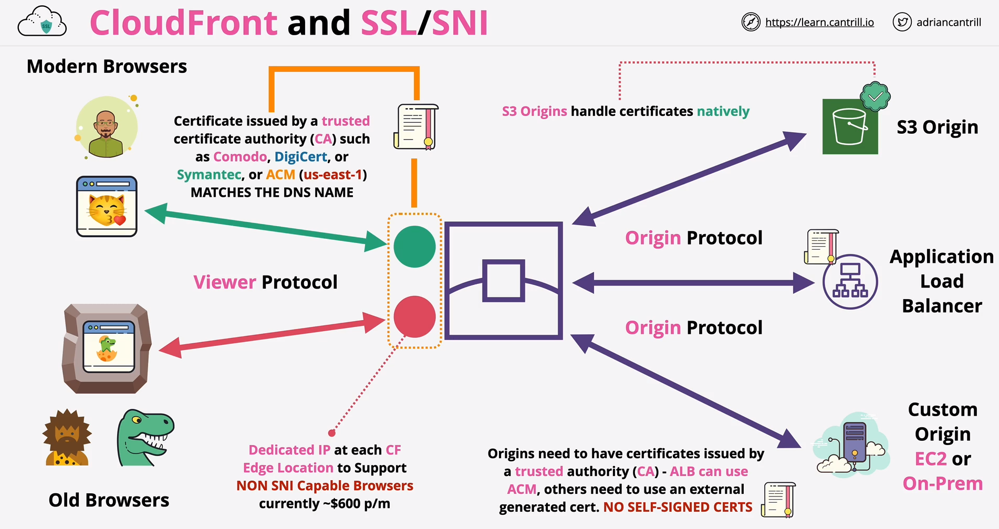

* Origin Types and Architecture
    * Origin Group to provides resilience across origins
    * If your origin is a S3 Static website the cloudfront views as a custom origin
    * S3 Origin Features
        * Origin Access Identity
        * Viewer protocol policy it's same in both connections
    * Custom Origin
        * Minimum Origin SSL Protocol
        * Original Protocol Policy
            * HTTP Only
            * HTTPS Only
            * Match Viewer
        * HTTP Port and HTTPS Port
* Caching Performance and Optimisation
    * Cache Hit -> Matching Object, delivered from cache
    * Cache Miss -> Matching object not cached
    * Maximise the Cache Hit Ratio
    * Cloudfront Request
        * 1 - Object Name
        * 2 - Query String Parameters e.g. index.html&lang=en
            * Can decide if wants forward and cache based on query parameters or no
            * Don't Forward & Don't cache based query parameters it's the default
            * Types
                * Don't Foward & Don't Cache
                * Forward ALL & Cache ALL
                * Forward ALL & Cache Whitelist
            * Forward what the application needs
            * Cache based on what can change the objects
            * The more things are involved in caching
        * 3 - Cookies
        * 4 - Request Headers
* Security
    * S3
        * AN OAI is a type of identity
        * It can be associated with Cloudfront Distributions
        * Cloudfront becomes tha OAI
        * That OAI can be used in S3 Bucket Policies
        * Deny all But one or more OAI's
    * Custom Origins
        * Utilize Custom Headers between Cloudfront and Custom Origin
        * Firewall allows IP_RANGES CloudFront
* Private Distributions
    * Public - Open Access To Objects
    * Private - Requests required signed cookie or URL
    * 1 Behaviour - Whole Distribution PUBLIC Or Private
    * Multiple behaviours - each is Public or Private
    * A Cloudfront Key is created by An Account Root User
        * That account is added as a Trusted Signer
    * Signed URLs
        * URL provides access to one object
        * Legacy RTMP distributions can't use cookies
        * Use URL's if your client which doesn't support cookies
    * Signed Cookies
        * Cookie provides access to groups of objects
        * Use for groups of files/all files of a type - e.g. all cat gifs
        * Or if maintaining URL's is important
        
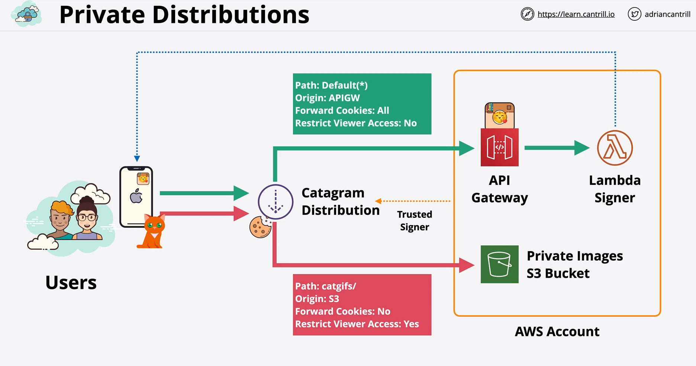
    
* Geo Restriction
    * Types:
        * Cloudfront Geo restriction
            * Whitelist of Blacklist - Country Only
            * GeoIP Databases 99,8% Accurate
            * Applies to entire distribution
            * Return Object or 403 (Forbidden)
        * 3rd Party Geolocation
            * Can restrict based on users, browser or logging state, licenses, user data fields, .... everything
            * Needs a compute to act as decider
        
* Field Level Encryption
    * Client <=> Origin can be encrypted using https
    * Information is processed at the web server as HTTP
    * Field Level encryption happens at the edge
        * Separately from the https tunnel
        * A private key is needed to decrypt individual fields
        * The sensitive data is encrypted at the edge and remains separately controlled through its lifecycle
        
* Lambda@Edge
    * You can run lightweight Lambda at edge locations
    * Adjust data between the Viewer & Origin
    * Currently supports Node.js and Python
    * Run in the AWS Public Space (Not VPC)
    * Layers are not Supported
    * Different Limits vs Normal Lambda Functions
    * Lambda
        * Viewer Request -> After cloudfront receives a request from viewer (Customer) - Limits 128 MB, 5 Seconds
        * Origin Request -> Before Cloudfront Forwards the request to an Origin - Normal Lambda MB, 30 Seconds
        * Origin Response -> After Cloudfront Receives a response from an Origin - Normal lambda MB, 30 Seconds
        * Viewer Response -> Before a Response is forwarded to a viewer (Customer) - Limits 128 MB, 5 Seconds
    * Use Cases
        * A/B Testing - Viewer Request
        * Migration S3 Origins - Origin Request
        * Different Objects Based on Device - Origin Request
        * Content By Country - Origin Request

### Elasticcache

* In-memory database .... high performance
* Managed Redis or Memcached .. as a service
* Can be used to cache data - for Read Heavy Workloads
* Reduces database Workloads (expensive)
* Can be used to store Session Data (Stateless Servers)
* Requires application code changes
* An in-memory cache allows cost effective scaling of read-heavy workloads - and perfomance improvement at scale
* Memcached
    * Simple data Structures
    * No replication
    * Multiple Nodes (Sharding)
    * No Backups
    * Multi-threaded
* Redis
    * Advanced Structures
    * Multi-AZ
    * Replication (Scale Reads)
    * Backup & Restore
    * Transactions
    
## Migrations & Extensions

### The 6R's Of Cloud Migration

* Discover, Assess & Priorities applications to Migrate
* Rehosting - Lift and Shift
    * Lift and Shift - Migrate as is (App Virtual Machine => EC2, DB => EC2)
    * + Reduced Admin Overhead (IaaS)
    * + Potentially easier to optimise when in AWS
    * + Cost savings (e.ge using burst Instance T3)
    * - Not taking full advantage of cloud
    * - Potentially ' Kicking the can down the road'
    * VM Import/Export Server Migration Service
* Replatforming - Lift and Shift with Optimization
    * Just like rehosting ... but ... with optimization
    * You might use RDS instead Self Managed DBs
    * You might use ELB's instead of Load balancers
    * You might use S3 as backup or media storage
    * No real negatives & no world-changing benefits
    * Admin overhead Reductions, Performance benefits. more effective backups or improved HA/FT
* Repurchasing - Move to something new ... e.g SaaS
    * Unless you have a reason to Self-manage
    * use a XaaS Product
    * MS Exchange -> Microsoft 365
    * CRM -> Salesforce
    * Payroll -> Xero
* Refactoring / Re-architecting - Take advantage of Cloud
    * Reviewing the architecture of an application
    * Adopting 'Cloud-native' architectures & products
    * Service-oriented or Microservices
    * APIS, Event-Driven or Serverless
    * - Initially very expensive & time sonsuming
    * + best long-term benefits
    * often cheaper, much more scalable, better HA/FT, costs aligned with app usage
* Retire - Do we even need this? No? Dump it
    * Systems are often running for no reason
    * Audting their usage is often more work than leaving running
    * If you don't need the application switch if off
    * often 10% to 20% cost savings
* Retain - Not worth the time/money or is too scary to migrate
    * Do Nothing
    * Old appplication - not worth the move
    * Complex Application - leave till later
    * Super-important Apllication - risky
    * Complete the migartion - swing back to focus on the left-overs

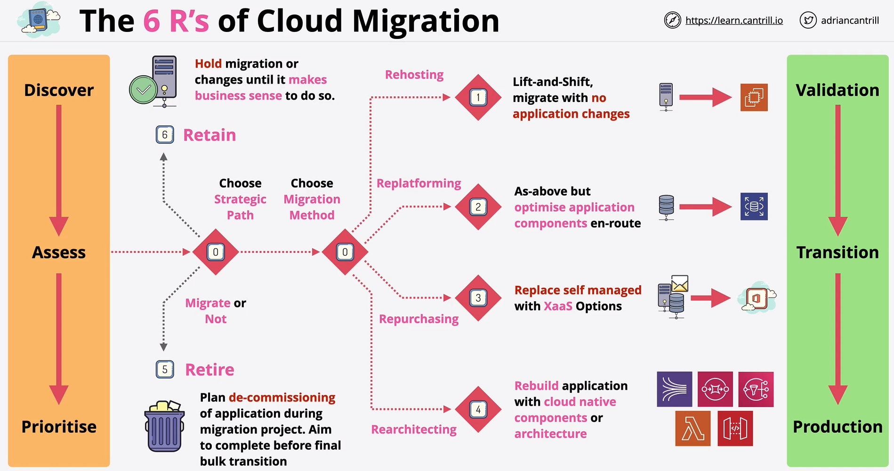

### Virtual Machine Migrations

* Application Discovery Service
    * Discover on-premises infrastructure
    * Integration with AWS Migration Hub and Amazon Athena
    * Mode: Agentless (Application Discovery Agentless Connector)
        * ... OVA appliance, integrates with VMWARE - inventory, vm usage
        * Measure performance and resource usage
    * Mode: Agent Based 
        * Discovery for 'in VM' data gathering (network, processes, usage, performance)
        * ... dependencies between servers (network activity)

* Server Migration Services (SMS)
    * Migrate whole VM's (OS, Data, Apps ... migrated as is)
    * Agentless ... uses a connector which runs on-premises
    * Integrates with VMware, Hyper-V and AzureVM Only
    * Incremental replication of live volumes
    * ... Orchestrate multi-server migations
    * Creates AMIs which can be used to create EC2 Instances
    * Integrates with AWS Migration Hub
    
### Database Migration Service (DMS)

* A managed database migration service
* Common DB support
    * MySQL, Aurora, Microsoft SQL, MariaDB, MongoDB, PostgreSQL, Oracle, AzureSQL
* Runs using a replication instance
* Source and Destination Endpoints point at Source and Target Databases
    * One Endpoint Must be on AWS
* Replication Tasks
    * Full Load (one off migration of all data)
    * Full Load + CDC (change data capture) - for ongoing replication which captures charges
    * CDC Only - If yoy want to use an alternative method to transfer the bulk DB data ... such as native tooling
* Integration with Snowball
    * Larger migrations might be multi-TB in Size
    * ... moving data over networks takes time and consumes capacity
    * Step 1: Use SCT to extract data locally and move to a snowball device
    * Step 2: Ship the device back to AWS. They load onto an S3 Bucket
    * Step 3: DMS Migrates from S3 into the target Store
    * Step 4: Change Data Capture (CDC) can capture changes, and via S3 intermediary they are also written to the target database

* Schema Conversion Tool
    * Is used when converting one database engine to another
    * Including DB -> S3 (Migrations using DMS)
    * SCT is not used when migrating between DB's of the same type
    * Works with OLTP DB Types (MySQL, MSSQL, Oracle)
    * And OLAP (Teradata, Oracle, Vertica, Greenplum)
    
### Storage Gateway

* Virtual Machine (or hardware appliance)
* Presents Storage using iSCI, NFS, or SMB
* Integrates with EBS, S3, and Glacier within AWS
* Migrations, Extensions, Storage Tiering, DR and Replacement of backups systems

* Volume Gateway
    * Two Modes       
        * Stored Mode
            * Functions Like SAN or NAS
            * Raw disks over iSCI
            * Can create filesystems
            * Everything is stored Locally
            * Has a upload buffer and every data written in local storage is copied to upload buffer and uploaded asynchronously into AWS
                * Uploaded to Storage Gateway Endpoint -> Is a public endpoint (Can use Public VIF)
                * Is copied to S3 in form EBS Snapshots
            * Great for full disk backups of servers
            * Assists with disaster recovery ... Creates EBS Volumes in AWS
            * Low-Latency data because the data is um local storage
            * Doesn't improve datacenter capacity
                * Main copy of data is stored on the gateway
            * Provics backup disaster and migrations capabilities
            * Limits
                * 32 Volumes per gateway
                * 16 TB per volume
                * 512 TB per Gateway
        * Cached Mode
            * Same architecture like Stored mode
            * Difference is have a local cache instead local storage
            * Primary data is stored in S3 (AWS Managed) and is cached locally
                * Can create EBS snapshots
            * Can use for Datacenter extension
            * Storage appears on-premises but is actually in AWS
            * Data Stored in AWS, Cached on-premises
            * Capacity Extension
            * Limits
                * 32 TB per volume
                * 1PB per gateway
                * 32 Volumes per gateway
                    
* Tape Gateway (VTL Mode)
    * Has upload Buffer and Local Cache
    * Virtual Tape 100 Gib => 5 TiB
    * 1PB across 1500 virtual tapes
    * Uses S3 (VTL) and Glacier (VTS)

* File Gateway
    * Bridges on-premises file storage and S3
    * Mount points (shares) available via NFS or SMB
    * Map directly onto an S3 Bucket
    * Files stored into a mount point, are visible as objects in an S3 bucket
    * Read and Write caching ensure LAN-like performance
    * A Bucket Share = AWS S3 Bucket = On-premises File share
    * Can integrate with AD use SMB AD Auth
    * Primary data is held in S3
    * Limits
        * 10 Bucket Shares per File Gateway
    * Multiple Contributors
        * Use the NotifyWhen upload API to notify other gateways when objects are changed
        * Doesn't support object Locking - use read only mode on other shares or tightly control file access
        
### AWS Snowball

* Move larger aumounts of data IN and OUT of AWS
* Physical storage .. suitcase or truck
* Ordered from AWS Empty, Load up, Return
* Ordered from AWS with data, empty & Return
* Snowball
    * Ordered from AWS, log a job, Device Delivered (not instant)
    * Data Encryption uses KMS
    * 50 TB or 80 TB Capacity
    * 1Gbps (RJ45 1 GBase-Tx) or 10 Gbps (LS/SR) Network
    * 10 TB to 10PB economical range (multiple devices)
    * Multiple devices to multiple premises
    * Only Storage
* Snowball Edge
    * Both Storage and Compute
    * Larger capacity vs Snowball
    * 10Gbps (RJ45), 10/25 (SFP), 45/50/100 Gbps (QSFP+)
    * Three Types
        * Storage Opimized (with EC2)
            * Can Run EC2
            * 80 TB, 24 vCPU, 32 Gib Ram, 1 TB SSD (If include EC2)
        * Compute Optimized
            * 100 TB + 7.68 NVME, 52 vCPU and 208 GiB RAM
        * Compute with GPU
            * As above ... with a GPU
    * Ideal for remote sites or where data processing on ingestion is needed
* Snowmobile
    * Portable DC within a shipping container on a truck
    * Special order
    * Ideal for single location when 10PB+ is required
    * up to 100PB per snowmobile
    * Not economical for multi-site (unless huge) or sub 10PB
    
### AWS DataSync

* Data Transfer Service TO and FROM AWS
* Migrations, Data Processing Transfers, Archival/Cost Effective Storage or DR/BC
* Designed to work at huge scale
* Keeps metadata (e.g. permissions/timestamps)
* Built int data validation
* Scalable - 10 GBps per agent (~100 TB per day)
* Bandwidth Limiters (avoid saturation)
* Incremental and scheduled transfer options
* Compression and encryption
* Automatic Recovery from transit errors
* AWS Service integration - S3, EFS, FSX
* Pay as you use ... per GB cost for data moved
* Supports bi-directional transfor
* Agent
    * DataSync Agent runs on a virtualisation platform such as VMWare and communicates with the AWS DataSync Endpoint
    * Schedules can be set to ensure the transfer of data occurs during or avoiding specific time periods
    * Encryption in-transit (TLS)
    * Customer impact can be minimised bt setting bandwidth limit in (MiB/s)
    * Software used to read or write to on-premises data stores using NFS or SMB
* Locations
    * Locations define the SRC or DST for the sync of data TO or FROm AWS. eg: S3, EFS, FSx, NFS, SMB
* Task
    * Defines what is being synced, how quickly, FROm where to Where
    
## Deployment & Management

### Cloudformation

* AWSTemplateFormatVersion is needed if you have description
* Description needs to appear immediately after AWSTemplateFormatVersion
* Metadata
    * AWS::Cloudformation::Interface -> Contol the UI
* Mappings
    * Key/value pairs which can be used for lookups
* Conditions
    * Two way process
    * First -> create condition
    * Second -> use condition

* Custom Resources
    * Cloudformation doesn't support everything
    * Custom Resources let CFN integrate with anything it doesn't yet, or doesn't natively support
    * Passes data to something, gets data back from something
    
* Nested Stacks
    *  Single Stack Limitations
        * Resources share a lifecycle
        * Can't easily reuse resources. e.g: A VPC
        * Can't easily reference other stacks
        * Stack resource limits (200)
    * Root Stack & Parent Stack
        * Root Stack => Normal Stack
    * Whole templates can be reuse in other stacks
    * Use when the stacks form part of one solution - lifecycle linked
    * Overcome the 200 Resource Limit of one stack
    * Modular templates ... code reuse
    * Make the installation process easier
    * Nested stacks created by the root stack

* Cross-Stack
    * Outputs are normally not visible from other stacks
        * Nested stacks can reference them
    * Outputs can be exported ... making them visible from other stacks
    * Exports must have a unique name in the region
    * FN::ImportValue can be used instead of Ref
    * Cross-region import is not supported
    * Service-Orientated & different lifecycles & Stack Reuse
    
* Stack Sets
    * Deploy CFN stacks across many accounts & Regions
    * StackSets are containers in an admin account
        * Contains Stack instances ... which reference stacks
        * StackInstances & stacks are in 'target accounts'
   * Each Stack - 1 region in 1 account
   * Security = self-managed or service managed
   * Term: Conurrent Accounts
   * Term: Failure Tolerance
   * Term: Retain Stacks
   * Scenario: Enable AWS Config
   * Scenario: AWS Config Rules - MFA, EIPS, EBS Encryption
   * Scenario: Create IAM Roles for cross-account access
   
* Stack Roles
    * CFN uses the permissions of the logged in identity
    * Which means you need permissions for AWS
    * CFN can assume a role to gain the permissions
    * This lets you implement role separation
    * The identity creating the stack ... doesn't need resource permissions - Only PassRole
    
### Service Catalog

* Service Catalog Definition
    * Document or database created by an IT team
    * Organised collection of products
    * Key Product Information: Product Owner, Cost, Requirements, Support Information, Dependancies
    * Defines approval of provisioning from IT and customer side
    * Manage costs and scale service delivery
* Self-Service Portal for 'end users'
* launch predefined (by admin) products
* End user permissions can be controlled
* Admins can define those products
    * and the permissions to launch them
* Build products onto portfolios
* Process
    * Admins defines products and portfolios using cloudformation templates and service catalog configuration
    * Deploy portfolio to any service enabled regions
    * Service catalog users review porfolios the have permissions on and launch produtc(s) into service enabled regions
    * Service catalog luanches the infrastructure using defined templates. Service catalog users don't need infrastructure permissions... only launch permissions
    * Products are available for usage
    
### CI/CD

* Codepipeline
    * Needs to have Source Stage
* Buildspec.yml, appspec.[yml|json]
* * CodeDeploy
    * Deploy to one or more EC2 using deployment group
    * AWs Elastic Beanstalk or AWS OpsWorks
    * AWS Cloudformation
    * ECS or ECS(Blue/Green)
    * AWS Service Catalog or Alexa Skills kit
    * Amazon S3

### Elastic Beanstalk

* Platform as a Service (PaaS)
* Developer Focussed - not end user
* High Level - Managed Application Environments
* User Provide Code & EB handles the environment
* Focus on code, low infrastructure overhead
* Fully customisable - uses AWS products under the covers
* Requires App Changes ... doesn't como for free
* Platforms
    * Built in Languagues
        * GO, Java SE, Tomcat
        * .NET Core (Linux) & .NET (Windows)
        * Node.js, PHP, Python & Ruby
    * Docker
        * Single Container & Multicontainer Docker
        * Pre-configured Docker
    * Custom platforms
        * Custom Via packer
* Application
    * is a collection of things relating to an application - a container / folder
* Application version
    * Specific labeled version of deployable code for an application
    * The source bundle is stored on S3
* Environments
    * Are containers of infrastrucuture and configuration for a specific application version
    * Each environment is either a web server tier or a worker tier
        * This controls the structure & function of environment
        * Web Tier - Communicate with end users
            * Receives communication from Load Balancer
        * Worker Tier - Process work from web tiers
            * Any workload from web tier are stored in SQS Messages and are received by worker tier
            * Worker tiers scale based on queue messages
    * Each Env has it's own CNAME - a CNAME SWAP can exchange two environment DNS
    
* Need app tweaks
* Ideal for small development teams
* Use docker for anything unsupported
* Databases OUTSIDE of Elastic Beanstalk
* DBs in an ENV are lost if the env is deleted
    
    
### AWS OpsWorks

* 3 Modes
    * Puppet Enterprise
        * AWS Managed Puppet Master Server
    * Chef Automate - AWS Managed Chef Servers with premium features
    * OpsWorks - AWS Integrated Chef - No servers
* Use when you already have one of these
* Requirement to automate
* See Recipes, Cookbook or Manifests Mentioned
* OpsWorks Mode
    * Stacks - Core Component ... container of resources
    * Layers - Each layer is a specific function withing a stack
    * Recipes & Cookbooks -> Can be stored on Github
    * Lifecycle Events - Setup, Configure, Deploy, Undeploy and shutdown
    * Instances - 24/7, Time-Based or Load-Based
    * Apps
        * Deployed for S3 or HTT
        
### AWS Systems Manager

* View amg control AWS and on-premises infrastructure
* Agent based - installed on Windows and Linux AWS AMI's
* Manage Inventory & Patch Assets
* Run Commands & Manage Desired State
* Parameter store ... configuration and secrets
* Securely connect to EC2

* Run Command
    * Run Command Documents on managed instances
    * No SSH/RDP access Required
    * Instances, Tags Or Resource Groups
    * Command documents can be reused & can have parameters
    * Rate Control - Concorrency & Error Threshold
        * Error Threshold defines how many fail before the job fails
    * Output Options - S3 ... SNS
    * EventBridge
    
* Patch Manager
    * Concepts
        * Patch Baseline
            * Predefined PAtch Baselines - Various OS (you can also create your own)
            * For Linux - AWS-[OS]DefaultPatchBaseline, explicitly define patches
            * Windows - AWS-DefaultPatchBaseline - Critical and Security Updates
            * AWS-WindowsPredefinedPatchBaseline-OS - Same as above
            * AWS-WindowsPredefinedPatchBaseline-OS-Applications - Sabme as above + MS App updates
        * Patch Groups
        * Maintenance Windows
        * Run Command
        * Concorrency & Error Threshold
        * Compliance
    * AWS-RunPatchBaseline it's the command used. Runs with a baseline and targets
        
        
        
## Advanced Security And Config Management

### GuardDuty

* Continuous security monitoring service
* Analyses supported Data Sources
    * plus AI/ML, plus threat intelligence feeds
* Identifies unexpected and unauthorised activity
    * Notify or event-driven protection/remediation
* Supports multiple accounts (MASTER and MEMBER)
* Supported Event Source
    * DNS Logs (Route 53)
    * VPC Flow Logs
    * Cloudtrail Event Logs
    * CloudTrail Management Events
    * Cloudtrail S3 Data Events
* Send events to Cloudwatch Events (EventBridge)
    * Notification via SNS
    * Invokation Lambda

### AWS Config

* Record configuration changes over time on resources
* Auditing of changes, compliance with standards
* Does not prevent changes happening ... no protection  - But can be used for automatic remediation
* Regional Service ... supports cross-region and account aggregation
* Changes can generate SNS Notifications and near-realtime events via EventBridge & Lambda
* Config Rules
    * Resources are evaluated against Config Rules - either AWS Managed or custom (using Lambda)
    * Rules return compliant or Non-compliant
* Notify via SNS remediate via EventBridge with Lambda
* Integrate with SSM to remediation

### AWS Inspector

* Scans EC2 Instances & the Instance OS
* Vulnerabilities and deviations against best practice
* Length ... 15 mins, 1 hour, 8/12 hours or 1 day
* Provides a report of findings ordered by priority
* Two Main Types
    * Network Assessment (Agentless)
    * Network & Host Assessment (Agent)
* Rules package determine what is checked
    * Network Reachability (No agent required)
    * Agent can provided additional OS visibility
    * Check reachability end to end. Ec2, ALB, DX, ELB, ENI, IGW, ACLs, RT's, SG's, Subnets, VPCs, VGWs & VPC Peering
    * RecognizedPortWithListener, RecognizedPortNoListener, RecognizedPortNoAgent
    * UnrecogizedPortWithListener
* CVE and CIS
* Security best practices for Amazon Inspector

### KMS

* Regional & Public Service
* Create, Store and Manage Keys
* Cryptographic operations (encrypt, decrypt & ...)
* Keys never leave KMS - Provides FIPS 140-2 (L2)
* AWS Manage ... Shared but separated

* Customer Master Key (CMK)
    * CMK is Logical - ID, date, policy, desc & state
    * Backed by physical key material
    * Generated or Imported
    * CMKs can be used for up to 4Kb of data
    * CMKs are isolated to a region & never leave
    * Support Rotation
        * In AWS CMKs -> can't be disabled and rotate every 3 years
        * In Customer Manaked CMKs -> can be disabled, but if enabled is rotated once per year
        * Stores Backing Key (and previous bakcing key)
        * Can use aliases to point to CMKs
    * Two Types
        * AWS Managed CMKs
        * Customer Managed CMKs
            * More configurable
            * Can edit key policy to give permission to other AWS Account to decrypt and encrypt actions
    * Security
        * Key Policies (Resource)
        * Every CMK has one
    
* Data Encryption Keys (DEKs)
    * Generated using Customer Master Key
    * GenerateDataKey - Works on > 4Kb
    * KMS don't store the DEKs
        * Provides to you (or the services that use) and discard it
    * KMS provide two Version of DEKs
        * Plaintext Version
        * ChiperText version
        * Encrypt data using plaintext key version
            * And Discard the plainttext key version
        * Store encrypted key with data
        * KMS don't encrypt using DEKs = You or the services
        * KMS don't track DEKs operations
        * DEKs can be used to encrypt hundred or million files
        * To decrypt, pass the DEK encrypted version to KMS and decrypt use the same CMK to generated
            * Then use the decrypt DEK that KMS gives you back and use to decrypt the data and discard the DEK encrypted key
     
### CloudHSM

* True "Single Tenant" HArdware Security Module (HSM)
* AWS Provisioned ... fully customer managed
* Fully FIPS 140-2 Level 3 (KMS is L2 Overall, some L3)
* Industry Standard APIS - PKCS#11, JAva Cryptography Extensions (JCE), Microsoft CryptoNG (CNG) Libraries
* KMS can use CloudHSM as a custom Key store, cloudHSM integration with KMS
* Deployed in AWS CloudHSM VPC that you don't have visibility
    * Injected in your VPC via ENI
* HSM by default is not Multi-AZ
    * Need to deploy multiple HSM and configure as a cluster
    * HSMS keep keys and policies in sync when nodes are added o removed
* Need to install AWS CloudHSM Client (EC2 Instances) to access CloudHSM using Industry standard APIS
* AWS Provision HSM but have no access to secure are where key material is held
    * AWs can perform maintenance updated but don't have access to cryptographic area
* No native AWS Integration ... e.eg no S3 SSE
    * Can use to perform client site encryption before upload to S3
* Offload the SSL/TLs processing for Web servers
    * KMS natively cannot
* Enable Transparent Data Encryption (TDE) for Oracle database
* Protect the Private Keys for an issuing Certificate Authority (CA)

### AWS Certificate Manager (ACM)

* Lets you run a public or private Certificate Authority (CA)
* Private CA - Applications need to trust your private CA
* Public CA - Browsers trust a list of providers, which can trust other providers
* Can generate or Import Certificats
* If gnerated ... it can automatically renew
* If imported ... you are responsible for renewal
* Certificates can be deployed out to supported services
* Supported AWs Services Only (Cloudfront and ALBs ... NOT EC2)
* ACM Regional Service
* Certs cannot leave the region they are generated or imported in
* To use a cert with ALB in ap-southeast-2 you need a cert in ACM in ap-southeast-2
* Global services such CloudFront operate as though within us-east-1

### Parameter Store

* Storage for configuration & secrets
* String, StringList & SecureString
* License codes, Database Strings, Full Configs & Passwords
* Hierarchies & Versioning
* Plaintext and Ciphertext
* Public Parameters - Latest AMIs per region
* Changes can create events

### Secrets Manager

* It does share functionality with Parameter Store
* Designed for secrets (.. passwords, API Keys)
* Usable via Console, Cli, API or SDK's (integration)
* Supports automatic rotation ... this uses lambda
* Directly integrates with some AWS Products (... RDS)
* Secrets are encrypted using KMS

### VPC Flow Logs VS Packet Sniffing

* Capture packet Metadata ... Not Packet contents
* Applied to
    * VPC - All interfaces in that VPC
    * Subnet
    * Interface Directly
* Not Realtime
* Destinations
    * S3
    * Cloudwatch Logs
* Traffic Not Recorded
    * To and From 169.254.169.254, 169.254.169.123
    * DHCP
    * Amazon DNS Server
    * Amazon Windows License

### AWS WAF & Shield

* AWS Shield
    * Provides AWS resources with DDoS protection
    * Standard
        * Free with Route53 and Cloudfront
        * Protection against Layer 3 and Layer 4 DDoS Attacks
    * Advanced
        * Includes EC2, ELB, Cloudfront, Global Accelerator & R53
        * DDoS Response Team & Financial Insurance
* WAF
    * Layer 7 (HTTP/s) Firewall
    * Protects against complex Layer 7 attacks/exploits
    * SQL Injections, Cross-Site Scripting, Geo Blocks, Rate Awareness
    * Web Access Control List (WEBACL) integrated with ALB, API Gateway and Cloudfront
    * Rules are added to a WEBACL and evaluated when traffic arrives
    * WebACL filters traffic at the edge (In Cloudfront)
    
## Disaster Recovery & Business Continuity In AWS

### Types of DR

* Effective DR/BC costs money all of the time
* You need some type of extra resource
* Execution DR/BC process takes time
    * How long .. depends on the type of DR/BC
    
* Backup & Restore
    * You have a primary Site and backups to create the backup site
    * Data is constantly backed up at the primary site
    * The only costs are backup medi & management - no ongoing spare infrastructure costs
    * Restores require new hardware or a lengthy restore process
* Pilot light
    * You have a primary Site and a Backup Site/hardware
    * A secondary environment is provisioned in advanced running only the absolute minimum of infrastructure
    * Critical Components such as Databases are always syncing ready to be used
* Warm Standby
    * You have a primary Site and a Backup Site/hardware
    * All components are replicated between primary and backup site
        * But the infrastructure in backup site is running on minimum sizes of compute
    * A smaller sized, but fully functional version of your primary infrastructure is running 24/7/365
    * Ready to be increased in size when failover is required
    * Faster than pilot light...cheaper than a full active/active
* Multi Site - Active / Active
    * You have a primary Site and a Backup Site/hardware
    * Data is constantly replicated from the primary site to backup
    * Costs are generally 200% - a full copy is running at all time
    * You can load balance across environment improving HA and performance
    
* Considerations to choose
    * How important is it yo your business
    * How quickly do you need recovery
    * Backups - Cheap and Slow
    * Pilot Light - Faily Cheap but faster
    * Warm standy - costly, but quick to recover
    * Active / Active - expensive .. no recovery time
    
### Storage

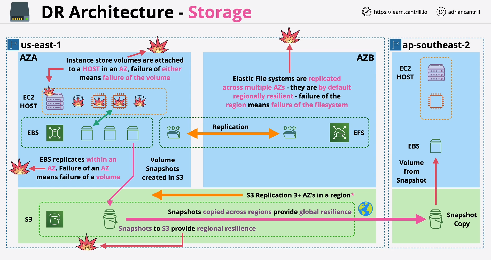

### Compute

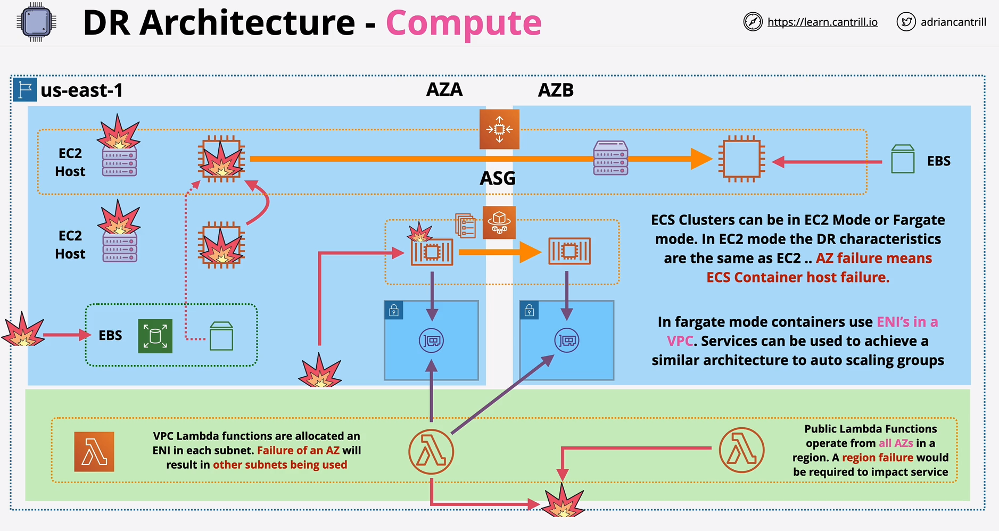

### Database

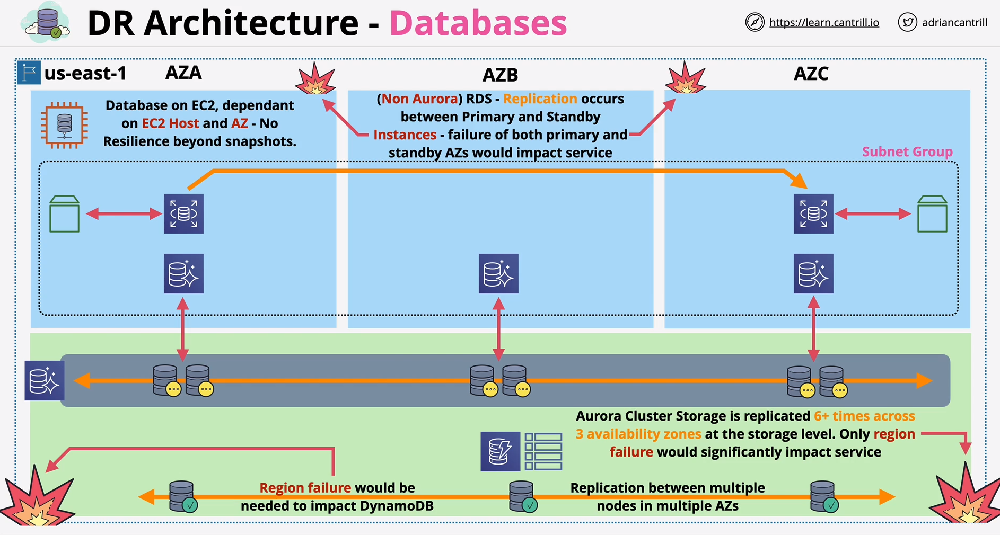

### Networking

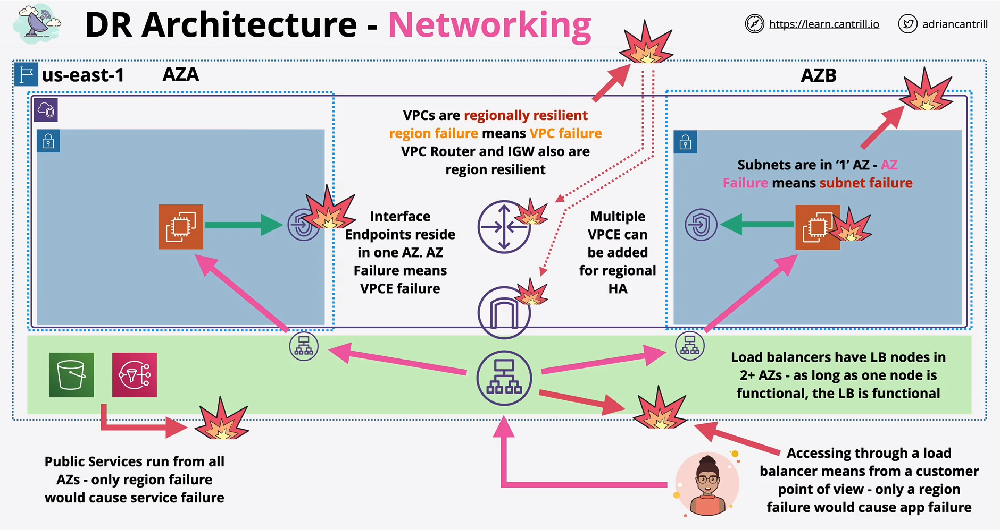

## Everything Else

### Amazon Lex & Connect

* Lex
    * Text or Voice conversational interfaces
    * Powers the Alexa service
    * Automatic speech recognition (ASR) - speech to text
    * Natural Languague Understanding (NLU) - Intent
    * Build understanding into your application
    * Scales, integrates, quick to deploy, pay as you go pricing
    * Chatbots, voice assistants, Q&A Bots, Info/Enterprise bots
* Connect
    * Contact center as a service
    * Omnichannel - voice and chat, incoming & outgoing
    * Integrates with PSTN networks for traditional voice
    * Agents can connect using the internet from anywhere
    * Integrates with other AWs services (Lambda/Lex) for additional intelligence and features
    * Quick to provision, pay as you use pricing & scalable

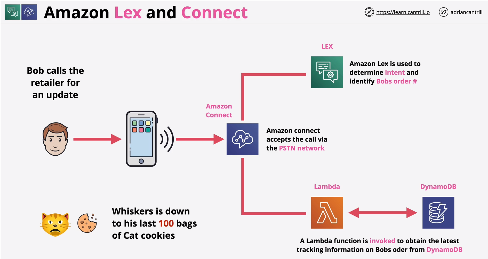

### AWS Rekognition

* Deep learning image and video analysis
* Per image or Per minute (video) pricing
* Integrates with applications & event-driven
* Can even analyse live video streams - Kinesis video streams

### Kinesis Video Streams

* Ingest live video from producers
    * Security Cameras, smartphones, cars, drones, time-serialised audio, ...
* Consumers can access data frame-by-frame ... or as needed
* Can persist and encrypt (in-transit and at rest) data
* Cant access directly via storage, only via APIs
* Integrates with other AWS Services. e.g. Rekognition and Connect

### AWS Glue

* Serverless ETL (Extract, transform & Load)
    * vs datapipeline (which can do ETL) and uses servers (EMR)
* Moves and transforms data between source and destination
* Crawls data sources and generates the AWs Glue Data Catalog
* Data Sources: Stores: S3, RDS, JDBC Compatible & DynamoDB
* Data Source: Streams: Kinesis Data Stream & Apache Kafka
* Data Targets; S3, RDS, JDBC Databases
* Data Catalog
    * Persistent metadata about data sources in region
    * One catalog per region per account
    * Avoids data silos
    * Athena, Redshift, EMR & AWS Lake Formation all use Data catalog
    * configure crawlers for data sources

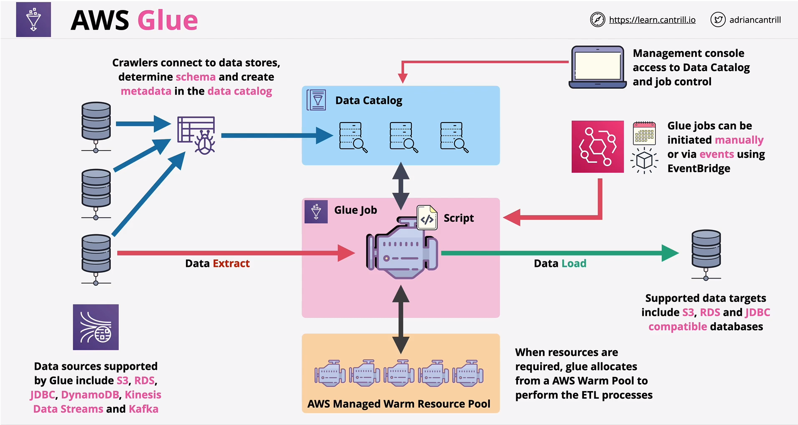

### Device Farm

* Provides managed Web and Mobile Application testing
* Test on a fleet of real browsers and devices
* Phones, Tablets, different languages, sizes and operations systems
* Use built in or supported automated testing frameworks
* Receive reports detailing testing output
* supports remote connection to devices for issue reproduction and testing
* AWS have all the devices so you don't need to

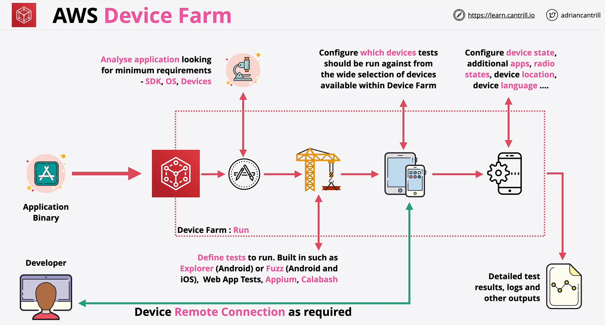