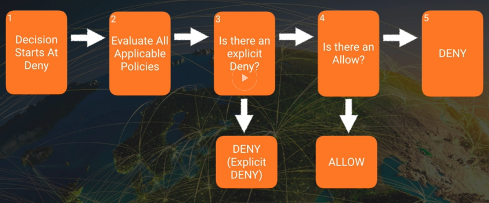
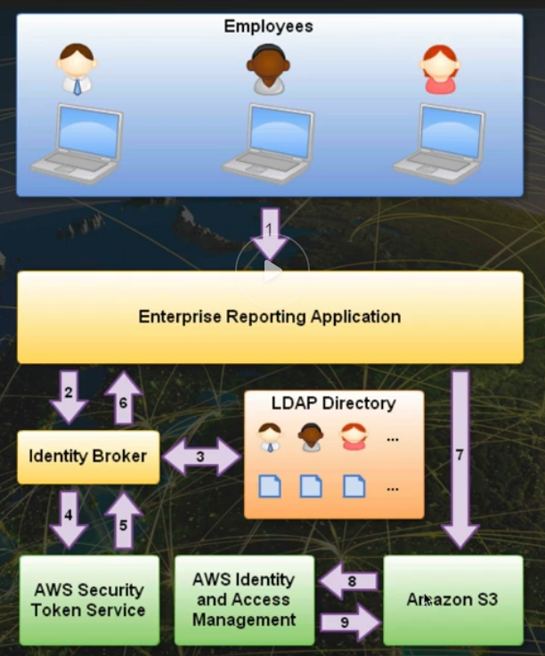
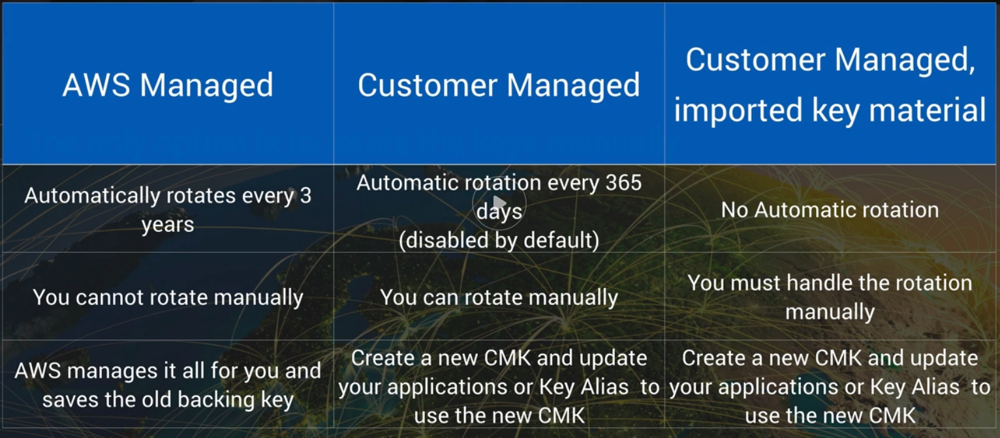
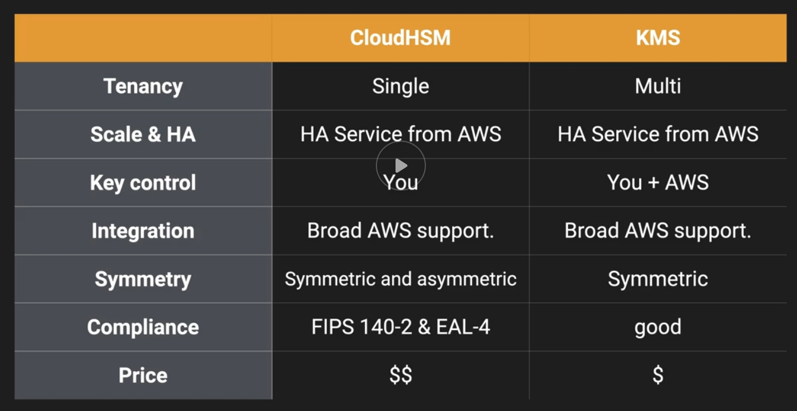
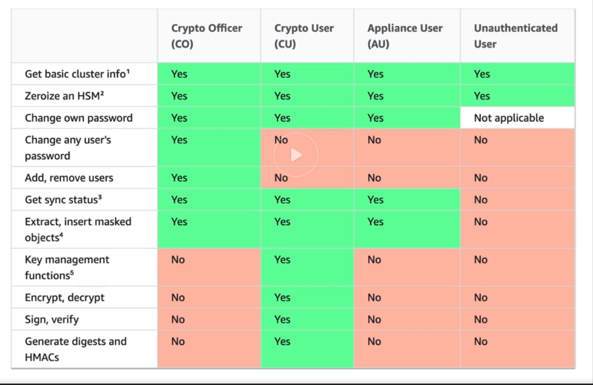
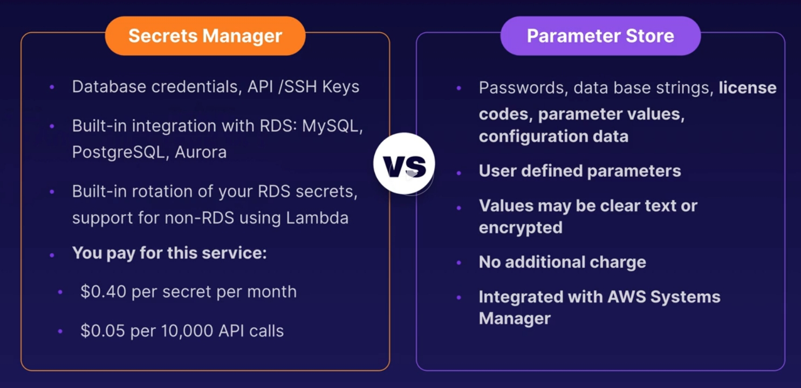

# AWS Certified Security Specialty

## Resources

[AWS Security](https://aws.amazon.com/security)

[White Paper: Introduction to AWS Security Processes](https://docs.aws.amazon.com/whitepapers/latest/aws-overview-security-processes/welcome.html?did=wp_card&trk=wp_card)

[Linux academy Guide](https://app.lucidchart.com/documents/view/42bca91d-ad59-4835-8f3a-cf0fa41a0cd4)

* WhitePapers
    * KMS best Practices
    * KMS Cryptographic Details
    * DDOS Best Practices
    * Logging in AWS
    * Well-Architected framework - Security Pillar
    
* Re:invent Videos (2017) - NET 3XX - Medium level , NET 4XX - Advanced
    * KMS best Practices
    * AWS Encryption Deepdive
    * Become an IAM Policy Master
    * DDOS Best Practices
    * VPC fundamentals & Connectivity options
    * Logging in AWS
    * Advanced security best practices masterclass
    * Advancer VPC Design and New captabilities for Amazon VPC
    
* FAQs
    * https://aws.amazon.com/faqs/ Security, identity & Compliance
    
## Exams

[Exam Guide](https://d1.awsstatic.com/training-and-certification/docs-security-spec/AWS_Certified_Security_Specialty_Exam_Guide_v1.5.pdf)
[AWS Practice Exam](https://rise.articulate.com/share/AMkmIRlYT4b8xsWXcOYEhqw3H_OMeoSM#/lessons/Ra5P0ix3pErElmpDy_ZQn8SXNcn6dMHx) => DONE
[AWS Practice Exam 2](https://d1.awsstatic.com/training-and-certification/docs-security-spec/AWS_Certified_SC-S_Sample%20Questions_v1.0_FINAL.pdf) 
[Quiz 1](https://www.twitch.tv/aws/video/467770461) => Done
[Quiz 2](https://www.aws.training/Details/Video?id=37283)
[Quiz 3](https://www.aws.training/Details/Video?id=37284)
[Quiz 4](https://www.aws.training/Details/Video?id=37293)
[Exam Sample Questions](https://d1.awsstatic.com/training-and-certification/docs-security-spec/AWS-Certified-Security-Speciality_Sample-Questions.pdf) => DONE

* Cloud Guru
* Linux Academy

## Introduction

### Security 101

#### Security Basics - Models

* CIA
    * Confidentiality - IAM, MFA
    * Integrity - Certificate Manager, IAM, Bucket Policies
    * Availability - Auto-Scaling, Multi-AZ

* AAA
    * Authentication - IAM
    * Authorization - Policies
    * Accounting - Cloudtrail

* Non-repudiation (Can't deny you did something)

#### Shared Responsibility Model

* Infrastructure (EC2, EBS, VPC)

* Container (RDS, EMR, Elastic Beanstalk)

* Abstracted (S3, Glacier, DynamoDB, SQS, SES)

#### Security IN AWS

* Visibility

    * AWS Config
    
* Auditability

    * AWS CloudTrail

* Controllability

    * AWS KMS - Multi-Tenant
    * AWS CloudHSM - Dedicated - FIPS 140-2 Compliance

* Agility

    * AWS Cloudformation
    * AWS Elastic Beanstalk
    
* Automation

    * AWS OpsWorks
    * AWS CodeDeploy
    
    
    
    

### IAM, S3 & Security Policies

#### Resetting Root Users

* Create a new root user password and strong password policy
* Delete previous 2 factor authentication and re-create
* Check if the root user has an Access Key Id and Secret Access Key. If so delete these immediately
* Check other user accounts. Verify they are legitimate and if not, delete these

#### IAM Policies

* IAM is global. Applies to all areas of AWS, not just S3
* Three different types os IAM Policies
    * AWS Managed Policies
    * Customer Managed Policies
    * Inline Policies
* Components
    * Version: current lastest is 2012-10-17 - check this is correct
    * Statement: Enclosed {}, and deliminated by commas . make sure the formatting is good
    * Effect: Needs to be Allow or Deny
    * Principal: The entity which the statement applies to, invalid for IAM user policies since it's implied - be careful to make sure it exists and is correct for resource policies
    * Action: The api Actions which the statement refers to. Make sure the actions and resources match.
    * Resource: One or more ARNs or wildcards which refert to AWS objects
    * Condition (optional): Conditions for the statement. Check for validity. sourceIP won't work with endpoints
   
   
#### Permissions Boundaries

* A permissions policy allows or denies, actions on resources. Policies are applied to identities (Users, Groups, Or Roles) in the case of identity policies, or resources in the case of resources policies
* Permissions boundary is a set of access which an entity (user, role, organisation) can never exceed
* It can act as a safety net to ensure adherence to organizational policies, or it can act as delegation tools
* A permissions boundary on its own grants no permissions, it only restricts 

#### Policy Evaluation


* With least-privilege, decisions ALWAYS default to DENY
* ALSO an explicit DENY ALWAYS trumps an ALLOW
* If no method specifies an ALLOW, then the request will be denied by default
* Only if no method specifies as DENY and one or more methods specify an ALLOW will the request be allowed

* Evaluation Order
    * Boundaries are always processed first, starting with organizational and then identity (User or Role)
    * Then AWS checks if you have chosen a subset of permissions for sts:AssumeRole
    * Final effective permissions are a merge of identity, resource, and ACL

#### Security Token Service (STS)

Grants users limited and temporary access to AWS resources. Users can come from three sources:

* Federation (typically Active Directory)
    * Uses security assertion markup language (SAML)
    * Grants temporary access based off the users Active Directory credentials. Does not need to be a user in IAM
    * Single sign on allows users to log in to AWS console without assigning IAM credentials
* Federation with Mobile Apps
    * Use Facebook/Amazon/Google or other OpenID providers to log in
* Cross Account Access
    * Let's users from one AWS account access resources in another
    
Key Terms
* Federation: combining or joining a list of users in one domain (such as IAM) with a list of users in another domain (such as Active Directory, Facebook etc)
* Identity Broker: a service that allows you to take an identity from point A and join it (federate it) to point B
* Identity store: services like Active Directory, Facebook, Google etc
* Identities: a user of a service like Facebook etc

Use Case
1. Employee enters their username and password
2. The application calls an identity broker. The broker captures the username and password
3. The identity broker uses the organization's LDAP directory to validate the employee's identity
4. The identity broker calls the new GetFederationToken function using IAM credentials. The call must include an IAM policy and a duration (1 to 36 hours), along with a policy tha specifies the permissions to be granted to the temporary security credentials
5. The STS confirms that the policy of the IAM user making the call to GetFederationToken gives the permission to create new tokens and then returns four values to the application: An Access key, a secret access key, a token, and a duration (the token's lifetime)
6. The identity broker returns the temporary security credentials to the reporting application
7. The data storage application uses the temporary security credentials (including the token) to make requests to S3
8. S3 uses IAM to verify that the credentials allow the requested operation on the given S3 bucket and key
9. IAM provides S3 with the go-ahead to perform the requested operation




#### Cognito

* User Pools
    * User pools are user directories used to manage sign-up and sign-in functionallity for mobile and web applications
    * Users can sign-in directly to the user Pool, or indirectly via an identity provider like Facebook, Amazon, Or Google.
    * Cognito acts as an Identity broker, handling all interaction with Web Identity Providers
    * Successfull authentication generates a number of JSON Web Tokens (JWTs) 
* Groups
    * Collection of users in a user Pool, which is often done to set the permissions for those users
* Identity Pools
    * Enable you to create unique identities for your users and authenticate them with identity providers. With an identity, you can obtain temporary, limited-privilege AWS credentials to access other AWS Services
    

#### Glacier Vault

* Glacier is low-cost storage for archiving and long-term backup
* Files are stored as Archives (Single of Multiple files a .tar or .zip file), Archives are stored in Vaults
* A Vault Lock Policy allows you to configure and enforce compliance controls for Glacier Vaults, using Vault Lock Policy
    * Similiar to an IAM Policy
    * Configure WORM (write once read many) archives
    * Create data retentions policys, ex: 5 year retention
    * 2 Steps to configuring a Vault Policy
        * Initiate the lock by attaching a vault policy to your vault, this sets the lock to an in-progress state
        * You have 24 hours to validate the lock policy, once validated, Lock policies are immutable
        * If the policy doesn't work as expected you can abort
        
* Enforce regulatory and compliance controls

#### AWS Organizations

* Allows you to organize your accounts into groups / OUs for access control and centralized billing
* Attach policy based controls - Service Control Policies
* Centrally manage permissions for OUs - groups of accounts or individual accounts
* Access to accounts created in Organizations is initially via a role OrganizationAccountAccessRole, which is created automatically
* SCP is used to centrally control the use of AWS Serices across multiple accounts
    * Like a filter which restricts access to AWS services
    * The SCP applies to all OUs and accounts below the OU to which it is attached
    * Can be used to create a Permissions Boundary
    * Restricting the actions the users, groups, roles in those accounts can do - including root
    * SCPs can deny access only, then cannot allow

#### IAM Credential Report

* Credential Report
    * List all users in your account and the status of their various credentials, including password, access keys, and MFA devices
* Console
    * Head to IAM section, find credential report on the left and download CSV containing the report
* CLI
    * aws iam generate-credential-report
    * aws iam get-credential-report
   

## Domain 1 - Incident Response

### Given an AWS abuse notice, evaluate the suspected compromised instance or exposed access keys

* AWS Acceptable Use Policy

* Compromised Resources and Abuse
    * Abuse Activities: Externally observed behavior of AWS customer instances or resources that are malicious, offensive, illegal, or cloud harm other internet sites
    * AWS will shut down malicious abusers, but many of the abuse complaints are about customers conducting legitimate business on AWS
    * Example causes of abuse that are not intentional
        * Compromised Resource:
            * EC2 instance becoming part of a botnet then attacking other hosts on the internet. This traffic could be going to other AWS Accounts as well
        * Secondary abuse
            * One of your end-users posts an infected file on your resources. When that file calls "home", it is going to appear to be traffic generated in your account
        * Application Function
            * If you are using applications such as web crawlers, it can sometimes appear as DoS attack and AWS will react accordingly
        * False complaints
            * Other AWS users can report your activity to AWS. The complaint might appear legitimate, and AWS will react accordingly   
* Responding to Abuse Notifications - There is a chance that the investigation of abuse will turn out be a compromised account or resource. If this is the case, the following AWS recommendations can help:
    * Change the root password ant the password for all IAM users
    * Add MFA to all admin users and anyone who access the AWS Console
    * Create a new EC2 Key pair and update instances (deleting the compromised key)
        * Create an AMI and Relaunch
        * Edit the .ssh/authorized_keys file
    * Delete for rotate potentially compromised IAM access keys
    * Delete unrecognized or unauthorized resources
        * Instances
        * IAM Users
        * Spot bids
    * Contact AWs Support
        * Respond to the notification
        * Important: Do not ignore AWS abuse communications and make sure they have the most effective email address on file
* Be Proactive: Avoid being Compromised
    * Vault root credentials and remove access keys if they exist
    * Require a strong password and MFA on all IAM accounts
    * Use roles whenever possible, do not trust humans
    * Do NOT copy EC2 key pairs to instances and protect them on admin machines
    * Rotate IAM access keys regularly
    * There are People scanning repositories like Github for access keys, EC2 Key pairs, and other sensitive information. AWS has created a tool to hel prevent spillage:
        * Git-secrets: Prevents committing secrets and sensitive information to gir repositories

### Verify that the Incident Response plan includes relevant AWS services

* Incident Response Framework
    * Preparation Phase - Doing everything we can to prevent breaches and failures. Eventually some type of security event will happen, it always does. We are building walls and fortifying barricades here
        * Be Proactive - Best Practices
            * Risk Management - Determine where the different levels of risk are
            * Principle of least privilege
            * Architect for failure - High availability and fault tolerance always
            * Train for the real thing - Test and simulate; a real incident is a horrible place to learn lessons
            * Clear ownership and governance - Tag all resources so no time is wasted finding who or what group to contact
            * Data classification - Tagging data stores with classification can quickly identify spilage
            * AWs Services involved - IAM, VPC, Route 53, EC2, EFS, RDS, etc ....
        * Limit the Blast - Carefull planning can reduce the "blast radius" of any attack. The ideia here is to segment/section off resources from each other
            * Organizations - We can add accounts under our main account
                * Benefits
                    * If there is a breach, it will not affect multiple accounts
                    * Service Control, Policies can be set so "child" accounts can be limited
            * Using multiple Regions and VPCs can have a similiar affect
            * Services involved: Organizations and VPC
        * Log Everything - Logging is the best way to collect information about our environments.
            * Centralized logging - Collect all the logs from the organization in one place
                * Encrypt and protect (logs contain sensitive data that should not be clear text)
            * It all starts with logs. The following pattern applies
                * Logs => Events => Alerts => Response
            * Services Involved: CloudTrail, VPC Flow Logs, EC2 OS & Apps Logs, S3, Cloudwatch Logs, Config, Lambda
        * Encrypt All - Two Ways
            * Server Side encryption  (data-at-rest)
            * Client Side encryption (data-in-transit)
            * Important - Treat your data as if everyone is looking at it all the time because they might be
            * Services Involved: KMS, S3, Certificate Manager, ELB, Route 53
    * Identification Phase - AKa detection phase, this is where we discover an incident is ocurring. We can do this through behavior-based rules we configure to help detect breaches. We must then determine the following:
        * Intention - Knowing this can help us fin compromised resources quickly
        * Blast Radius - What resources where effected? How deep did the attach go?
        * Data Loss Protection - A combination of encryption and access control. What did they get»
        * Resources needing clean up - What resources do we need to mitigate or isolate
        * This phase can be very difficult, and we should be heavily dependent on automation to help us with detection. We can then react accordingly or even automate responses. There are also stealth techniques we can use to observe user behaviour without being detected if there is questionable behavior
        * Services involved: Cloudwatch, S3 Events, Third Party tools 
    * Containment Phase - Removing the threat. There sould be tools and processes ready to make changes to isolate any compromised resources. The ideal situation would be CLI or SDK scripts we can deploy very quickly when needed. For fast isolation, we need to have following created or have scripts ready:
        * A security group that restricts egress traffic and only allows management ports in
        * A separate subnet with restrictive NACL we can move resources to
        * An S3 Bucket policy that is designed to immediately stop spillage
        * An explicit deny policy created in IAM (Deny *), quick removal of privileges
        * A key policy that denies all decryption
        * In addition there may be additional activities we should perform
            * Snapshot volumes of compromised instances
            * Stopping instances
            * Disabling encryption keys in KMS
            * Change Route 53 record sets
        * Services Involved: VPC, S3, KMS, Route 53
    * Investigation Phase
        * Investigation involves event correlation and forensics. We need to determine exactly what happened and when. We also need to determine if the threat is still viable.
        * As soon as we start our investigation, forensics can begin. Whether we use live box, or dead box forensics here, proceed with caution and make sure it is in a safe, sandboxed environment.
        * Services Involved: VPC, Flow Logs, EC2, Cloudtrail, Cloudwatch
    * Eradication Phase - Try to remove all the infections and compromises in our resources. In most cases, we can just delete the resources. There are some additional concerns whe dealing with data
        * If encryption was implemented correctly, data that was accessed should not be legible. In this case, we can do the following
            * Delete/disable any KMS Keys
            * For EBS, delete splilled files, create a new encrypted volume, copy all good files
            * For S3 with S3 managed encryption, delete the object
            * For S3 with KMS managed keys or customer keys, delete the object and the CMKs
            * Secure wipe any affected files
        * If our data was not encrypted on EBS, we can attempt to sanitize the volume
            * Not recommended
            * Create new columes or instances with clean files or restore them from "Last know good" backups
        * Services Involved: KMS, EBS, S3
    * Recovery Phase - We need to put everything back to normal. This normally includes verifying eradicated resources and reversing the steps taken in the containment phase
        * Restore resources one at time (or group)
        * Use new encryption keys
        * Restore network access
        * Monitor, monitor, monitor
        * Have the containment phase tools ready
        * This phase can be potentially dangerous as the forensic process may not have revealed everything
    * Follow-up Phase
        * Testing and simulations are vital
        * Must strive for efficiency (tagging, automation)
        * Teams need experience
        

### Evaluate the Configuration of Automated Alerting and Execute Possible Remediation of Security-Related Incidents and Emerging Issues    

* Automated Alerting
    * The services we use in the cloud make scalability and reliability easy. These concepts should apply to our logging, monitoring and alerting as well
    * Architecture
        * Logging (CloudTrail, VPC Flow Logs, Route 53 DNS Logs, EC2) => Cloudwatch Logs => cloudWatch Metric Filters => Alarms => Targets (SNS Topic, AutoScaling)
* Automated Response
    * Once we get alerts generated in Cloudwatch, there are a log of target services we can trigger with those alerts. We can configure these target services to automatically remediate our resources
        * CloudWatch Event Rules => Targets:
            * Lambda - Function
            * Systems Manager - Patch or Run command
            * SNS Topic - Message or application
            * SQS - Application Queue
    

## Domain 2 - Logging And Monitoring

### S3 Events

* Work at Object Level
* Events:
    * RRSObjectLost
    * Put
    * Post
    * Copy
    * Complete Multipart Upload
    * Delete
    * Delete marker Created
    * ObjectCreate (All)
    * ObjectDelete(All)
* Then we send notification to three services
    * SNS Topic
    * SQS Queue
    * Lambda Function
    

### S3 Access Logs

* The default storage for CloudTrail is S3
* Cloudwatch Logs can be exported to S3
* S3 can help cost savings while still assisting with compliance
    * Lifecycle policies to reduce storage costs
    * Archive older logs to glacier
* S3 Access Logs
    * Tracks access requests to buckets
    * Each log event contains one access request
    * Log events contain
        * Requester
        * Bucket Name
        * Request Time
        * Request action
        * Response Status
        * Error code
* Important features of s3 access logging
    * The log delivery group must be granted write permission on the target bucket
    * Not near-real-time logging - Can take one hour to propagate
    * Logs are delivered on a best effort basis
        * Newly enable access logs might not be displayed in the target bucket for up to an hour
        * Changes to the target bucket might take up to an hour propagate
        
        

### Centralized Logging

* The Multi-Account Strategy
    * Use Organizations and set up accounts by environments or function
        * Production, Development, Staging, etc
        * Security, Administration
    * Will help reduce the blast radius of any incident
    * An additional layer of security
        * Cross-account roles
* Centralized logging
    * Logs should be contained in one location (the complete picture)
    * Logs should be read-only for most job functions ( including security)
    * Logs should be encrypted (KMS Preferred)
    * Roles Can provide cross account access

### CloudTrail

* Enables
    * After-the-fact incident investigation
    * Near-realtime intrusion detection
    * Industry & regulatory compliance
* Provides
    * Logs API call details (for supported services)
    * Entries can be viewed using Event History (past 90 days)
* Validating CloudTrail Log File Integrity
    * Was the log file modified, or deleted?
    * CloudTail log file integrity validation:
        * SHA-256 hashing
        * SHA-256 with RSA for digital signing
    * Log files are delivered with a 'digest' file
    * Digest file can be used to validate the integrity of the log file
* What is Logged
    * Metadata around API calls
    * The identity of the API caller
    * The time of the API call
    * The source IP address of the API caller
    * The request parameters
    * The response elements returned by the service
* CloudTrail Event Logs
    * Sent to an S3 bucket
    * You manage the retention in S3
    * Delivered every 5 (active) minutes with up 15 minute delay
    * Can be aggregated across regions
    * Can be aggregated across accounts
    * Notifications Available
* Setup
    * Enabled by default (For 7 Days)
    * Trail - A configuration allowing for logs to be sent to an S3 bucket
        * Single region or multi-region trails can be configured
        * trails can make multi-account logging possible
        * Configuration Options
            * Management events - Enabling will log control plane events, such as
                * User login events
                * Configuring Security
                * Setting up logging
            * Data Events which include
                * Object Level events in S3
                * Function level events in Lambda
            * Encryption flexibility
                * Encrypted in S3 server side by default, can be changed to KMS
            * The logs can be sent to an S3 bucket of choice and even prefixed (folders)
* Security
    * Protect you CloudTrail logs, they contain everything that you are doing in your AWS account and may contain PII
    * Allow your security people admin access to Cloudtrail, auditors read only access to CloudTrail using IAM
    * Use Iam policies to restrict access to unauthorised people
    * Restrict Access to S3 using bucket policies (That contain log files), and use MFA delete on your objects
    * Use SSE-S3 or SSE-KMS to encrypt the logs
    * Use lifecycle rules to move data to Glacier or to delete it
    * Check the integrity of your log files using digest files
* Json and CSV file formats to export

### Cloudwatch

* Enables
    * Resource utilization, operational performance monitoring
    * Log aggregation and basic analysis
* Provides
    * Real-time monitoring within AWS for resources and applications
    * Hooks to event triggers
* Key Components
    * CloudWatch
    * CloudWatch logs
    * Cloudwatch Events
* Notifications
* CloudWatch Logs
    * Pushed from AWS services (including CloudTrail)
    * Pushed from your applications/systems
    * Stored indefinitely (not user S3)
    * Can stream log data to lambda and Elasticsearch service
    * Components
        * Log Events - Record of activity recorded by the monitored resource
        * Log Streams - Sequence of logs events from the same source/application
        * Log Groups - A collection of logs streams with same access control, monitoring, and retention settings
        * Metric Filters - Assigned to a log groups, it extracts data from the group's log streams and converts that data into Metric data point
        * Retention Settings - Period of time logs are kept. Assigned to log groups, but applies to all the streams in a group (q day to never expire)
    * Use cloudwatch logs to monitor, store, and access your log files from:
        * Cloudtrail 
        * VPC flow logs
            * Sent to cloudwatch per default
        * Cloudwatch Agent
        * DNS Logs
            * DNS Query Logs can be enabled on Route53 hosted zones and sent to CloudWatch. Route 53 uses common DNS return codes in the log and includes the edge location (based on airport codes)
            * These logs can be used to determine when there is a DNS problem in an application
            * These logs are only available for hosted zones where Route53 is the endpoint (no outside hosting). Also, the logs are not available for private hosted zones
            
* Cloudwatch Metrics    
    * Metric Filters: Used to create a custom metric from log data
        * Assigned at the log group level
            * Will filter all the streams in that group
        * Uses a filter and pattern syntax
            * Example: { $.eventName = "createUser" }
    * Metric Namespace: The Folder or category the custom metric will appear in
    * Metric Name: The name given to the custom metric
    * Alarms: Assigned to the filter
        * Alarms can trigger:
            * SNS Topics
            * Autoscaling Actions
            * EC2 actions (if the metric chosen is related)
            
* Cloudwatch Events
    * Are similiar to alarms, Instead of configuring tresholds and alarming on metrics, CloudWatch Events are matching event Patterns
    * Near real-time stream of system events
    * Common issues: Permissions, Wrong ARN, Typos
    * Three Parts
        * Event Source
            * AWS Resources state change
            * AWS CloudTrail (API Calls)
            * Custom Events (code)
            * Scheduled
        * Rules - match incoming events and route them to one or more targets
        * Targets - Lambda functions, SNS topics, SQS queues, Kinesis streams
            * There can be more than one
    * Examples
        * Alerting on object uploads in S3 (can trigger automatic ACL remediation)
        * Alerting on EC2 instance state changes (can trigger actions on the instances)
        * Alerting on user creation in IAM
        
* Cloudwatch Buses
    * Allows different AWS accounts to share Cloudwatch Events
    * Can collect events from all your accounts together in one account
    * Must grant an account permission by adding and then sending the account number to the receiving account bus configuration
        * The sending account send an event to an Event bus target
    * The CloudWatch Event Bus process requires two event rules, one event rule on either end of the event bus.
    

### AWS Config

* Enables
    * Compliance auditing
    * Security analysis
    * Resource tracking
* Provides
    * Configuration snapshots and logs config changes of AWS resources
    * Automated compliance checking
    * Evaluate resource configurations for desired settings
    * Retrieve configurations of resources in your account
    * Retrieve historical configurations
    * Receive a notification for creations, deletions, and modifications
    * View relationships between resources ( members of a security group)
* Config Rules - A rule represents the desired value for resources. There are two types:
    * AWS Managed Rules - Pre-built and managed by AWS. You simply choose the rule you want to enable, then supply a few configuration parameters to get started
    * Customer Managed Rules - These are custom rules, defined and built by you. You can create a function in AWS Lambda that can be invoked as part of a custom rule and these functions execute in your account
* Conformance Packs
    * A conformance pack is a collection of AWs Config Rules and remediation actions that can be easily deployed as a single entity in an account and a Region or across an organization in AWS organizations
    * Conformance packs are created by authoring a YAML template that contains the list of AWS Config managed or custom rules and remediation actions
* An Aggregator is an AWS Config resource type that collects AWS Config configuration and compliance data from the following
    * Multiple accounts and multiple regions
    * Single account and multiple regions
    * An organization in AWS Organizations and all the accounts in that organization
* Permissions needed
    * AWS Config requires an IAM Role with 
        * Read only permissions to the recorded resources
        * Write access to S3 logging bucket
        * Publish access to SNS
        * console will optionally create these for you
* Restrict Access
    * Users need to be authenticated with AWS and have the appropriate permissions set via IAM policies to gain access
    * Only Admins needing to set up and manage config require full access
    * Provide read only permissions for Config day-to-day use
* Monitoring Config
    * Use CloudTrail with Config to provide deeper insight into resources
    * Use Cloudtrail to monitor access to config such as someone stopping the config recorder
* Uses cases
    * Administering resources
        * Notification when a resource violates configuration rules
    * Auditing and compliance
        * Historical records of configurations are sometimes needed in auditing
    * Configuration management and troubleshooting
        * Configuration changes on one resource might affect others
        * Can help find these issues quickly and can restore last know good configurations
    * Security Analysis
        * Allows for historical records of IAM policies
            * For example, what permissions a user had at the time of an issue
        * Allows for historical records of security group configurations
    


    

### AWS Inspector 

Amazon Inspector is an automated security assessment service that helps improve the security and compliance of applications deployed on AWS
Amazon Inspector automatically assesses applications for vulnerabilities or deviations from best practices.
After performing assessment, Inspector produces a detailed list of security findings prioritized by level of severity
These findings can be reviewed directly or as part of detailed assessment reports which are available via Amazon inspector console or API

* How does it Work
    * Create Assessment target
    * Install agents on EC2 Instances
    * Create Assessment Template
    * Perform Assessment Run
    * Review findings against rules
    
* Rules Packages
    * Common Vulnerabilities and Exposures
    * CIS Operation System Security Configuration Benchmarks
    * Security Best Practices
    * Runtime Behavior Analysis
    
* Severity Levels for Rules
    * High
    * Medium
    * Low
    * Informational
    
* It Will
    * Monitor the network, file system, and process activity within the specified target
    * Compare what it 'sees' to security rules
    * Report on security Issues observed within target during run
    * Report findings and advise remediation
    * Analyzing the behaviour of your AWS resources
    * Identifying potential security issues
  
* It Will not
    * Relive you of your responsibility under the share responsibility model
    * Perform miracles
    
* Components
    * Target: A collection of AWs resources
    * Assesment Template: Made up of security rules and produces a list of findings
    * Assessment Run: Applying the assessment template to a target
    
* Features
    * Configuration Scanning and Activity Monitoring Engine
        * Determines what target looks like, its behavior, and any dependencies it may have
        * Identifies security and compliance issues
    * Built-in content library
        * Rules and reports built into inspector
        * Best practice, common compliance standard, and vulnerability evaluations
    * Detailed recommendations for resolving issues
        * Api Automation
        * Allows for security Testing to be included in the development and design stages
        

### AWS Trusted Advisor

An online resource to help you reduce cost, increase performance, and improve security by optimizing your AWS environment
Advisor will advise you on Cost Optimization, Performance, Security, Fault Tolerance

* Core checks and Recommendations
* Full trusted advisor - Business and Enterprise Companies only

* Cost Optimization
* Availability
* Performance
* As Well as Security

### AWS Inspector vs AWS Trusted Advisor

* Questions about Cost Optimization/Performance/Fault Tolerance => Trusted Advisor

* Questions about Security => If needs instal agent/create reports => Inspector
    * But if question is only about security groups open, IAM => Trusted advisor
    

### Logging

* AWS CloudTrail
* AWS Config
* VPC Flow Logs
* AWS CloudWatch Logs

* White-paper: Security at Scale: Logging in AWS - Looks at "Common Logging requirements"

* Prevent Unauthorized access
    * IAM users, groups, roles and policies
    * S3 Bucket policies
    * Multi factor authentication
    
* Ensure role-based access
    * IAM users, groups, roles, and policies
    * Amazon S3 bucket polices
    
* Log changes to system components
    * (AWS Config Rules)
    * Clout Trail
    
* Controls exist ro prevent modification to logs
    * IAM and S3 controls and policies
    * CloudTrail log file encryption
    * CloudTrail log file validation
    
* Storage of Log Files
    * Logs are stored for at least one year
        * Store logs for an org-defined period of time
        * Store Logs real-time for resiliency
            * S3
            * S3 Object lifecycle Management
            * 99.999999999 durability and 99.99% availability of objects over a given year
            
            

## Domain 3 - Infrastructure Security

### CloudFront

Cloudfront is a global CDN operating from AWS Edge Locations. Connections to a cloudfront distribution can utilize HTTP or HTTPs.
Connections From Cloudfront to your content (origin server) can occur using HTTP or HTTPs. It also removes many invalid HTTP requests at the edge-basic filtering

* Dedicated IP Vs Shared IP (SNI - Server Name Identifier) 
    * Dedicated IP SSL is supported in ALL Browsers, but costs extra. 
    * SNI has no extra cost, but browsers need to support it
    * To Support Old browsers, we need choose dedicated IP
* Viewer protocol policy
    * HTTP and HTTPS -> default selected
    * Redirect HTTP to HTTPS
    * HTTPS only
* Advanced Security Features
    * Integrates with AWS WAF
    * Supports full access control and signed URLs/cookies
    * Provides basic white/blacklist geo-restriction per distribution
    * Can integrate with 3 party solution using signed URLS/Cookies
    * Field-Level Encryption - help protect sensitive data (Encrypted End-to-End) - (Credit card ,.... )
    * Supports Lambda at the edge
* Custom Origin
    * Origin SSL Protocols
        * TLSv1.2 - Default selected
        * TLSv1.1 - Default selected
        * TLSv1 - Default selected
        * SSLv3 - Disabled
    * Origin Protocol Policy
        * HTTP Only - Default selected
        * HTTPS Only
        * Match Viewer
     * Can configure HTTP/HTTPS Ports
     * Key pair is us required for signing URLS or cookeis
     * The application at the custom orgin must send back three Set-Cookie headers in response to viewer
* Restrict Viewer Access (Use Signed URLs or Signed Cookies)
    * Yes/No options. No is default
    * If select yes, users must use signed urls or signed cookies
* Lambda Edge
    * Inspect cookies to rewrite URLS to different versions of a site for A/B Testing
    * Send different objects to your users based on the User Agent Header
    * Inspect headers or authorized tokens, inserting a corresponding header and allowing access control before forwarding a request to the oring
    * Add, delete modify headers, and rewrite URL path to direct users to different objects in the cache
    * Generate new HTTP responses to do things like redirect unauthenticated users to login pages, or create and deliver static webpages right from the edge
* CloudFront SSL Certificates
    * If you are happy for users to access your content using *.cloudfront.net domain name, then select the default CloudFront Certificate
    * If you want to use a domain name that you already own, you will need to use a custom SSL certificate
        * Custom SSL certificates must be stored in either ACM in the us-east-1 (North Virgina) or you can also store them in IAM using the IAM Cli.
        * Signed Certificates Don't work
        * Must match the custom origin name if custom origin is used
    * Can configure alternate domain names
* Restricting S3 to Use cloudfront
    * By default, when using cloudfront with  s3, cloudfront is optional, and S3 can be acessed directly. This can be changed
 
    * It's necessary check "Restrict Bucket Access" option
    * It's necessary create a (or reuse) Origin Access Identity (OAI) (something like a cloudfront user to access to bucket)
        * What is? - Is a virtual identity. A distribution can be configured to use it, so when accessing S3, cloudfront assumes this identity
        * It's necessary update Bucket Policy to give permissions to Origin Access identity access to Bucket
        * Why use? - To use on OAI, public permissions are removed from your S3 bucket policy and permissions for the OAI are added. Only the cloudfront using that OAI can access your S3 bucket
* Supports Logging
* Geo Restriction
    * CloudFront can restrict content in one of two ways
        * Using Cloudfront Geo Restriction
            * Simple implement
            * Whitelist or blacklist and it works on country restrictions only
            * Location is based on IP country location - backed by a GeoIP Database ( ~ 99.8% accuracy)
            * No restrictions on ANYTHING ELSE - session/cookie/content/browser etc
        * Using a third-party GeoLocation Service
            * Third-Party Geo Restriction needs a server/serveless application - Signed URLs are used
            * A thrid Party Geolocation service is used... extra accuracy
            * Your application can apply additional restriction - session/browser/account level/os
            * Location can be much more accurate ... city, locale, LAT/Long in some cases
            * The application can apply any logic it wants
            * Needs to be this option with need anything beyond IP Location whitelist/blacklist

### Pre-Signed URLs and Cookies

* Signed URLs allow an entity (generally an application) to create a URL which includes the necessary information to provide the holder of that url read/write access to an object, even if they have no permissions to that object
* Cookies extend this, allowing access to an object type or area/folder and don't need a specifically formatted url
* You can access objects using pre-signed URL's
* Typically these are done via the SDK but can also be done using the CLI
* Features/Limits
    * Signed URLs/Cookies are linked to an existing identity (Role/User), and they have the permissions of that entity
    * They exist for a certain length of time in seconds. Default is 1 Hour.
        * You can change this using "--expires-in" followed by the number of seconds
        * They expire either at the end of the period or until the entity on which they are based expires
        * If need the signed URL have long expiration time (several hours , days), don't use IAM Role as entity because IAM Role credentials expire, it's better use IAM User 
    * Anyone can create a signed URL, even if they don't have permissions on the object
    * With Cloudfront you defined the accounts which can sign; the key pair TrustedSigners is needed for cloudfront
        * Signed cookies (Cloudfront feature) don't work with RTMP distributions

### Forcing Encryption using S3

* S3 doesn't encrypt bucket, objects are encrypted and the settings are defined at an object level
* Historically, it wasn't possible to define encryption at bucket level, but you can now set S3 Default Encryption on bucket level
    * If set, then any objects put into a bucket without encryption headers are encrypted using the bucket level default settings

* aws:SecureTransport
```json
# Deny This
"Condition": {
  "Bool": {
    "aws:SecureTransport": false
  }
}
```

* Additionally, bucket policies can be used to deny attempts to put objects into a bucket with individual encryption methods

### Cross Region Replication

* Is configured at bucket level
* Requirements
    * Do not need to use a bucket policy with aws:SecureTransport to replicate objects using SSL. It is done by default
    * Versioning must be enabled (In two buckets)
    * Source and destination buckets must be in different AWS Regions
    * S3 must have permissions to replicate objects from that source bucket to the destination bucket on your behalf
    * It's possible to use CRR from one AWS account to another. The IAM role must have permissions ro replicate objects in the destination bucket.
    * If the object owner is different than source bucket owner, the object owner must grant the bucket owner the READ and READ_ACP permissions via the object ACL   
* In the replication configuration, can optionally direct Amazon S3 to change the ownership of object replica to the AWs account that owns the destination bucket
* What is Replicated
    * Any objects created after add a replication configuration
    * In addition to unencrypted objects, S3 replicates objects encrypted using S3 managed keys (SSE-S3) or AWS KMS managed keys (SSE-KMS)
    * Object metadata , ACL Updates, Tags, Ownership, StorageClass
    * Replicates only objects in the source bucket for which the bucket owner has permissions to read objects and read access control lists (ACL)
    * If you just use a delete marker, then that delete marker is replicated
* What is NOT Replicated
    * Anything created before CRR is turned on
    * Objects created with Server-side encryption using customer-provided (SSE-C) encryption keys
    * Objects created with server-side encryption using AWS KMS - managed encryption (SSE-KMS) unless you explicitly enable this option
    * Objects in the source bucket for which the bucket owner does not have permissions. This can happen when the object owner is different from the bucket owner
    * Delete markers are replicated, deleted versions of files are NOT
    * Lifecycle events are not replicated

* Standard Replication - Region A to Region B
    * Configure IAM Role with permissions to get Objects from Region A and replicate ro Region B
* Other Account repplication
    * Need add bucket policy in Account B to account A have permissions to replicate
* Owner Change
    * Need add Replication Configuration
* KMS
    * Need Replication Configuration
    * Need KMS config updates

### AWS WAF Vs AWS Shield

AWS WAF is a web application firewall that lets you monitor the HTTP and HTTPS requests that are forwarded to Amazon CloudFront or and Application Load Balanacer.
AWS WAF also lets you control access to your content

You can configure conditions such as what IP addresses are allowed to make this request or what query string parameters need to be passed for the request to be allowed and then the application load balancer or cloudfront will either allow this content to be received or to give a HTTP 403 Status Code

At it's most basic level, AWS WAF allows 3 different behaviours:
* Allow all requests except the ones that you specify
* Block all requests except the ones that you specify
* Count the requests that match the properties that you specify

What is AWS WAF?

Additional protection against web attacks using conditions that you specify. 
You can define conditions by using characteristics of web requests such as the following:

* IP addresses that requests originate from
* Country that requests originate from
* Values in request headers
* Strings that appear in requests, either specific strings or string that match regular expression (regex) patterns
* Length of requests
* Presence of SQL code that is likely to be malicious (Known as SQL injection)
* Presence of a script that is likely to be malicious (Knows as cross-site scripting)
* When multiple conditions exist om a rule, the result must include all conditions
    * Example Rule: Block requests from 2.2.0.0/16 that appear to have SQL Code
    * Both conitions must match for a block

* Application Load Balancers integrate with WAF at a regional level, Cloudfront at a Global Level
* You need to associate your rules to AWS resources in order to be able to make it work
* You can use AWS WAF to protect web sites not hosted in AWS via Cloudfront. Cloudfront supports customs origins outside of AWS
* IP's can be blocked at a /8, /16, /24 and /32 level
* IPv4 and IPv6 are supported


AWS Shield

* Turned on by default
* Standard
    * The basic level of DDoS protection for your web applications
    * Included with WAF with no additional cost
* Advanced
    * Expands services protected to include Elastic Load balancers, cloudfront Distributions, Route 53 hosted zones, and resources with EIPs
    * Some of the advantages
        * Contact 24x7 DDoS Response Team (DRT) for assistance during an attack
        * You won't pay if you are a victim of an attack
        *A dvanced gives you an incident response team and in depth reporting
        * Expanded protection against many types of attacks
    * WAF is included in Advanced pricing
        * 3000 a month if you want the advanced option
        * Plus Data Transfer Out usage fees

### Serverless

* Lambda Function Policy
    * Controls who or what can invoke it
* For poll-based services (Kinesis, DynamoDB) or SQS - lambda polls on your behalf, and so permissions are granted via its execution role
* For anything else, for for external entities or accounts, the PUSH model is used
    * Change to the function policy will be required
* Execution Role
    * Ensure it has enough permissions to log to cloudwatch logs
    * To access any resources it needs to PULL from or PUSH too
    * For event-driven invocation, the execution role doesn't need permissions to access it
    * For poll based sources such as DynamoDb, SQS, Kinesis it does

### Egress Only Internet Gateway

With IPv4, all AWS resources have a private IP. Some can be provided with a public IP and connectivity using an Internet Gateway.
With IPv4 a NAT Instance/gateway can be utilized to provide outgoing only access

IPv6 addressing is globally unique and publically routable. Supported resources in AWS are all publically addressable, so a NAT gateway isn't an option.
Egress-Only internet gateway provides a feature limited internet gateway, specifically for IPv6, and only allowing outbound connections and return traffic.
No incoming IPv6 connections can be initiated to VPC resources using an Egress-Only gateway

### Systems Manager

* Insights
    * Two insight features, inventory and Compliacy. Both supported by SSM state manager
    * Inventory periodically scans EC2 intances, or on-premise servers, retrieving details of installed applications, AWS components, network config, windows updates, detailed information on an instance/VM, details on running services, windows roles, and opitonal custom data SSM can collect on your behalf
    * Compliance allows that data to be compared against a baseline, provding a compliant or non-compliant state to a resource. Compliance uses state manager, SSM patching and custom compliant types
* Actions
    * Are the operational engine part of systems manager. Actions is the part of systems manager which performs collections, runs commands, controls patching and manages the general state of managed instances
    * Automation
    * Run Command
    * Patch Manager
    * State manager is a desired state engine. You define the desired state in the form of a systems manager document. A document can be a command document or a policy doccument.
        * A command document is used by running command and state manager
        * A policy document defines desired states and is only used by State Manager
        * A document is associated with one or more managed instances
* Shared tooling - Several services
    * Managed Instances
    * Activations
        * The method used to activate non EC2 instances withing Systems manager. Activation generates a code to activate the external machine
    * Document
        * Think of these are scripts or lists of commands that can be run against a managed instance
    * ParameterStore
        * AWS provided services to store configuration data and secrets

### KMS

AWS Key Management Service (KMS) is a managed service that makes it easy for you to create and control the encryption keys used to encrypt your data, and uses Hardware Security Models (HSMs) to protect the security of your keys.
AWS KMS is integrated with other AWS Services including, EBS, S3, Redshift, Amazon Elastic Transcoder, Amazon WorkMail, Amazon RDS and others to make it simple to encrypt your data with encryption keys that you manage
KMS uses FIPS 140-2 (Level 2) compliant hardware modules
Don't support Java Cryptography Extensions (JCE)

* CMK - Logical representation of a key. Keys can be generated by KMS or imported
    * Provides
        * alias
        * creation date
        * description
        * key state
        * key material (either customer provided or AWS provided)
    * Can never be exported
    * CMKs never leave KMS and never leave a region
    * CMKS can encrypt or decrypt data up to 4kb in size
    * AWS-managed CMK for each service that is integrated with AWS KMS
    * Or you can have customer managed CMK that you generate by providing AWS with key material

    * Setup
        * Create Alias and description
        * Choose material option
        * Define Key Administrative Permissions
            * IAm Users/roles that can administer (but not use) the key through the KMS API
        * Define Key Usage Permissions
            * IAM users/roles that can use the key to encrypt and decrypt data
    * GeneratedDataKey creates encrypted and plaintext data key. The plaintext version is used to encrypt and then discarded. Its never stored in plaintext. The encrypted version is stored along with the encrypted data; this is envelope encryption
            * KMS is used  to decrypt the encrypted key, returning plaintext, and data is decrypted. Encrypt and Decrypt perform those functions, and are handled by kms
    * Key Material Options
        * Use KMS generated key material
        * Your Own key material
            * You can import a symmetric 256-bit key from your key management infrastructure into KMS and use it like any other customer master key
        * Why import your own key material
            * Prove that randomness meets your requirements (Compliance)
            * Extend your existing processes to AWS
            * To be able to delete key material without a 7-30 days wait. Then be able to import them again
            * to be resilient to AWS failures by storing keys outside AWS 
        * How to Import your own key material
            * Create a CMK with no key material
            * Download a public key (wrapping key) and import token
            * Encrypt key material
            * Import the key material
        * Considerations for imported key material
            * Availability and durability is different
            * Secure key generation is up to you
            * No automatic rotation
            * Ciphertexts are not portable between CMKs
        * Key Material import Fail
            * You key material need to be 256-bit symmetric key
            * Import token has 24 hour expiration time
        * AWS KMS never provides option to export key material
        * CAn reimport the key material however the key material must be the same
        * AWS kms update-alias - to update the alias
     
#### KMS Key Rotation Options

* Extensive re-use of encryption keys is not recommended
* It is best practice to rotate keys on a regular basis
* The frequency of key rotation is dependent upon local laws, regulations and corporate policies
* The method of rotation depends on the type of key you are using
    * AWS Managed
    * Customer Managed
    * Customer Managed with imported key material
    
* Managed Keys       
    * Rotates automatically every 3 years
        * When the CMK is due for rotation, a new backing key is created and marked as the active key for all new requests
        * The old backing key remains available to decrypt any existing ciphertext files that were encrypted using the old key
        * AWS handles everything for you
        * You cannot manage rotation yourself
        * AWS managed keys cannot be deleted
 
* Customer Managed Keys
    * Once a year automatically - disabled by default
        * AWS KMS generates new cryptographic material for the CMK every year
        * The CMK's old backing key is saved so it can be used to decrypt data that it previously encrypted
    * On-demand manually
        * Create a new CMK, then change your applications or aliases to use the new CMK
        * You control the rotation frequency
    * Keys can be deleted but be careful!
 
* Customer Managed Keys With Imported Key Material
    * Automatic key rotation is NOT available for CMKS with imported key material i.e. the CMK was not generated in AWS
    * The only option is to rotate the keys manually
    * Create a new CMK, then change your applications or aliases to use the nem CMK
    * You control the rotation frequency
    * Keys can be deleted but be careful, if delete the old key, KMS cannot decrypt data that the original CMK encrypted
    * Key Expire
        * To change expiration date of a KMS key, you must reimport the same key material and specify a new expiration date
        * Import the key material to a CMK. Download and use a new wrapping key and import token. Encrypt and reimport the same key material that was originally imported into CMK
    


#### KMS Key Policy

KMS Key policies are resource policies which control access to the Customer Master Keys (CMKs). Unlike most AWS Services, without specifically being
allowed, the root user has no access to CMKs. In cases where nobody has access to CMKs, only AWS can restore access

* If removed Key Policy, nothing can use the key. AWS support is required
* Key Administrators are permitted (via he key policy) to perform admin actions on the key, but not the ability to use the key. Operations include
    * kms:Create*
    * kms:Describe*
    * kms:Enable
    * kms:Put
    * kms:Update
    * Kms:Delete
    * and more
    * CAn't perform cryptography operations
* Need give another account permissions to CMK to use it

#### KMS Key Usage

KMS has specific operations which are used to utilise CMK. CMKs generally aren't used to encrypt data. They generate data keys which perform the encryption and decryption

* Operations
    * kms:Encrypt - is suitable for encrypting a file which is less than 4kb. No envelope encryption needed
    * kms:Decrypt - 
    * kms:ReEncrypt
    * kms:GenerateDataKey - Not desirable for a distributed system, where each component would use a different key to encrypt the data. To distribute system, if don't need distribute a data key among the system components, choose GenerateDataKeyWithoutPlainText
    * kms:DescribeKey
    
#### KMS Grants

Grants are an alternative access control mechanism to a key policy

* Programmatically delegate the use of KMS CMKs to other AWS principals - e.g a user in either your account or another account
* Temporary, granular permissions (encrypt, decrypt, re-encrypt, describekey etc)
* Grants allow access, not deny
* Use Key Policies for relatively static permissions & for explicit deny


* CLI Commands
    * Grants are configured programatically using the AWS CLI
    * create-grant - adds a grant to the CMK, specifies who can use it and a list of operations the grantee can perform
    * list-grants - lists the grants
    * revoke-grant - to remove a grant
    * A grant token is generated & can be passed as an argument to KMS APi
    
#### Data At Rest KMS
    
* EBS
    * EBS Vol is encrypted using DataKey generated from a CMK
    * Encrypted data key is stored with volume
    * Used by the hypervisor to decrypt upon detaching
    * IO, Snapshots and persisted data is encrypted
* DynamoDB
    * For any encrypted table created in a region, DynamoDB uses KMS to create an AWS/DynamoDB service default CMK (in each region)
    * When a table is created and set to be encrypted, this CMK is used to create a data key unique to that tabled, called a table key
        * This key is managed by DynamoDB and stored with the table in encrypted form
     * Every Item encrypted by DynamoDB is encrypted with a data encrypted key, which is encrypted with this table key and stored with the data
     * Table keys are cached for up to 12 hours in plaintext by DynamoDB, but a request is sent to KMS after 5 minutes of table key inactivity to check for permissions changes
* RDS
    * RDS utilizes EBS for its encryption.
    * RDS Instances are managed versions of EC2 instances, configured to act as managed DB cluster.
    * In Similiar way to ec2, encrypted volumes attached to RDS are handled by the host, with persistent data, snapshots, and IO encrypted and decrypted using KMS
* S3
    * Every object in a bucket is encrypted by S3 using a DataKey provided by KMS
    * The DataKey is generated from a CMK
    * ChiperText DataKey is stored with the object as metadata. When decryption is needed, it's passed to KMS, Decrypted, and used by S3 to Decrypt the Object


#### KMS Cross Account Access

Access to KMS CMKs is controlled using

* The Key policy
* IAM Policies
* If you want to enable another external account to encrypt or decrypt using your CMK, you need to enable cross account access
    * Enable access in the Key Policy for the account which owns the CMK
    * Enable access to KMS in the IAM Policy for the external account
    * Both steps are necessary otherwise it will not work
    
Access to KMS CMKs is controlled using
* The key Policy - add the root user, not individual IAM users / roles
* IAM Policies - define the allowed actions and the CMK ARN
* If you want to enable cross account access
    * Enable access in the Key Policy for the account which owns the CMK
    * Enable access to KMS in the IAM Policy for the external account
    * Both steps are necessary otherwise it will not work
    
* KMS in a multi-account configuration
    * The key won't appear in the external account, but if it is configured using a key policy, that account can interact with the key for cryptographic functions
    * Key usage and Key admin are not the same thing
    
    
### Cloud HSM

The AWS CloudHSM service helps you meet corporate, contractual and regulatory compliance requirements for data security by using dedicated hardware security module (HSM) appliances within the AWS cloud

* AWS manages and maintains hardware, but has no access to the cryptographic component
* Interaction is via industry standard APIs, no normal AWS APIs
* Keys can be transfered between CloudHSM and other Hardware solutions (on premises)
* Keys are shared between cluster members. NO HA unless multiple HSM's are provisioned
* Applications can be outside the VPC - Direct Connect, Peered or VPN
* On-Premises HSM - for if you really need to control your own physical hardware
* Enables
    * Control of data
    * Evidence of control
    * Meet tough compliance controls
* Provides
    * Secure Key Storage
    * Cryptographic operations
    * Tamper-resistant Hardware Security Model
* Setup
    * Inside a VPC, in the region required
    * A private subnet for the HSM
    * An EC2 instance (control instance) with the cloudhsm_mgmt_util & key_mgmt_util
    * Needs to be accessible by you
    * Create a cluster & HSM
        * Create a VPC
        * Create a Private & Public subnet
        * Create the Cluster
        * Verify HSM identity
        * Initialize the Cluster
        * Launch a client instance
        * Install and configure the client
        * Activate the cluster
        * Setup Users
        * Generate Keys
* Key Control
    * AWS does not have access to your keys
    * Separation of duties and role-based access control is part of the design of the HSM
    * AWS can only administer the appliance, not the HSM partitions where the keys are stored
    * AWS can (but probably won't) destroy your keys, but otherwise have no access
* Tampering
    * If the CloudHSM detects physical tampering the keys will be destroyed
    * If the CloudHSM detects five unsuccessful attempts to access an HSM partition as Crypto Officer the HSM appliance erases itself
    * If the CloudHSM detects five unsuccessful attempts to access an HSM with Crypto User (CU) credentials, the user will be locked and must be unlocked by a CO
* Monitoring
    * Use CloudTrail to log API calls including those made to CloudHSM
* 4 Main User Types
    * Precrypto Officer (PRECO)
    * Crypto Officer (CO)
        * Performs user management operations
        * For example, a CO can create and delete users and change user password
    * Crypto Users (CU)
        * Key management - Create, delete, share, import and export cryptographic keys
        * Cryptographic operations - Use cryptographic keys for encryption, decryption, signing, verifying and more
    * Appliance User (AU)
        * The appliance User (AU) can perform cloning and synchronization operations. AWS CloudHSM uses the AU to synchronize the HSMs in an AWS CloudHSM cluster
        * The AU exists on all HSMs provided by AWS CloudHSM and has limited permissions
* To digitally sign firmware sotfware, you must use the sign command of the key_mgmt_util command line of CloudHSM (PKI functionally)
* FIPS 140-2 Level 3
* Supports Java Cryptography Extensions (JCE) API's






### AWS EC2 Encryption

* We can use KMS to encrypt EBS volumes, but we cannot use KMS to generate a public key/private to log in EC2
* We can import Public Keys into EC2 Key pairs, but we cannot use EC2 Key pairs to encrypt EBS volumes, we must use KMS or third party application/tools

* We can use KMS to encrypt EBS volumes and it is possible to encrypt root device volumes
* To encrypt a root device volume create an AMI. The Initial AMI will be unencrypted, but you can then copy it and in doing so encrypt it
* You can change the encryption keys from amazon managed to customer master keys
* You can copy from one region to another and make those copies (snapshots) encrypted, but you must use the keys in the destination region to do encryption
* You cannot copy KMS keys from one region to another
* SSH Keys
    * You can view the public key by going to /home/ec2-user/.ssh/authorized_keys
    * You can also view the public key using instance metadata
        * curl http://169.254.169.254/latest/meta-data/public-keys/0/openssh-key
    * You can have multiple public keys attached to an EC2 instance
    * You can now add roles to existing EC2 instances
    * Deleting a key Pair in the console will not delete it from the instance or the instances metadata
    * If you lose a KP (Public or Private), simply take a snapshot of the EC2 instance and then deploy it as a new instance
        * this will append a new public key to the /home/ec2-user/.ssh/authorized_keys
        * You can then go in to that file and delete the outdated public keys
        * Because you cannot export keys from KMS and because Amazon in involved the generation of keys, you cannot use KMS with SSH for EC2
        * With CloudHSM you can however because can export keys from CloudHSM
        

### AWS EC2 - Marketplace

* Can purchase security products from third party vendors on the AWS Market Place
* Firewalls, Hardened OS's, WAF's, Antivirus, Security Monitoring etc
* Free, Hourly, Monthly, Annual, BYOL etc
* CIS OS Hardening

### EC2 Dedicated Instances vs Dedicated Hosts

* Dedicated Instances
    * Are EC2 Instances that run in a VPC on hardware that's dedicated to a single customer. 
    * Are physically isolated at the host hardware level from instances that belong to other AWS Accounts
    * Dedicated instances may share hardware with other instances from the same AWS Account that are not Dedicated instances
    * Pay for dedicated instances On-Demand, save up to 70% by purchasing Reserved Instances, or save up 90% by purchasing Sport Instances
* Dedicated Hosts
    * You can use Dedicated Hosts and Dedicated Instances to launch EC2 instances on physical servers that are dedicated for you use
    * An important difference between a Dedicated Host and a Dedicated instance is that a Dedicated Host gives you additional visibility and control over how instances are placed on a physical server, and you can consistently deploy your instances to the same physical server over time
    * As a result, dedicated hosts enable you to use your existing server-bound software licenses and address corporate compliance and regulatory requirements

* Dedicated Instances Vs Dedicated Hosts
    * Both dedicated instances and dedicated hosts have dedicated hardware
    * Dedicated instances are charged by the instance, dedicated hosts are charge by the host
    * If you have specific regulatory requirements or licensing conditions, choose dedicated hosts
    * Dedicated instances may share the same hardware with other AWS instances from the same account that are not dedicated
    * Dedicated hosts give you much better visibility in to things like sockets, cores and host id
    

### AWS Hypervisors

A hypervisor or virtual machine monitor (VMM) is a computer software, firmware or hardware that creates and runs virtual machines.
A computer on which a hypervisor runs one or more virtual machines is called a host machine, and each virtual machine is called a guest machine

* EC2 runs on a mixture of Nitro and Xen Hypervisors. Eventually all of EC2 will be based off Nitro hypervisors
* Both Hypervisors can have guest operation systems running either as Paravirtualization (PV) or using Hardware Virtual Machinhe (HVM)
* HVM guests are fully virtualized. The VMS on top of the hypervisors are not aware that they are sharing processing time with other VMs
* PV is a lighter form of virtualization and it used to be quicker
* However this performance gap has now closed and Amazon now recommend using HVM over PV where possible. It's also worth nothing that Windows EC2 instances can only be HVM where as linux can be both PV and HVM
* PV
    * Paravirtualized guests rely on the hypervisor to provide support for operations that normally required privileged access, the guest OS has no elevated access to the CPU
    * The CPU provides four separate privelege modes:
        * 0-3 called rings. Ring 0 is the mos privileged and 3 the least
        * The host OS executes in Ring 0. However, rather than executing in Ring 0 as most operating systems do, the guest OS runs in a lesser-privileged Ring 1 and and application in the least privileged Ring 3

* Isolation (Layers ordered)
    1. Physical Interface
    2. Firewall
    3. Customer Security Groups (C1 Sg, C2 SG -> one per VM)
    4. Virtual Interface
    5. Hypervisor
    4. VMS (Customer 1, Customer 2, Customer x)
    
* Hypervisor Access
    * Administrators with a business need to access the management plane are required to use multifactor authentication to gain access to purpose-built administration hosts
    * These administrative hosts are systems that are specifically desinged, built, configured, and hardened to protect the management plane of the cloud
    * All such access is logged and audited
    * When an employee no longer has a business need to access the management place, the privileges and access to these host and relevant systems can be revoked
    
* Guest (EC2) Access
    * Virtual instances are completely controlled by you, the customer
    * You have full root access or administrative control over accounts, services, and applications
    * AWS does not have any access rights to your instances of the guest OS
    
* Memory Scrubbing
    * EBS automatically resets every block of storage used by yhe customer, so that one customer's data is never unintentionally exposed to another
    * Also memory allocated to guests is scrubbed (set to zero) by the hypervisor when it is unallocated to a guest
    * The memory is not returned to the poll of free memory available for new allocations until the memory scrubbing is complete
    
* Disk
    * EBS volumes are provided to instances in a Zero'd state - this zeroing occurs immediately before reuse
    * If you have specific deletion requirements, you need to do this before terminating the instance/deleting the volume
    
* Exam Tips
    * Choose HVM over PV where is possible
    * PV is isolated by layers, Guest OS sits on Layer 1, Applications Layer 3
    * Only AWS Administrators have access to hypervisors
    * AWS staff do not have access to EC2, that is your responsibility as a customer
    * All storage memory and RAM memory is scrubbed before it's delivered to you

### Host Proxy Servers

Filtering within AWS is perfomed at two points: Security groups attached to network interfaces and NACLs attached to subnets within VPCs.
Security Groups and NACLs have viability of protocols, IPs, CIDRs, and ports. The cannot filter on DNS Names, nor can they decide between allowing and denying traffic based on any form of authentication

If authentication or additional intelligence beyond IP/CIDR/PORT/PROTOCOL is needed, a proxy server or an enchanced NAT architecture is required

### Packet capture on EC2

Packet capture or packet sniffing is a process where network traffic can be intercepted, analyzed and logged.
Sniffed packets are captured in their entirety and unlike VPC flow logs can be inspected at data level - providing they are not encrypted

* Common Scenarios
    * Review data flows between components to identify networking problems
    * Support IDS/IPS systems - help detect and remediate intrusion attempts
    * Debug connections between clients and the edge components of an environment
    * Debug communications between tiers of your applications
    * Verify the functionality of other networking components such as firewalls, NATs, and proxies
* VPC flow logs meet a subset of the above scenarios but don't allow traffic capture - only metadata
* Important: Traditionally packet sniffing was done in a promiscuous way - a network interface listened for all traffic - even that not destined for the interface. This isn't supported in AWS
* Recommended architecture - Run command feature of systems manager, install a packet capture agent on ALL EC2 instances, configure the software to store the capture logs in a central location

### Key Policy Conditions

Policy conditions can be used to specify a condition within a key policy or IAM policy. The condition must be tru for the policy statement to take effect

* You might want a policy statement to take effect only after a specific date has passed
* Allow or deny an action based the requesting service
* Predefined condition keys

* Kms:ViaService

    * Is a condition key which can allow or deny access to your CMK depending on which service originated the request
    * Possibilities
        * Allow access to the CMK only for requests which come from S3
        * Deny all requests which come from Lambda
    * ViaService can be used in Key Policies and IAM policies which control access to KMS resources
    * The services that you specify must be integrated with KMS e.g S3, EBS, Systems Manager, SQS, Lambda
    

### Microservices

* Microservices Run in Containers
    * Small independent services that communicate over well-defined APIs
* Does One thing only
* Easy to Support & Maintain
    * Changes like bug fixes, upgrades, scaling and adding new features are very easy
    
* ECS
    * Fargate is the preferred option-Serverless
    * Or managed clusters of EC2 instances
    * Deep integration with AWS services e.g. IAM, VPC, Route53
    * Used internally e.g amazon.com, Sagemaker, Amazon Lex

* EKS
    * Fargate is the preferred option-Serverless
    * Or managed clusters of EC2 instances
    * Certified conformant
    * Benefit of open source tooling from the community
    
* Container Security
    * Best Practices
        * Don't Store secrets
            * Secrets Manager
            * Use IAM roles instead of user credentials
            * Don't run your containers as root!
        * One Service per Container
            * Minimize the attach surface
            * Avoid unnecessary libraries
        * Trusted images only
            * Avoid using images from public repositories
        * Image Scanning
            * Scan for common vulnerabilities & exposures
        * Protect infrastructure
            * Use ECS Interface endpoints to avoid sending VPC traffic over the internet
        * Encrypt in Transit Using TLS
            * Use ACM
            

## Data Protection With VPCs

### VPC Introduction

* Think of a VPC as a logical datacenter in AWS
* Consists of IGWs (Or Virtual Private Gateways), Route Tables, Network Access Control Lists, Subnets, and Security Groups
* 1 Subnet = 1 AZ
* Security Groups are Stateful; Network Access Control Lists are Stateless
* No transitive Peering

### NAT Instances

* When creating a NAT instance, Disable Source/Destination check on the Instance
* NAT instances must be in a public subnet
* There must be a route out of the private subnet to the NAT instance, in order for this to work
* The amount of traffic that NAT instances can support dependes on the instance size. If you are bottlenecking, increase the instace size
* You can create high availability using Autoscaling Groups, multiple subnets in different AZs, and script to automate failover 

### NAT Gateways

* Preferred by the enterprise
* Scale automatically up to 100 Gbps
* No need to patch
* Not associated with security groups
* Automatically assigned a public ip address (EIP)
* Remember to update your route table
* No need to disable Source/Destination checks
* More secure than a NAT Instance
* Cannot have SGs attached

### Network ACLS

* Your VPC automatically comes a default network ACL, and by default it allows all outbound and inbound traffic
* You can create a custom network ACLs. By default, each custom network ACL denies all inbound and outbound traffic until you add rules
* Each subnet in your VPC must be associated with a network ACL. If you don't explicitly associate a subnet with a network ACL, the subnet is automatically associated with the default network ACL
* You can associate a network ACL with multiple subnets; however, a subnet can be associated with only one network ACL at a time. When you associate a network ACL with a subnet, the previous association is removed
* Network ACLs contain a numbered list of rules that is evaluated in order, starting with the lowest numbered rule
* Network ACLs have separate inbound and outbound rules, and each rule can either allow or deny traffic
* Network ACls are stateless; responses to allowed inbound traffic are subject to rules for outbound traffic (and vice versa)
* Block IP Addresses using network ACLs not Security Groups
* NACLs are processes only when data enters or leaves subnets, before security groups
* NACLs work on IP and CIDR only. You can' reference AWS services

### TLS/SSL Termination Options

* When using an Elastic Load Balancer, you have the choice to wither terminate TLS/SSL connections either on the Load Balancer or on your EC2 Instances
* When we terminate TLS/SSL on the Load Balancer, this means the ELB decrypts the encrypted request and sends it on to your application servers as plain text over the local private network inside your VPC
* Benefits of Terminating TLS/SSL on the ELB
    * Offloads the processing, EC2 has more resources to use for application processing
    * Can be more cost effective less compute power needed to handle your application load
    * Reduces administrative overhead if you have many EC2 instances
* Security Implication of Terminating at the ELB
    * Traffic between the load balancer and your instance is unencrypted
    * If you have a compliance or regulatory requirement to use encryption end-to-end all the way to your EC2 Instances, you would need to terminate TLS/SSL on the EC2 Instance
* Which Load Balancer to Use
    * The Application Load Balancer only supports TLS/SSL termination on the Load Balancer and only supports HTTP/S
        * Application Load Balancer supports SNI. Can be installed multiple certificates in one HTTPS Listener
    * If you want to terminate TLS/SSL on your EC2 instances, you'll need to use a Network or Classic Load Balancer and you will also need to use the TCP protocol rather than HTTP/S
    * Classic Load Balancer is a legacy option, but it may still come up in the exam
* Tips
    * For best use of your EC2 compute resource, terminate TLS/SSL on the Elastic Load Balancer
    * If there is a requirement to ensure traffic is encrypted all the way to the EC2 instance, terminate TLS/SSL on the EC2 instance
    * If you need to terminate traffic at the EC2 instance, then you'll need to use the TCP protocol with Network or Classic Load Balancer
    * Application Load Balancers is HTTP/HTTPS only - for other protocols like TCP, use Network or Classic
    

### VPC Flow Logs

VPC Flow Logs is a feature that enables you to capture information about the IP traffic going to and from network interfaces in your VPC.
Flow Log data is stored using Amazon CloudWatch logs.
After you've created a flow log, you can view and retrieve its data in Amazon Cloudwatch logs
* Can be created at 3 levels
    * VPC
    * Subnet
    * Network Interface Level
* You cannot enable flow logs for VPCs that are peered with your VPC unless the peer VPC is in your account
* You cannot tag a flow log
* After you've created a flow log, you cannot change its configuration; for example, you can't associate a different IAM role with the flow log
* Not all IP Traffic is monitored
    * Traffic generated by instances when they contact the Amazon DNS server. If you use your OWN DNS server, the all traffic to that DNS server is logged
    * Traffic generated by a Windows instance for Amazon Windows license activation
    * Traffic to and from 169.254.169.254 for instance metadata
    * DHCP traffic
    * Traffic to the reserved IP address for default VPC router
* Flow logs only have metadata, not the content

### NAT vs Bastions

* A NAT is used to provide internet traffic to EC2 instances in private subnets
* A Bastion is used to securely administer EC2 instances (using SSH or RDP) in private subnets.

### Session Manager

* Secure Remote Login to EC2 Instances
    * Browser Based
        * Interactive session using Powershell or bash. Console, CLI and SDK
    * Single Solution
        * Manage Windows and Linux Instances
    * No RDP or SSH required
        * No SSH keys, no Bastion host to manage
    * AWS recommended approach
        * For interactive sessions on EC2. On-premises physical or virtual hosts. Secured using TLS encryption and auditable
* The Secure way to administer your Instances
    * Centralized Access Control
        * Using IAM you can control which individual users or groups in your organization can use Session Manager and which instances they can access
    * No ports to open
        * No need to open inbound SSH, RDP, Remote Powershell ports. Increased security
    * Session Logs
        * Connection history recorded in CloudTrail. Session history with keystroke logging can be sent to Cloudwatch or S3
* Tips
    * Remote Login
        * Browser, CLI or SDK
        * Powershell or Bash interactive sessions
    * The Most secure option
        * TLS encrypted, no bastion hosts or ports required
    * Everything is logged
        * Encrypted connection & session logging available using Cloudtrail, cloudwatch and s3

### Amazon DNS

* When you create a VPC, your new VPC automatically includes an Amazon provided DNS server which is used to resolve public DNS hostnames
* Used for DNS hostname resolution for instances in your vpc which are communicating over the internet
* The Amazon DNS server uses one of the reserved IP address in your VPS CIDR range:
    * In a subnet CIDR block of: 10.0.0.0/16
        * 10.0.0.0 is the network address
        * 10.0.0.1 is your VPC router
        * 10.0.0.2 is the DNS server
        * 10.0.0.3 reserved for future use
        * 10.0.0.255 is usually the network broadcast address but as broadcast is not supported in AWS that is also reserved
* If you do not want to use the Amazon provided DNS server and instead you want to use a custom DNS server, you can disable this in the settings of your VPC
* Go TO DNS Resolution and uncheck the box
* Create a new DHCP options set to use your own custom DNS

### Transit Gateway

Any connected VPC is automatically available to every other connected network. Route tables control which VPCs can commmunicate
* Benefits
    * Highly Scalable
        * Support 1000s of VPCs with a single transit gateway which scales as you grow
    * Hub & Spoke
        * Create and manage a single connection from your data centre to the transit gateway. Centralized connectivity policies
    * Secure
        * Traffic between your VPCs and the Transit Gateway is on the AWS network. Inter-region traffic is encrypted
* Tips
    * Centralised Connectivity
        * Connect VPCs and on-premises networks using a single gateway
    * When to use It -> if you have 100+ VPCs
        * Avoid managing a lots of point-to-point connections
    * Scalable - 1000s of VPCS
        * A new VPC connected to the Transit Gateway is automatically available to every other connected network
    * Secure - AWS private network
        * Traffic between VPCs does not use the public internet. Inter-region traffic encrypted
        
        
### S3
        
* S3 Bucket Policies
    * S3 Bucket policies are attached only to S3 Buckets. S3 Bucket policies specify what actions are allowed or denied on the bucket. They can be broken down to a user level, So Alice can PUT but not DELETE and John can READ but not PUT.
    * Bucket level only, S3 only
    * Explicit Deny always Overrides an Allow
    * Use Cases
        * IAM Policies bump up against the size limit (up to 2kb for users, 5 kb for groups and 10kb for roles). S3 supports bucket policies of up 20kb
    
* S3 ACL's
    * Are Legacy access control. AWS recommend IAm Policies and S3 Bucket Policies
    * Access Control only
    * Use them if you need apply policies on the objects themselves. Bucket policies can be applied at bucket level, and S3 ACLS can be applied to individual files (Objects)
    * Only can grant permissions to AWS Accounts. Cannot select IAM Users

* Cross-Account Access To S3 Buckets and Objects
    * ACL
        * Objects are owned by the identity who puts them
        * If account B put objects in Bucket of Account A, the owner is Account B
    * Bucket Policy
        * Account B users are the owner of any objects created (Simniliar ACL)
        * Permission control is handled within S3. There is no IAM involvement
        * Bucket policies can require Account A (Bucket Owner) be the owner for objects as they are put in the bucket
        * Utilize if want maintain permissions control inside S3
        * Can utilize anonymous and authenticated access. Utilize bucket polices to this
```json
{
  "Statement":[
    {
      "Effect":"Allow",
      "Principal":{"AWS":"311407276115"}, # Account B
      "Action":"s3:PutObject",
      "Resource":["arn:aws:s3:::la-permissionsdemo/*"]
    },
    {
      "Effect":"Deny",
      "Principal":{"AWS":"311407276115"}, # Account B
      "Action":"s3:PutObject",
      "Resource":"arn:aws:s3:::la-permissionsdemo/*",
      "Condition": {
        "StringNotEquals": {"s3:x-amz-acl":"bucket-owner-full-control"}
      }
    }
  ]
```
    * IAM Role
        * Users of account B assume a rule in account A (sts:AssumeRole)
        * Objects are owned by that role so Account A
        * Permissions are managed by IAM, not S3
        * Prefer option, best pratices

* Data at Rest: S3 Customer Provided Encryption Keys (SSE-C)
    * SSE-C is a feature of Server side Encryption where S3 still handles the cryptographic operations, but does so with keys that you as the customer manage and supply every object operation
    * x-amz-server-side-encryption-customer-key allows the key to be provided. The is used for encryption and then discarded. The customes is 100% responsible for key management and rotation. Versions can have alternative keys
    * x-amz-server-side-encryption-customer-key-MD5 allows S3 to validate the key (for damage is transit)
    * x-amz-server-sode-encryption-customer-algorithm = AES256 informs S3 that a customer managed key will be supplied as part of the putObject request

### Identity Federation

* AWS Supports federation with IdPs (identity Providers) which are OpenID connect (OIDC) Or Saml 2.0 compatible
* Identity federation is generally grouped into three types
    * Web identity Federation
    * SAML 2.0 identity Federation
    * Custom ID Broker Federation (used when SAML2.0 compatability isn't available)
* Web Identity Federation
    * Federation allows users to authenticate with a web identity provider (Google, Facebook, Amazon)
    * The User authenticates first with the Web ID Provider and receives an authentication token, which is exchanged for temporary AWS credentials allowing them to assume an IAM role
    * Cognito is an Identity Broker which handles interaction between your applications and the Web ID provider (You don't need to write you own code to do this)
        * Provides sign-up, sign-in, and guest user access
        * Syncs user data for a seamless experience across your devices
        * Cognito is the AWS recommended approach for Web ID federation particularly for mobile apps
        * Use Cases
            * Cognito brokers between the app and Facebook or Google to provide temporary credentials which map to an IAM role allowing access to the required resources
            * No need for the application to embed or store AWS credentials locally on the device and it gives users a seamless experience across all mobile devices
* SAML 2.0 Federation
    * Enterprise Solution
    * Use your own ID Provider (Not AWs provider)
    * IP Provider, normally AD
    * Authenticate in AD , returns SAML Assertion (similiar token in web identity), connects to AWS SSO enpoint and validate SAML assertion, and STS generates credentials and opens Console
    * AssumeRoleWithSAML operations
    * In ADFS, configure trusted with AWS as the relying party - This configuration is done in Active Directory Federation services

### System Manager Parameter Store

* Confidential information such as password, database connection string, and license codes can be stored in SSM Parameter store
* You can store values as plain text or you can encrypt the data (Using KMS)
* You can then reference these values by using their names
* You can use this service with , cloudformation, lambda, EC2 Run Command etc
* Key Features
    * Configuration and data is separated from code - no chance of leakage via git
    * Data is stored hierarchically - aids management
    * Data is versioned, and access can controlled and audited
    * Parameter store integrates with many AWS services - EC2, ECs, Lambda, CodeBuild/Deploy, and many more
    * Can also be used for automated deployment using cloudformation
    * Serverless, resilient and scalable
    


## Incident Response & AWS in The real world

### DDOS

* DDOS Attack
    * A distributed denial of service (DDoS) attach is an attack that attempts to make your website or application unavailable to your end users
    * This can be achieved by multiple mechanisms, such as large packet floods, by using combination of reflection and amplification techniques, or by using large buttons
* Amplification/Reflection
    * Amplification/Reflection attacks can include things such as NTP, SSDP, DNS, Chargen, SNMP attacks, etc. and is where an attacker may send a third party server (such as an NTP server) a request using a spoofed IP address
    * That server will then respond to that request with a greater pauload than initial request (usually within the region of 28 x 54 times larger than the request) to the spoofed IP address
    * This means that if the attacker sends a packet with a spoofed IP address of 64 bytes, the NTP server would respond with up 3.456 bytes of traffic. Attackers can co-ordinate this and use multiple NTP servers a second to send legitimate NTP traffic to target
* How to mitigate DDos
    * Minimize the Attack surface area
    * Be ready to scale to absorb the attack
    * Safeguard exposed resources
* Minimize the attack surface area
    * Some production environments have multiple entry points in to them. Perhaps they allow direct SSH or RDP access to their web servers/application and DB servers for management
    * This can be minimized by using a Bastion/JumpBox that only allows access to specific white listed IP address to these bastion servers and move the web, application, and DB servers to private subnets.
    * By minimizing the attack surface area, you are limiting your exposure to just a few hardened entry point
* Be Ready to Scale to Absorb the Attack
    * The key strategy behind a DDoS attack is to bring your infrastructure to breaking point. This strategy assumes one thing: that you can't scale to meet the attack
    * The easiest way to defeat this strategy is to design your infraestructure to scale as, and when, it is needed
    * You can scale both horinzontally & Vertically
* Scaling has the following benefits
    * The attack is spread over a larger are
    * Attackers then have to counter attack, taking up more of their resources
    * Scaling buys you time to analyze the attack and to respond with the appropriate countermeasures
    * Scaling has the added benefit of providing you with additional levels of redundancy
* Safeguard Exposed Resources
    * In situations where you cannot eliminate internet entry points to your applications, you will need to take additional measures to restrict access and protect those entry points without interrupting legitimate end user traffic
    * Three resources that can provide this control and flexibility are Amazon cloudFront, Amazon Route 43 and Web Apllication Firewalls (WAFs)
    * CloudFront
        * Geo Restriction/Blocking - Restrict access to users in specific countries (Using whitelists or blacklists)
        * Origin Access identity - Restrict access to your S3 bucket so that people can only access S3 using Cloudfront URLS
    * Route53
        * Alias Record Sets - You can use these to immediately redirect your traffic to an CloudFront distribution, or to a different ELB load balancer with higher capacity EC2 instances running WAFs or your own security tools. No DNS change, and no need to worry about propagation
        * Private DNS - Allows you to manage internal DNS names for your application resources ( web servers, application servers, databases) without exposing this information to the public internet
    * WAFs
        * DDoS attacks that happen at the application layer commonly target web applications with lower volumes of traffic compared to infrastructure attacks. To mitigate these type of attacks, you'll want to include a WAF as part of your infraestructure
        * New WAF Service - You can use the new AWS WAF service
        * AWs MarketPlace - You can buy other WAF's on the AWS Marketplace
* Learn Normal Behavior
    * Be aware of normal and unusual behavior
        * Know the different types of traffic and what normal levels of this traffic should be
        * Understand expected and unexpected resource spikes
    * What are the benefits
        * Allows you to spot abnormalities fast
        *`You can create alarms to alert you of abnormal behaviour
        * Helps you to collect forensic data to understand the attack
        
* Create a plan for attacks - Having a plan in place before an attack ensures that
    * You've validated the design of your architecture
    * You understand the costs for your increased resiliency and already know what techniques to employ when you come under attack
    * You know who to contact when an attack happens
 
* AWS Shield
    * Free service that protects all AWs customers on ELB, CloudFront, and Route 53
    * Protects against SYN/UDP floods, reflection attacks, and other layer3/layer4 attacks
    * Advanced provides enhanced protections for your applications running on ELB, Cloudfront and Route 53 against larger and more sophisticated attack. 3000 per month
    * AWs Shield Advanced Provides
        * Always-on, flow-based monitoring of network traffic and active application monitoring to provide near real-time notifications of DDoS attacks
        * DDos Response Team (DRT) 24x7 to manage and mitigate application layer DDoS attacks
        * Protects your AWS bill against higher fees due to ELB, cloudfront and Route53 usage spikes during DDoS attack 
* Tips
    * Read white paper
        https://d0.awsstatic.com/whitepapers/Security/DDoS_White_Papper.pdf
    * technologies can use to mitigate DDoS attack
        * CloudFront
        * Route53
        * ELB's
        * WAFs
        * Autoscaling (use for both WAFs and Web servers)
        * Cloudwatch
  

### WAF Integration

WAF (Web application Firewall) integrates with both Application Load balancers and CloudFront. It does not integrate with EC2 directly, nor Route53 or any other services

### EC2 Has been Hacker

Some Scenarios around EC2 being compromised. What steps should you take

* Stop the instance immediately
* Take a snapshot of the EBS Volume
* Deploy the instance in to a totally isolated environment. isolated VPC, no internet access - ideally private subnet
* Access the instance using a foresinc workstation
* Read through the logs to figure out how (Windows Event Logs)

### Pen Tests

Allowed without approve in:

* EC2 Instances, Nat Gateways and ELB
* RDS
* Cloudfront
* Aurora
* Api Gateway
* Lambda and Lambda Edge
* Lightsail
* Beanstalk

* Prohibited Activies
    * DNS zone walking via Route 53 hosted zones
    * DoS, DDoS, Simulated DoS and DDoS
    * Port flooding
    * Protocol flooding
    * Request flooding (login request flooding, API request flooding)

* To run Penetration testing on AWs go to AWS Marketplace and search for a penetration testing tool like kali linux

### AWS Certificate Manager - Data in Transit

* Managed service providing X509 v3 SSL/TLS Certificates. The certificates are Asymmetric.
    * One half is private and stored on resources (Servers, LoadBalancers etc) and the other half is public
* SSL Certificates renew automatically (Valid for 13 months)
* provided you purchased the domain name from Route 53 and it's not for an Route 53 private hosted zone
* Integrates with Route53 to perform DNS checks as part of certificate issuing process
* You can use Amazon SSL certificates with both load balancers and cloudfront, beanstalk and API Gateway
* You cannot export the certificates
* No cost
* Regional
* KMS is used - certificates are never stored unencrypted

### Api Gateway

* To prevent your API from being overwhelmed by too many requests, Amazon API Gateway throttles requests to your API
* When request submissions exceed the steady-state request rate and burst limites, API Gateway fails the limit-exceeding requets and returns 429 Too Many Requests error responses to the client
* By default, API Gateway limits the steady-state request rate to 10000 requets per second (rps)
* It limits the burst to 5000 requets across all APIs within AWS
* The account-level rate limit and burst limit can be increased upon request

* Caching
    * You can enable API caching in Amazon APi Gateway to cache your endpoints response. With caching, you can reduce the number of calls made to your endpoint and also improve the latency of the requests to your API
    * When you enable caching for a stage, API Gateway caches responses from your endpoint for a specified time-to-live (TTL) period, in seconds.
    * APi Gateway then responds to the request by looking up the endpoint response from the cache instead of making a request to your endpoint
    * The default TTL value for API caching is 300 seconds. The maximum TTL value is 3600 seconds. TTL=0  means caching is disabled

### System Manager EC2 Run Command

* You work as System administrator managing a large number of EC2 instances and on premise systems
* You would like to automate common admin tasks and ad hoc configuration changes e.g. installing applications, applying the latest patches, joining new intances to an Windows domain without having to login to each instance
* Commands can be applied to a group os systems based on AWS instance tags or be selecting manually
* SSM agent needs to be installed on all your managed instances
* The commands and parameters are defined in a Systems Manager Document
* Commands can be issued using AWs Console, AWS CLI, AWS Tools for Windows PowerShell, Systems Manager API or Amazon SDKs
* You can use this service with your on-premise systems as well as EC2 instances

### Compliance 

* ISO 27001:2005/10/13
    * Specifies the requirements for establishing, implementing , operating, monitoring, reviewing, maintaining and improving a documented information security management system within the context ot the organiztion's overall business risks
* HIPPA
    * HIPAA is the federal health insurance portability and accountablility act of 1996. The primary goal of the law is to make it easier for people to keep health insurance, protect the confidentiality and security of healthcare information and help the healtcare industry control administritve costs
* PCI DSS V3.2
    * Build and Maintain a Secure Network and Systems
        * Requirement 1: install and maintain a firewall configuration to protect cardholder data
        * Requirement 2: Do not use vendor-supplied defaults for system passwords and other security parameters
    * Protect cardholder data
        * Requirement 3: Protect stored cardholder data
        * Requirement 4: Encrypt transmission of cardholder data across open, public networks
    * Maintain a vulnerability
        * Requirement 5: Protect all systems against malware and regularly update anti-virus software or programs
        * Requirement 6: develop and maintain secure systems and applications
    * Implement Strong Access control Measures
        * Requirement 7: Restrict access to cardholder data by business need to know
        * Requirement 8: identify and authenticate access to system components
        * Requirement 9: Restrict physical access to cardholder data
    * Regularly Monitor and Test Networks
        * Requirement 10: Track and monitor all access to network resources and cardholder data
        * Requirement 11: Regularly test security systems and processes
* SAS70
* SOC1
* FISMA
* FIPS 140-2 - Cloud HSM meets the level 3 standard . KMS don't meet this
 
 

## Chapter 8

### Athena

Interactive query service which enables you to analyse and query data located in S3 using Standard SQL
* Serverless, nothing ro provision, pay per query / per TB scanned
* No need to set up complex Extract/Transform/Load (ETL) processes
* Works directly with data stored in S3

What can Athena be used for
* Can be used to query log files stored in S3, e.g. ELB logs, S3 access logs
* Generate business reports on data stored in S3
* Analyse AWs cost and usage reports
* Run queries on click-stream data

Exam Tips
* Commonly used to analyse log data stored in S3

### Macie

* What is PII (Personally identifiable information)
    * Personal data used to establish an individuals identity
    * This data could be exploited by criminals, used in identity theft and financial fraud
    * Home address, email address, SSN
    * Passport number, Drivers license number
    * D.O.B, phone number, bank account, credit card number

* What is -> Security service which uses Machine Learning and NLP (Natural languague Processing) to discover, classify and protect sensitive data stored in S3
    * Uses AI to recognise if your S3 objects contain sensitive data such as PII
    * Dashboards, reporting and alerts
    * Works directly with data stored in S3
    * Can also analyze Cloudtrail logs
    * Great for PCI-DSS and preventing ID theft

* Macie Classifies your data
    * By content Type
        * JSON, PDF, Excel, TAR or Zip file, source code, XML
    * By File extension
        * .bin, .c, .bat, .exe, .html, .sql
    * By theme
        * AmEx, Visa, MasterCard credit card keywords, banking or financial keywords, hacker and web exploitation keywords
    * By Regular Expression
        * aws_secret_key, RSA Private key, SWIFT codes, cisco router config
        
* How can Macie Protect your data
    * Analyze and classify the data
    * Dashboards, Alerts and Reports on the presence of PII
    * Gives visibility on how the data is being accessed
    * Analyze Cloudtrails logs and report on suspicious API activity
    
* Tips
    * Macie uses AI to analyze data in S3 and helps identify PII
    * Can also be used to analyse Cloudtrail logs for suspicious API activity
    * Includes dasboards, Reports and alerting
    * Great for PCS-DSS compliance and preventing ID theft
    

### GuardDuty

Guardduty is a threat detection service which uses ML to continuously monitor malicious behaviour
* Unusual API calls, calls from a know malicious IP
* Attempts to disable CloudTrail logging
* Unauthorized deployments
* Compromised instances
* Reconnaissance by would be attackers
* Port scanning, failed logins

Features
* Alerts appear in the Guardduty console & Cloudwatch events
* Receives feed from third parties like Proofpoint, Crowdstrike and AWS Security - know malicious domains / IP addresses
* Monitors cloudtrail logs, VPC flow logs, DNS logs
* Centralize threat detection across multiple AWS accounts
* Automated response using cloudwatch events and lambda
* Machine learning and anomaly detection

Setting up
* 7-14 days to set a baseline - What is normal behaviour on your account
* Once active you will see findings on the GuardDuty console and in cloudwatch events only if GuardDuty detects behaviour it considers a threat
* 30 days free. Charges based on
    * Quantity of cloudtrail events
    * volume of DNS and VPC flow log data
    
Tips
* Uses AI to learn what normal behaviour looks like in your account and to alert you of any abnormal or malicious behaviour
* Updates a database of know malicious domains using external feeds from third parties
* Monitor cloudtrail logs, VPC flow logs, DNS logs
* Findings appear in the Guarduty dashboard, cloudwatch events can be used to trigger a lambda function to address a threat

### Secrets Manager

Secrets Manager is a service which securely stores, encrypts and rotates your DB credentials and other secrets
* Encryption in-transit and at rest using KMS
* Automatically rotates credentials
* Apply fine grained access control using IAM Policies
* Your application makes an API call to secrets Manager to retrieve the secret programmatically
* Reduces the risk of credentials being compromised

* Rotation Options
    * Multi-User Rotation
        * Separate master user credentials are used for secret rotation. The old version of secret continues to operate and hangle service requests, while the new version is prepared and tested. The old version isn't deleted until after the clients switch to the new version. There is no downtime while changing between versions
    * Single-user Rotation
        * Secrets master uses a single user to rotate its own credentials. Sign-in failures can occur between the moment when the old password is removed by rotation and the moment when the updated password is made accessible as a  new version of the secret. This time window should be very short, but it can happen
        * To avoid this, use Multi-User Rotation or exponential back-off

What Can Store
* RDS credentials
* Credentials for non-RDS databases
* Any other type of secret provided you can store it as a key value pair (SSH keys, API keys)



Enabling Secrets manager Automatic Rotation

* Important: if you enable rotation, secrets manager immediately rotates the secret once to test the configuration
* Ensure that all of your applications that use these credentials are updated to retrieve the credentials from this secret using secrets manager
* Disable automatic rotation
    * if your applications are still using embedded credentials do not enable rotation because the embedded credentials will no longer work and this will break your application
* Enable Rotation - recommended setting if your applications are not already using embedded credentials i.e. they are not going to try to connect to the database using old credentials

Tips
* Secrets Manager can be used to securely store your application secrets: DB credentials, API keys, SSH keys, passwords etc
* Applications use the secrets manager API
* Rotating credentials is super easy - but be careful
* When enabled, Secrets manager will rotate credentials immediately
* Make sure all your application instances are configured to use Secrets manager before enabling credential rotation

### SES

SES is a cloud based email service, which supports both sending and receiving email

* Can be used to send marketing emails, transaction emails and email notifications from your applications
* It uses a standard SMTP interface and can also be accessed using an API to allow you to integrate with existing applications
* All connections to the SMTP endpoint must be encrypted in transit using TLS

Configuring Access to SES for EC2 instances
* Configure the security group associated with your ec2 instances to allow connections to the SES smtp endpoint
* Port 25 is the default but EC2 throttles email traffic over port 25
* To avoid timeouts use either port 587 or 2587

### Security Hub

* Central hub for security alerts
    * one place to manage and aggregate the findings and alerts from key AWS security services
* Automated checks
    * PCS-DSS (Payment card industry)
    * CIS (center for internet security)
* Ongoing Security Audit
    * automated ongoing security audit for your AWS accounts
* Integration with
    * Guardduty
    * Macie
    * Inspector
    * IAM Access Analyzer
    * Firewall manager
    * 3 Party tools
    * CloudWatch
    
* From cloudwatch cand send the events to lambda/chat/SIEM/notification/...
  
  

### Network Packet Inspection

Inspects packet headers and data content of the packet
* Also know as Deep Packet Inspection (DPI)
* Filters non-compliant protocols viruses, spam, intrusions
* Takes action blocking, re-routing or logging
* IDS / IPS combined with a traditional firewall

* What AWS provide
    * VPC Flow Logs
        * Capture network flow for a VPC, subnet or network interface, storing the data in cloudwatch logs, can be used for troubleshooting and profiling network flow
    * AWS WAF
        * protects web applications against know exploits like SQL injection and cross site scripting
    * host based firewalls like Iptables / windows Firewall
* IDS /IPS
    * Use a third party solution
    * AWS does not provide a solution for Network packet inspection, IDS/IPS
    * You will need to run host based solution in EC2 - Alert Logic, Trend Micro, Mcafee
* A host based IDS solution compliments the features available within AWS
    * WAF - Provides edge security before a threat arrives at your environment edge
    * IDS Appliance - Monitor and analyses data as it moves in your plafform
    * AWs Config - Ensures a stable and compliant configuration of account level aspects
    * SSM - Ensures compute resources are compliant with patch levels
    * Inspector - Reviews resources for know exploits and questionable OS/Software configurations
    * Host Based IDS - Handles everything else

### Active Directory Federation with AWS

* AWS allows federated sign-in to AWS using AD credentials
* Minimises the admin overhead by leveraging existing user accounts, passwords, password policies and groups
* Provides SSO for users
* ADFS - Active Directory Federation Services, SSO and ID broker solution
* SAML 2.0 Security Assertion Markup Language, Open standard for exchanging identity and security information between identity providers and applications. Enables SSO for AWS accounts
* AD federation with AWS
    * 2-way trust: In AWs, ADFS is trusted as the ID provider
    * In ADFS, configure a Relying Party trust with AWS as the Relying party
    * Corporate user accesses the Corporate AFS portal sign-in and provides their AD username and password
    * ADFS authenticates the user against AD
    * AD returns user's information including group membership
    * ADFS sends a SAML token to the user's browser which sends the token the AWS sign-in endpoint
    * The AWS sign-in endpoint makes an STS AssumeRoleWithSAML request and STS returns temporary credentials
    * User is authenticated and allowed to access the AWS management console
    * ADFS baiscally acts as an identity broker between AWS and your Active Directory
    * AD users can assume roles in AWS based on group membership in AD
* Tips
    * Remember how it works at a high level
        * User authenticates with ADFS/AD first, they receive a SAMl token which is exchanged with the AWs sign-in endpoint for temporary credentials to the AWS console (STS API AssumeRoleWithSAML)
        * User is automatically redirected to the AWS console
        * No need to create duplicate accounts in AWS
        * ADFS it the trusted ID provider, AWS is the Trusted Relying Party
        

### Artifact

Central resource for compliance & security related information

* Download AWS security and compliance documents - Widely used industry standards
    * ISO certifications
    * PCI (Payment card industry)
    * SOC Reports (Service Organizational control)

AWS Artifact enables you
* Demonstrate compliance to regulators
* Evaluate your own cloud architecture
* Assess the effectiveness of your company's internal controls

#### AWS Encryption SDK

Is an encryption library that helps make it easier for you implement encryption best practices in your application

* Data Key Caching

## Troubleshooting & Monitoring & Alerting

### Troubleshooting Cloudwatch

* Common Issues
    * Does the IAm user have the correct permissions to allow them to read the coudwatch dashboard?
    * Check that cloudwatch events has permission to invoke the event target
    * Check the lambda has permissions to terminate EC2
* CloudWatch Events - Common issues
    * General configuration issues
        * Wrong resource name when connection resources
    * Typos - This should be checked during configuration, but we all make mistakes
        * Huge with API calls, filter patterns, and lambda functions
    * Not waiting long enough after making changes or new configurations
    * Roles do not have sufficient permissions (AWS does not always tell you with an error)
        * This includes targets and subscriptions to encrypted resources - must include KMS policies
* CloudEvents
    * With Cloudwatch, we can create an alarm on Events Metrics. We can use FailedInvocations to notify us when our Cloudwatch Events rules are broken
* Lambda functions
    * Lambda delivers logs to cloudwatch logs. It will log errors with invocations. We can then alarm on this using a metric filter and notify via SNS
* Cloudtrail
    * Trail and logging enabled
    * Cloudwatch logs configured
    * Role for Cloudwatch logs
    * Log group name
* VPC Flow Flogs
    * Flows enabled on VPC or Subnet
    * Check Filter
    * Role for cloudwatch logs
    * Log group name
* Route 53 DNS Logs
    * Query loggin configured
    * New or existing log group
    * Log group name
* EC2
    * Agent installation and config
    * Agent must be started
    * Role For cloudwatch logs
    
    

### Trouleshooting CloudTrail

* S3 Bucket Problems
    * Cloudtrail logs not appearing in S3? Check the Cloudtrail is enabled
    * Check you have provided the correct S3 bucket name
* Important to remember that S3 and lambda data events are high volume so they are not enabled by default
* Touble accessing the cloudtrail logs? Check your user has read access to cloudtrail: AWSCloutRailReadOnlyAccess Policy
* Check All Regions Enabled

### Troubleshooting Secure Network Infra

* Check routing tables, Security Groups, NACLs
* Remember NACLs are stateless - Need configure both inbound and oubount rules
* Security Groups deny by default, use NACL to explicitly deny
* If you are peering 2 VPCs, remember to configure routing tables in both VPCs
* Internet access - NAT Gateway, Internet Gateway
* check VPC flow logs to view allow / deny messages

### Troubleshooting Identity Federation

* Use the Correct API for the JOB
    * Authenticated by a Web identity Provider - Facebook ect
        * STS:AssumeroleWithWebIdentity
    * Autenthicated by a SAML Compliant ID provider - AD
        * STS:AssumeRoleWithSAML
    * Authenticated by AWS
        * STS:AssumeRole

### Troubleshooting Cross Account Roles

* Cross-Account Roles are IAM Roles in an account A which are accessed by identities in account B
    * Like all roles, they consist of two parts: a trust policy, and a permissions policy
* Using STS:AssumeRole - Common Issues
    * Check the external account has permission to call STS:AssumeRole - Dev Account IAM Policy
    * Check the external account is trusted AND has permission to perform the action you are attempting - Prod Account, Role
* Using STS:AssumeRole - Access to KMS
    * The key policy needs to trust the external account
    * The external account needs an IAM policy allowing users to run specific API calls for the resource (in this case the CMK)

* Tips
    * For cross account access to S3: check that the account is trusted, the iam policy the external account needs to allow the user to call STS:AssumeRole, The iam policy in the trusting account needs allow the action
    * Cross account access to kms, check you have configured the key policy to allow access to the external account as well as the iam policy in the local account
    
    

### Troubleshooting Lambda Access

* Lambda cannot perform some action e.g. write to S3, Log to Cloudwatch, terminate instances, use a CMK, etc - Check the Lambda execution role has the correct permissions
* Remember that some services have their own resource based policies which will also impact who or what can access them - S3 bucket policies, key policies
* If cloudwatch events or some other event source cannot invoke lambda function, double check that the function policy allows it

### Troubleshooting Access to KMS CMKs

* Access to use KMS CMKs is defined by:
    * Key Policy - Resource based policy attached to the CMK, defines key users and key administrators and trusted external accounts
    * IAM Policy - Assigned to User, Group Or Role, defines the allowed actions e.g. kms:ListKeys, kms:Encrypt, kms:Decrypt
* Important : There is no hard truste between a CMK and an account. The permission can be removed, resulting in unusable key and a requirement to involve AWS Support
* Key admins can admin keys, not use them. Permissions granted via IAM Policy, or Key Policy or both

### Troubleshooting KMS

* KMS Permissions
    * Permissions within KMS are centered around Customer Master Key (CMKs)
    * A default policy to a CMK trusts the account the key is created within, and this trust can be provided to IAM users via IDENTITY policies, or, on the KEY policy itself
    * Permissions within KMS are either ADMIN permissions or Usage Permissions
    * You can Lock out a CMK making it unusable to everyone
* KMS Limits
    * Simple Limits
        * 1000 (customer managed) CMKS per region - in Any state
        * 1100 Aliases per account
        * 2500 Grants per CMK - e.g max of 2500 EBS Volumes using CMK
    * Breaching the shared, or per operation limits result in KMS throttling the requests
    * Rate Limit 
        * There is a 5500 Shared API limit shared across a number of operations relating KMS - the high volume operations
        * Actions With rate Limit: Decrypt, Encrypt, GenerateDataKey, GenerateDataKeyWithoutPlainText, GenerateRandom, ReEncrypt

### Troubleshooting S3 Access Logs

* Confusion over source and destination buckets
* Log delivery group permissions

### Troubleshoot Multi-Account logging

* CloudTrail logging across multiple accounts
    * S3 bucket policy for accounts sending logs
    * Bucket names should be double-checked for accuracy
* CloudWatch Logs across multiple accounts
    * Cloudwatch does not send logs directly to another account
    * S3 access issues blocking exports (scheduled or manual)
    * Kinesis stream is not setup properly (only target for real-time logs)
* Common Issues with Multi-Account Logging
    * Issues will mostly be around permissions (roles and resource policies)
    * Make sure all permissions only grant read-only access