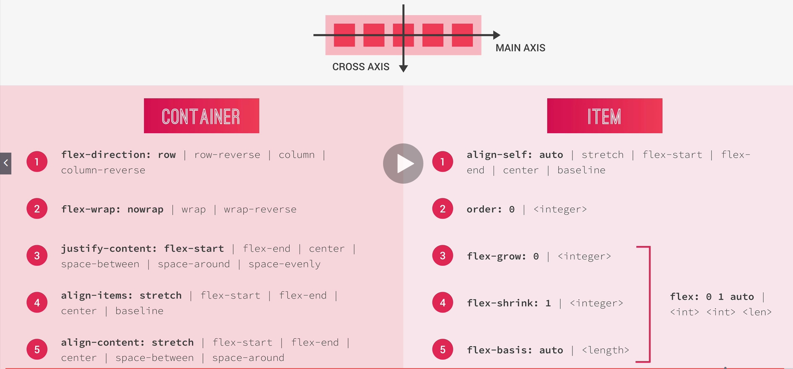

# Flexbox

## Properties

## Flex Container

### Justify-content

Controls how the items should be positioning along the main axis

* center - Don't care with space
* space-between - Space between items is evenly distribute
* space-around - Puts same amount space left side and the right side
* space-evenly - The space is always the same
* flex-end
* flex-center

### Align-items

Defines how the items should be positioning in cross axis

## Flex Items

### align-self

Replaces align-items

### flex-grow

Allows element grows up. Is relative to the other flex-grow

### flex-basis

Is the width. Put the container percentagem or pixels