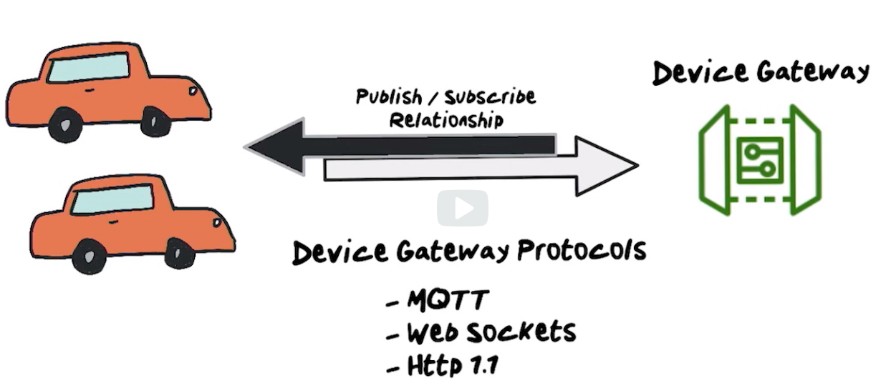

# IOT

## IoT Core

### Device Gateway

* Supports pub/sub pattern
* Enables scalable, low latency, low overhead communication
* Useful for IoT scenarios were billions of devices are expected to communicate frequently with minimal delay
* Publish/Subscribe over MQTT and WebSockets
* Publish over HTTPS

### Message Broker

* High throughput pub/sub message broker, securely transmit messages to and from all your iot devices with low latency
* Patterns
    * One to One
    * One to Many

### Device Shadow

* Enables cloud and mobile applications to query data sent from the devices and send commands to devices using a simple rest api

### IoT Core Rules Engine

* Can filter, transform and act upon device data on the fly based on business roles

### Registry

* Store metadata about devices
* Unique identity for device