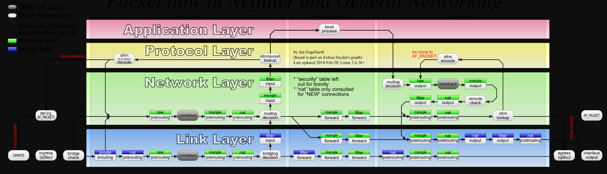
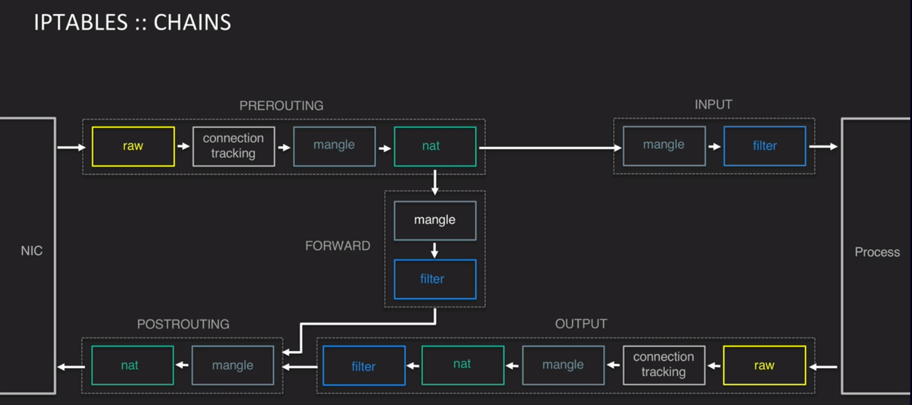

# Iptables

## Netfliter Graph





## Examples

[(semi-)stateless linux router](https://web.archive.org/web/20160413034150/https://jonatan.nilsson.is/running-a-semi-stateless-linux-router-for-private-network/)

[DeepDive](https://www.digitalocean.com/community/tutorials/a-deep-dive-into-iptables-and-netfilter-architecture)


## Log

[Example](https://wiki.strongswan.org/projects/strongswan/wiki/CorrectTrafficDump)

```bash
iptables -t raw -I PREROUTING -p udp -m multiport --dports 500,4500 -j NFLOG --nflog-group 5
tcpdump -s 0 -n -i nflog:5
```

## TCPDump

```bash
tcpdump -i eth0 -s 1500 -w /root/<filename.pcap>
```